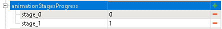

# 3D Models of FOB Modules

*(NEW) This feature is valid for Expeditions only.*

Every built FOB module is displayed on the map as a static model and, also, may have some animation of its appearance on the map.


## Two Static Models
The Main Base usually has more space for "building" FOB modules than secondary Outposts. 

Due to this, FOB modules have *two* static visual models corresponding to them: the *medium-sized* model and the *small* model. 

Dimensions of corresponding zones do vary also, see [Deploy zones][deploy_zones_fob_modules] for details.

Names of XML classes of these models, without the `.xml` file extension, are specified in the **modelId** (the medium-sized model) and **modelIdAdditional** (the small model) fields of the FOB module properties.


## Two Animated Models
Along with that, a FOB module may have the animation of its appearance on the map. 

And, since there are two static models of different sizes for the "built" module, we will need two animated models for them, correspondingly.

Names of XML classes of these models, without the `.xml` file extension, are specified in the **modelAnimated** (the animated model for the medium-sized module) and **modelAdditionalAnimated** (the animated model for the small module) fields.

**NOTE 1**: These models must have configured animation states – in the XML class of the model, as values of the `Name` attributes of the `<Subset>` tags – similarly to original in-game animated models models from [`initial.pak`][initial_pak]. 

**NOTE 2**: Original animated models can be easily identified in the [`initial.pak`][initial_pak] archive by the `_objective` suffix in their names.


## Configuration of Animations
The configuration for the animations is set up similarly to the [Model Building Settings][model_building_settings] mechanics:

1.  In the **modelAnimated** and **modelAdditionalAnimated** fields, you specify the name of the animated (`_objective`) model that have configured animation states.

2.  You specify names of these animation states (from XML classes of these models) and their order in the following sections:

    -   **animationStagesProgress** – for the medium-sized animated model.
    -   **animationAdditionalStagesProgress** – for the medium-sized animated model


## Where I Can Get These Models? 
When creating a custom module, you will need to either use one of original existing models of FOB modules provided with the game or create your own custom 3D models of your FOB module.

### Existing Models
XML classes of original in-game models of FOB modules are available in [`initial.pak`][initial_pak] archive.

Their 3D models (`.fbx` files) and XML files of the mesh are *not* publicly available there, but they are not necessary if you want to use these models.

I.e., you can specify names of XML classes of necessary models from [`initial.pak`][initial_pak] in the **modelId**, **modelIdAdditional**, **modelAnimated**, and **modelAdditionalAnimated** fields and the game will find remaining data by itself.

For existing animated models, names of animation states – required by the **animationStagesProgress** and **animationAdditionalStagesProgress** sections – can be found in these XML classes of models, the same way as when configuring the [Model Building Settings][model_building_settings].

I.e., in these XML classes, names of animation states are values of the `Name` attribute of the `<Subset>` tag.

*For example, for `fob_module_workshop_objective.xml`:*

```xml
<ModelBrand ClipCamera="true" NeedPreload="true">
	...
	<Subset IsDefault="true" Name="stage_0"></Subset>
	
	<Subset Name="stage_1">
		...
    </Subset>
	...
</ModelBrand>

```

Order of these states within **animationStagesProgress** and **animationAdditionalStagesProgress** sections is configured the same way as when configuring the [Model Building Settings][model_building_settings].

Particularly, the `0` value next to the state corresponds to the initial state of the module, `1` corresponds to the state when the module is being "built".

*For example*:  


### Custom Models
For general information on creating custom models (without animation), see the [Custom_Level_Entities_Models_Overlays_and_PbrMaterials.pdf][custom_level_entities_models_overlays_and_pbrmaterials_pdf] guide.

However, there are two additional aspects in creating these models for FOB modules: the mandatory `NeedPreload` attribute and correct location of model files.

#### NeedPreload attribute
XML classes of all used custom models should contain the special `NeedPreload` attribute in the `<ModelBrand>` tag and this attribute should be equal to `true`. 

This is necessary for the system to be able to preload these models before starting the level. 

For example:

```xml
<ModelBrand ... NeedPreload="true">
	...
</ModelBrand>
```

#### Location of Model Files
All files of custom models that are used by the FOB module should be put to the [folder of this FOB module][folder_of_fob_module] within `Documents\My Games\Expeditions\Media\Mods\`.

The set of model folders there is the same as when creating a regular custom model. 

I.e., in this case, the [folder of this FOB module][folder_of_fob_module] will contain the regular `classes`, `meshes`, and `textures` subfolders with model contents. See the [Custom_Level_Entities_Models_Overlays_and_PbrMaterials.pdf][custom_level_entities_models_overlays_and_pbrmaterials_pdf] guide for details.

In the FOB module's **modelId** and **modelIdAdditional** fields, you need to specify the names of the models' XML classes, without the `.xml` file extension.

For example, your XML class of the main model is named `my_oil_pump_01.xml`. It is located in [folder of this FOB module][folder_of_fob_module] at `\classes\models\my_oil_pump_01.xml`. The structure in `meshes` and `textures` subfolders is similar. So, you can specify `my_oil_pump_01` as the value of the **modelId** field.


## How Can I Create Animated Models?
Animated models and their animation states are optional for the creation of custom FOB modules. If they are not specified, the FOB module will be built without the "appearance" animation.

The [Custom_Level_Entities_Models_Overlays_and_PbrMaterials.pdf][custom_level_entities_models_overlays_and_pbrmaterials_pdf] guide describes only the creation of regular (not animated) models. The similar guide on creating models with animation is planned, but is not created yet.


[deploy_zones_fob_modules]: ./../../map_modding/creating_a_map/zones/expeditions_zones/deploy_zones.md#fob-modules
[model_building_settings]: ./../../map_modding/creating_a_map/objectives/model_building_settings/model_building_settings.md
[initial_pak]: ./../../map_modding/getting_started/file_paths_and_naming/file_paths.md#source-of-info-initialpak-archive
[folder_of_fob_module]: ./creation_of_custom_fob_module.md#source-files
[custom_level_entities_models_overlays_and_pbrmaterials_pdf]: ./../../custom_level_entities/Custom_Level_Entities_Models_Overlays_and_PbrMaterials.pdf
