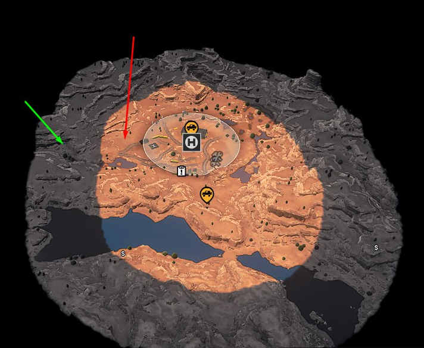

# Modifiers of Specialists

## Overview
Every *modifier* corresponds to a certain ability of the Specialist. See [Custom Specialists: Overview][overview_modifiers] for the general info on it.

Fields related to particular **modifiers** of Specialists can be found below.
For clarity, `SpecialistModifier...` prefixes in headings are omitted for modifiers.

Mechanics of **...UiDesc** and **group** fields within a modifier, are described in anther section of [Custom Specialists: Overview][overview_uidesc_and_group]. These fields work the same way for all modifiers and are also omitted here. Only the actual parameters of modifiers are described.

### Naming of Parameters
Parameters of modifiers typically have suffixes corresponding to types of their values:

-   **...Count** – the quantitative value. Typically, corresponds to the numerical amount of something.
-   **...Percent** – the percentage. Typically, if you specify, say, `30` in this field, the value will be increased or decreased by `30%`.
-   **...Meters** – the value in meters. Typically, used for values that are measured in the in-game meters.

In other cases, checkboxes or other non-typical types of parameters are used. 

### Negative Values
Negative values also work for parameters of modifiers and will decrease the value of the corresponding parameter. 

For example, you can try to specify [**anchorRadiusIncreasedPercent**](#anchorradius) = `-50`. And it will *decrease* the value of radius, by `50` percents.

However, this scheme does not work for all parameters with **...Reduced** suffixes in their names.

## List of Possible Modifiers

### Base
`SpecialistModifierBase` is a base class of modifiers. It will be hidden. (`TBD`)

### AdditionalTreasureItems
Increases the amount of [Treasure Items][treasure_items] in the resource zones. 

When a single Treasure Item is spawned in this zone, this modifier will add an additional specified amount of these items. However, these additional item will not be added, if there are no free slots in the zone.

-   **additionalTreasureItemsCount** – The amount of additional [Treasure Items][treasure_items] to be added. 

### AnchorRadius
Increases the radius of all specified *Anchors*.

-   **anchorRadiusID** – [identifiers][inv_items_idemtifiers_list] of all *Anchors* that this modifier will be applied to.
-   **anchorRadiusIncreasedPercent** – the increase of the radius, in percents. 

### AnchorSupplies
Increases the amount of charges of all specified *Anchors* that are available for purchasing in Headquarters or within the Expedition.

-   **anchorRadiusID** – [identifiers][inv_items_idemtifiers_list] of all *Anchors* that this modifier will be applied to.
-   **anchorMaxLimitCount** – the number of additional charges that will be added to both current number of charges and maximum possible amount of charges. 

### ArmorRestoreEverywhere
Allows to perform reinforcement (restore the armor) in any location.

This modifier has no parameters. It allows the player to repair truck components to maximum amount of durability available *in the particular moment*. 

It works similarly to the following:

-   The player has hired the specialist that gives `+10%` of armor at the start of the Expedition. And, this specialist allows to repair armor everywhere.
-   The player is able to use *Repair parts* to repair components of the truck to `110%`.
-   The *Service Station* gives another additional `+20%` to armor. I.e., in the *Service Station* zone, the player is able to repair components of the truck to `130%`.
-   After leaving the *Service Station*, the player is still able to repair truck components to `110%`.  

See also: [ArmorCapacity](#armorcapacity).

### BaseWithDescs
Different base class of modifiers that will be be hidden. (`TBD`)

### AdditionalReward
Increases the amount of [reward] of particular type.

-   **additionalRewardExpeditionIncreasedPercent** – the increase of the reward for an Expedition, in percents. 
-   **additionalRewardSideQuestsIncreasedPercent** – the increase of the reward for a Contract, in percents. 
-   **additionalRewardTasksIncreasedPercent** – the increase of the reward for a Task, in percents. 

### ArmorCapacity
Increases the amount of armor of the particular component of the truck.

-   **armorEngineIncreasedPercent** – the increase of the *Engine* armor, in percents. 
-   **armorGearboxIncreasedPercent** – the increase of the *Gearbox* armor, in percents. 
-   **armorGasTankIncreasedPercent** – the increase of the *Gas Tank* armor, in percents. 
-   **armorSuspencionIncreasedPercent** – the increase of the *Suspension* armor, in percents. 

See also: [ArmorRestoreEverywhere](#armorrestoreeverywhere).

### BinocularRadius
Increases the radius of vision for *Binoculars*.

-   **binocularPartRadiusIncreasedMeters** – the increase of the radius of *partial* exploration for *Binoculars*, in meters. Partial exploration locates new POI, but does not identify them (shows them as "question" marks).  

-   **binocularFullRadiusIncreasedMeters** – the increase of the radius of *full* exploration for *Binoculars*, in meters. Full exploration fully identifies POI.  

### DroneAcceleration
Increases the speed of the *Drone*.

-   **droneAccelerationIncreasedPercent** – the increase of the acceleration and speed of the *Drone*, in percents.  

-   **droneAccelerationHeightIncreasedPercent** – the increase of the height and vertical accelartion of the *Drone*, in percents. 

### DroneControllability
Increases the controllability of the *Drone*.

-   **droneControllabilityResForceIncreasedPercent** – the increase of the parameter responsible for the resistance force applied to the *Drone*, in percents. The higher this value is, the faster the *Drone* will stop.  

-   **droneControllabilityResForceRotationIncreasedPercent** – the increase of the parameter responsible for the resistance force applied to the *Drone* when it rotates, in percents. The higher this value is, the faster the *Drone* will stop after rotation. 

-   **droneControllabilityForceRotationIncreasedPercent** – the increase of the rotation speed of the *Drone*, in percents. 

### DroneScoutRadius
Increases the exploration radius of the *Drone*.

-   **droneFullScoutRadiusIncreasedMeters** – the increase of the radius of *full* exploration for the *Drone*, in meters. Full exploration fully identifies POI.

-   **dronePartScoutRadiusIncreasedMeters** – the increase of the radius of *partial* exploration for the *Drone*, in meters. Partial exploration locates new POI, but does not identify them (shows them as "question" marks). 
  
The *full* and *partial* exploration areas are displayed as follows:

- Full — the map is fully colored, objects are identified.
- Partial — the map is colored gray, objects are displayed as question marks.

### EcholotModeAura
Changes the mechanics of the *Echo Sounder* operation.
If this modifier is active, the zone of the *Echo Sounder* operation becomes permanent "aura" around the truck. This "aura" is enabled and disabled when the player uses the *Echo Sounder*.

**NOTE**: When multiple active specialists have modifiers of *Echo Sounder* operation, the game will use modifier parameters of the first active specialist.

-   **echolotRadiusOverrideMeters** – the radius of the *Echo Sounder* operation in the "aura" mode, in meters.

-   **echolotStepCountOverride** – the density of *Echo Sounder* visualization marks on the surface of water in the "aura" mode.

-   **echolotApplicationAdditionalTime** – the increase of the duration of *Echo Sounder*, in seconds.

### EmergencyStockSupplies
Increases the amount of resources in *Emergency Stock*, an additional supply of resources that is stored in the track.

-   **emergencyStockFuel** – the increase of the *Fuel* in Emergency Stock.. 
-   **emergencyStockRepairs** – the increase of the number of *Repair parts* in Emergency Stock.
    -   Specify an integer non-negative value.
    -   If there are several specialists with this ability, the values ​​are summed up.
-   **emergencyStockWheels** – the increase of the *Wheels* in Emergency Stock.
    -   Specify an integer non-negative value.
    -   If there are several specialists with this ability, the values ​​are summed up. 

### FogOfWarTranspRadius
Increases the radius of full exploration around the truck.

-   **fogOfWarRadiusInceasedMeters** – the increase of the full exploration radius around the truck, in meters.
-   **fogOfWarTranspRadiusInceasedMeters** – the increase of the partial exploration radius around the truck, in meters.

### MayDiscoverZones
Allows the player to discover zones (POI) marked as [discoverable][discoverable] for this [class][class] of the Specialist.

The [class][class] of the Specialist required for the discovery is speicied in the settings of the zone itself. See [Discoverability of Zones][discoverable] for details.

These zones are discovered within the radius of the *full* exploration of *Binoculars* or *Drone*.

-   **mayDiscoverZonesByBinocular** – option; when enabled, allows the player to identify these zones in the radius of *full* exploration of *Binoculars*.

-   **mayDiscoverZonesByDrone** – option; when enabled, allows the player to identify these zones in the radius of *full* exploration of the *Drone*.

### TruckDamage
Reduces damage to various components of the truck.

-   **truckDamageEngineReducedPercent** – the decrease of the damage to *Engine*, in percents. Positive integer value.
-   **truckDamageGearboxReducedPercent** – the decrease of the damage to *Gearbox*, in percents. Positive integer value.
-   **truckDamageGasTankReducedPercent** – the decrease of the damage to *Gas Tank*, in percents. Positive integer value.
-   **truckDamageSuspensionReducedPercent** – the decrease of the damage to *Suspension*, in percents. Positive integer value.
-   **truckDamageWheelReducedPercent** – the decrease of the damage to *Wheels*, in percents. Positive integer value.

**NOTE**: The total decrease of the damage to a component of the truck may not exceed `100%`, even when multiple specialists with this modifier are hired.

### BaseWithOverrideDesc
Different base class of modifiers that will be hidden. (`TBD`)

### AdditionalAddonSupplies
Increases the amount of resources in [Consumable][consumable] addons to the truck.

-   **additionalAddonFuelCount** – the increase of the amount of *Fuel* in [Consumable][consumable] addons. 
-   **additionalAddonRepairsCount** – the increase of the amount of *Repair parts* in [Consumable][consumable] addons. 
-   **additionalAddonWheelsCount** – the increase of the amount of *Wheels* in [Consumable][consumable] addons. 

### AdditionalDeployResources
Increases the amount of *Fuel*, *Repair parts*, and *Wheels* resources in all opened [Deploy zones][deploy_zones], including the main FOB. 

Additional resources are not stored after leaving the map.

-   **additionalDeployFuelCount** – the amount of extra *Fuel* to be added to [Deploy zones][deploy_zones] resources. 
-   **additionalDeployRepairsCount** – the amount of extra *Repair parts* to be added to [Deploy zones][deploy_zones] resources. 
-   **additionalDeployWheelsCount** – the amount of extra *Wheels* to be added to [Deploy zones][deploy_zones] resources. 

### EcholotModeCone
Changes the mechanics of the *Echo Sounder* operation.
If this modifier is active, the zone of the *Echo Sounder* operation becomes the "cone" displayed before the truck. 

The *Echo Sounder* itself is activated in the standard way.

**NOTE**: When multiple active specialists have modifiers of *Echo Sounder* operation, the game will use modifier parameters of the first active specialist.
I.e., the values of these parameters will *not* be summarized. 

-   **echolotRadiusOverrideMeters** – the length of the "cone" before the truck, in meters. 

-   **echolotStepCountOverride** – the density of *Echo Sounder* visualization marks on the surface of water in the "cone" mode. 

-   **echolotConeAngle** – the angle of the displayed "cone". 

-   **echolotApplicationAdditionalTime** – the increase of the duration of *Echo Sounder*, in seconds.

### EmergencyWinch

Allows you to use the winch even when the truck's engine is off but not broken (e.g., if the truck flipped on its side, the engine stalled, etc.)

- **winchFuelPerSecond** — set the fuel consumption (in liters per second) during the winch operation. 

### RepairBuildingConsumption

Reduces the number of spare parts that are required for repairing bridges and clearing debris.

- **repairBuildingConsumptionReducedPercent** — set the percentage reduction in spare parts required for bridge repairs and debris removal.

### droneMaxSpeed 

Increases the speed of flying drones.

- **droneMaxSpeedInceasedPercent** — set the percentage increase of the flying drone's `maxSpeed` value.

### ImproveWinchedTruck

When a player winches a vehicle that has no driver, the towed vehicle becomes more powerful.

- **EngineResponsivenessIncreasedPercent** — increases the parameter that controls engine start delay and acceleration speed.
- **TorqueIncreasedPercent** — increases engine torque.
- **FuelConsumptionReducedPercent** — decreases the fuel consumption.
- **OnModelFrectionIncreasedPercent** — increases the coefficient of resistance for all surfaces that do not have their own separate coefficient of resistance (not higher than 10%).
- **BodyFrictionAsphaltIncreasedPercent** — increases the coefficient of resistance for stones (not higher than 10%).
- **SubstanceFrictionIncerasedPercent** — increases the coefficient of resistance for mud (not higher than 10%).
- **BodyFrictionIncreasedPercent** — increases the coefficient of resistance for terrain (not higher than 10%).

### echolotModeSnow

The echo sounder can measure the depth of snow.

- **echolotModeSnowRadiusOverrideMeters** — set the echo sounder's operational radius in this mode, in meters.
- **echolotModeSnowStepOverrideCount** — set the density of snow depth measurement points in this echo sounder mode.

### wheelDroneZone

Increases the radius of all coverage zones on the map by the specified percentage.

- **wheelDroneZoneIncreasedPercent** — set the percentage by which the zones should be increased.

### wheelDroneFriction

Increases the coefficient of the [wheeled drone's](./../../truck_modding/new_features/wheeled_drones.md) wheel grip.

- **wheelDroneOnModelFrictionIncrecedPercent** — set the percentage increase of the `OnModelFriction` parameter.
- **wheelDroneBodyFrictionAsphaltIncrecedPercent** — set the percentage increase of the `BodyFrictionAsphalt` parameter.
- **wheelDroneSubstanceFrictionIncrecedPercent** — set the percentage increase of the `SubstanceFriction` parameter.
- **wheelDroneBodyFrictionIncrecedPercent** — set the percentage increase of the `BodyFriction` parameter.

### wheelDroneScoutRadius 

Increases the scouting range (radius) of the wheeled drone.

- **wheelDroneFullScoutRadiusIncreasedMeters** — set the increase (in meters) for the **full** scouting range of the wheeled drone. 
- **wheelDronePartScoutRadiusIncreasedMeters** — set the increase (in meters) for the **partial** scouting range of the wheeled drone.   

### To be described
Other modifiers exist in the game and in the Editor, but are not described here yet.

[overview_modifiers]: ./custom_specialists_overview.md#modifiers
[overview_uidesc_and_group]: ./custom_specialists_overview.md#descriptions-and-groups-in-ui
[treasure_items]: ./../inventory_items/custom_inventory_items_overview.md#treasure-items
[inv_items_idemtifiers_list]: ./../inventory_items/appendix_types_of_inventory_items.md#identifiers
[reward]: ./../../map_modding/creating_a_map/objectives/objectives_in_expeditions/rewards.md
[discoverable]: ./../../map_modding/creating_a_map/zones/expeditions_zones/discoverability_of_zones.md
[class]: ./custom_specialists_overview.md#class
[consumable]: ./../../truck_modding/new_features/consumables.md
[deploy_zones]: ./../../map_modding/creating_a_map/zones/expeditions_zones/deploy_zones.md
