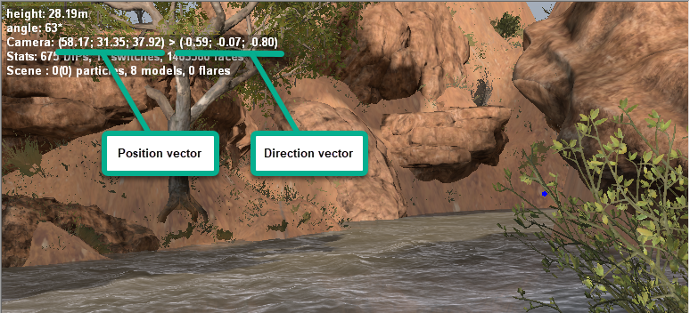
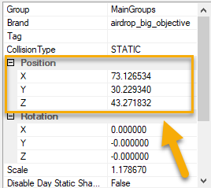

# Tip on cameraPos and cameraDir values

It is sometimes rather hard to specify the correct values of vectors for the position and direction of the camera.

However, you can do the following:

1.  Enable the **Statistics** option () on the toolbar of the Editor. This will display Camera statistics on the screen.

2.  Put the camera manually in the correct position/direction (see [Camera Controls](./../../getting_started/ui_overview/camera_controls.md) for details) and write down the values of the position and direction vectors of the camera (see screenshot below).

3.  If you enter the same values of vectors to **cameraPos** and **cameraDir** fields, they will correspond to this position/direction of the camera.

As an alternative variant for specifying **cameraPos** fields, you can use coordinates of some objects on the map that are displayed in their properties (you will need to add some value for the `Y` coordinate).

Then, you can tune the values as necessary.

