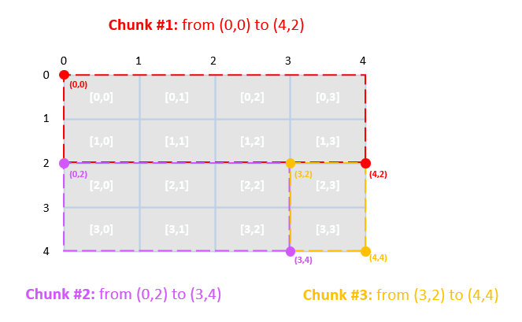
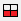

# Chunks. Selection of Chunk

A *chunk* is a set of adjacent pieces of the map, defined by two points: its top left point and its lower right point.

Regardless of the actual dimensions of the map, there are `16` map pieces in total (`4 x 4`). So, each of these points will have conventional `X` and `Y` coordinates from `0` to `4`.

For example, when you are dividing the map between `3` modders, you can divide it into `3` chunks, as shown on the illustration above:

-   **Chunk 1**: from `(0,0)` to `(4,2)`

-   **Chunk 2**: from `(0,2)` to `(3,4)`

-   **Chunk 3**: from `(3,2)` to `(4,4)`

And, as a result, **Chunk 2** will contain `6` map pieces in it: `[2,0]`, `[2,1]`, `[2,2]`, `[3,0]`, `[3,1]`, `[3,2]`. And, the modder working with this chunk will have their data stored in the corresponding [subfolders][subfolders] within the `data` folder.

So, at first, it is probably a good idea to divide your map into convenient chunks and distribute these chunks between members of your modding team. After that, they will know the chunks (and, correspondingly, map pieces, i.e. [subfolders][subfolders] of `data`) they will be working with and the conventional coordinates of these chunks.

However, after that, you need every member of the team to be able to select their chunk on the map and highlight it, to avoid modifications in other chunks. 

This can be done by the **Select chunk** () button and **Show zone for work** () option on the [Toolbar][toolbar]:

1.  Click **Select chunk** () on the Toolbar.

2.  In the appearing small dialog, specify the conventional coordinates of necessary chunk, i.e. conventional coordinates of its top left point and its lower right point.
    
    

3.  Enable the **Show zone for work** () option on the Toolbar.

4.  The area of the necessary chunk will appear as a regular map, without any colorization. All other parts of the map will be colored with red.

    

If you leave the **Show zone for work** () option enabled, you will be able to work with the necessary part of the map only and will be able to avoid modifications in parts of the map that are highlighted with red.

[subfolders]: ./map_pieces_their_subfolders.md
[toolbar]: ./../../getting_started/ui_overview/toolbar_buttons.md