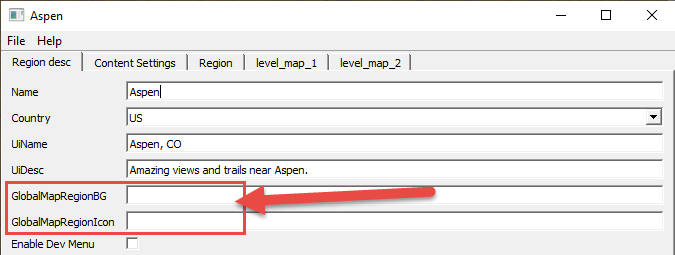

# Custom Images for Regions and Maps

*Currently, this topic is valid for SnowRunner only.*

In *SnowRunner*, the Editor allows you to set up custom pictures for the UI elements related to your Regions and Maps.

## For Regions
For a Region, there are two fields for that in the Region Settings dialog, when you are editing a region:

-   **GlobalMapRegionBG** – allows you to set a background for the Region on the **Global Map** screen. See the instructions below for the format of images and other details.

-   **GlobalMapRegionIcon** – allows you to set an icon for the Region in the **Global Map** (in the upper part of the screen). Please note that some areas of the **GlobalMapRegionIcon** image must be transparent for the icon to match the UI of the Global Map screen. See the instructions below for the format of images and other details.

## For Maps
For a Map, there are two fields for that in the Zone Settings dialog (shown when you are editing settings of zones or objectives of this map):

-   **globalMapPreview** – the small picture of the map that will be used for it in the **Global Map** screen.

-   **saveSlotMapPreview** – the preview of the map that will be used for the Save Slots with this map in the **LIST OF SAVED GAMES** screen.

## Setting Up
In *SnowRunner*, to set up these pictures for a map or a region:

1.  Prepare the pictures themselves:

    -   *Format* of images: `PNG`

    -   *Dimensions* of images:

        -   Image for the **GlobalMapRegionBG** field = `1920 x 1080` px

        -   Image for the **GlobalMapRegionIcon** field = `85 x 85` px \*

        -   Image for the **globalMapPreview** field = `360 x 216` px

        -   Image for the **saveSlotMapPreview** field = `360 x 203` px

        **\* WARNING**: For the **GlobalMapRegionIcon** image to match the UI of the Global Map screen, its transparency mask should be the following:

        

        The `PNG` image of the mask is available here:  
        <https://drive.google.com/file/d/1aR_Og0xrtq_ATgi_B93hqoBdI_qvNUsS/view>

2.  Put the pictures to required directories:

    -   Pictures for a Region (**GlobalMapRegionBG**, **GlobalMapRegionIcon**) should be put here:  
    `Media\prebuild\<RegionName>\ui\textures`

    -   Pictures for a Map (**globalMapPreview**, **saveSlotMapPreview**) should be put here:  
    `Media\prebuild\<MapName>\ui\textures`

    **NOTE**: Please note that there should be two separate `\ui\textures` folders: one for a map and one for a region.

3.  In each image field (**GlobalMapRegionBG**, **GlobalMapRegionIcon**, **globalMapPreview**, **saveSlotMapPreview**) in the settings of a Region or a Map (see above for info on the location of the fields in dialogs), specify the name of the necessary picture *without extension*.  
    For example, `my_region_image` for the `my_region_image.png`

4.  Repack the map or region in a standard way.

