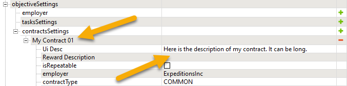

# Localization

## Overview
Both maps and trucks contain a lot of fields with text values that are shown in the UI of the game.

For example, [`UiName`][ui_name_truck] and [`UiDesc`][ui_desc_truck] attributes of in the XML class of the Truck are used for displaying its name and description in the UI. 

Or, *Name* and **Ui Desc** fields that exist for all objectives both in [*Expeditions*][name_ui_desc_objctives_exp] and in [*SnowRunner*][name_ui_desc_objectives_sr].

All these fields can be localized to multiple languages. 

The pattern for their localization is the same.

In short, you need to:

1.  Use `UI_IDENTIFIERS` in your text fields: either set them in Editor or specify them as XML attribute values.
2.  After that, map these `UI_IDENTIFIERS` to the localization strings in the `.str` files of different languages.

These `.str` files need to be put to the `texts` subfolder in the *source folder of your mod*.

For example, for maps, to the `Media\prebuild\<level_map_name>\texts` folder.  
Or, for truck mods, to the `Media\Mods\<truck_mod_name>\texts` folder.

**NOTE**: Localization `.str` files must be in the *Little-endian UTF-16 Unicode* encoding.

However, if you do *not* want to localize your mod, you can simply specify necessary text values in text fields, without any `UI_IDENTIFIERS`. In this case, specified text values will be shown as is for all languages. 

## Two Approaches

In general, there are two approaches to specifying text field values, see below.


### Text Values Shown "As Is"
If you want to keep it simple, you can just specify your text as a value of the necessary field in Editor or the value of the XML attribute.

For example, for `UiName` and `UiDesc` attributes in the XML class of the Truck:

```xml
		<UiDesc
			UiDesc="Here is the description of my truck. It can be long."
			...
			UiName="My Truck 01"
		/>
```
Or, for *Name* and **Ui Desc** of the Contract:



**WARNING**: The following special symbols are prohibited in this text: square brackets (`[`,`]`) and a vertical bar (`|`). Usage of these symbols in localization strings can lead to various issues.

However, if you set the values of these fields this way, you will not be able to localize them. In all languages, they will appear just as you specified them.

### Localized Values
If you want your text fields to support different languages, you need a little bit more effort.

In general, the process is the following:

1.  Instead of specifying text in your fields, you specify UI placeholders there.  
    These UI placeholders will be the identifiers of your localization strings.  
    For example, for the truck, you can specify `UI_MY_TRUCK_NAME` and `UI_MY_TRUCK_DESC` as these identifiers:

    ```xml
		<UiDesc
			UiDesc="UI_MY_TRUCK_NAME"
			...
			UiName="UI_MY_TRUCK_DESC"
		/>
    ```
    Or, for the Contract, specify similar identifiers in *Name* and **Ui Desc**.

2.  You create the folder named `texts` inside the folder of your mod.  
    For example, for the truck, it will be `Media\Mods\<truck_mod_name>\texts`    
    Or, for the map, it will be `Media\prebuild\<level_map_name>\texts`  

3.  In the `texts` folder, you need to create `.str` files corresponding to languages that you want to support. You can create them simply as empty `.txt` files, and then change their filename extension to `.str`.  
    Importantly, These `.str` files should match the *list of languages supported by the game and should be named as specified below*:

    -   `strings_brazilian_portuguese.str`
    -   `strings_chinese_simplified.str`
    -   `strings_chinese_traditional.str`
    -   `strings_czech.str`
    -   `strings_english.str`
    -   `strings_french.str`
    -   `strings_german.str`
    -   `strings_italian.str`
    -   `strings_japanese.str`
    -   `strings_korean.str`
    -   `strings_polish.str`
    -   `strings_russian.str`
    -   `strings_spanish.str`

4.  In these `.str` files, you need to specify localization strings corresponding to your identifiers from Step 1 above.  
    You should do it in the same format, as in the original game: with the value next to the identifier, the value in quotation marks, and a new line as a delimiter. We recommend you to use "Tab" symbols as a delimiter between the identifier and its value.  
    For example:

    ```text
    UI_MY_TRUCK_DESC				"The best vehicle ever made"
    UI_MY_TRUCK_NAME				"Tin Lizzie"
    ```
    
    **WARNING 1**: The following special symbols are prohibited in the localization strings: square brackets (`[`,`]`) and a vertical bar (`|`). Usage of these symbols can lead to various issues.
    
    **WARNING 2**: If you have not created *the `.str` file* for some language, the localization identifier will be displayed for this language. E.g., the players will see `UI_MY_TRUCK_NAME` in the UI.

    **WARNING 3**: If you have *not* specified a value for your identifier (e.g. you specified `""` as the value) for some language, the name of the localization identifier itself will be displayed for this language. E.g., the players will see `UI_MY_TRUCK_NAME` in the UI.

    **TIP**: You can use one of the `.str` files provided with the [sample mod of the truck][sample_mod_of_the_truck] as a sample `.str` file. However, the sample `.str` files there were created *not for all* languages (see Warnings above).

5.  Save your localization `.str` files in the *"Little-endian UTF-16 Unicode"* encoding.

    **WARNING**: If the encoding of your files is different, the localization may not work!

After that, values from `.str` files will be used instead of UI_identifiers in the game.

[ui_name_truck]: ./../../../truck_modding/tags_and_attributes_of_trucks/truck/gamedata/uidesc/index.md
[ui_desc_truck]: ./../../../truck_modding/tags_and_attributes_of_trucks/truck/gamedata/uidesc/index.md
[name_ui_desc_objctives_exp]: ./../../creating_a_map/objectives/objectives_in_expeditions/common_fields_of_objectives.md
[name_ui_desc_objectives_sr]: ./../../creating_a_map/objectives/objectives_in_expeditions/common_fields_of_objectives.md
[sample_mod_of_the_truck]: ./../../../truck_modding/getting_started/sample_mod_by_the_game/overview.md