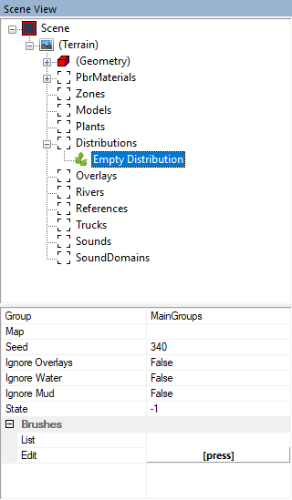
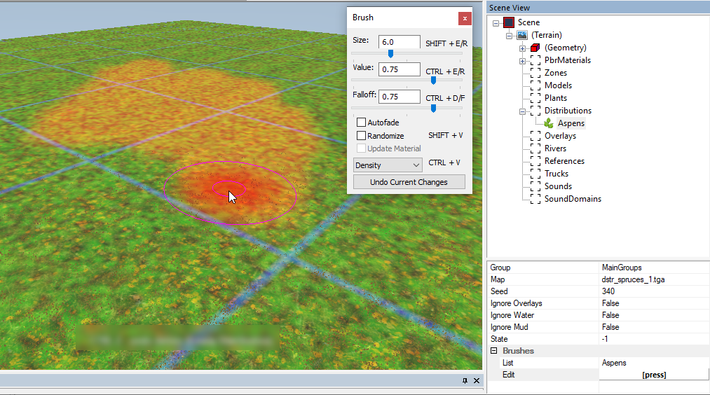
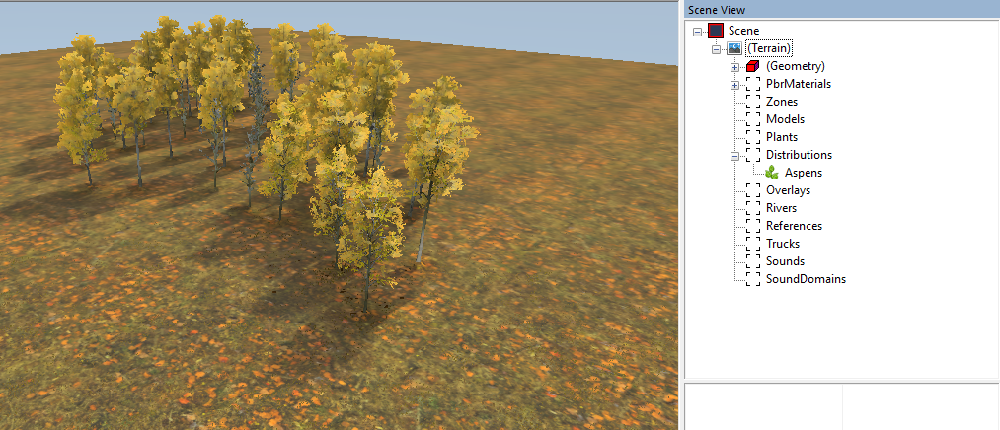

# Adding Multiple Objects via Distribution

## Overview
Adding large amounts of trees and other plants *one by one* is inefficient.

To add them massively and efficiently, there is a special tool – *Distributions*.

Distributions are based on two things:

-   *Map* – the texture that stores the density of particular plant(s) in all areas of the level

-   *Brushes* – define these particular plants that will be planted on this *Map*.  

After defining these properties of the Distribution, you can paint the defined *Map* – varying the Density and Scale of the plants – and, after rebuilding the level, the plants defined by the *Brushes* will appear, massively.

Moreover, using Distributions you can add not only plants, but also stones, debris, and so on. You can do that by selecting the appropriate Brushes.

## Creating a Distribution

To create a new Distribution:

1.  Right-click the terrain or the **Distributions** section in the **Scene View** panel and select **Add Distribution** in the context menu.

2.  After doing this, the new **Empty Distribution** object will appear in the **Distributions** section in the **Scene View** panel.

    

3.  Now you need to specify the *Map* and *Brushes* properties of this Distribution:

    -   **Map** – In this field, you need to create the file of the Distribution map itself.  
        To do this, you need to:
    
        1.  Click the **Map** field and then click the browse button () button displayed on the right side of it.
    
        2.  Specify the name of the new file of the Distribution map in the appearing window. This name must start with the `dstr_` suffix and must end with the `.tga` extension.  
        For example, `dstr_aspens_1.tga`
        
        3.  After clicking **Open** in this window, the file with the specified name will be created, and the (painting) brush for this distribution map will appear in the main window of the Editor in the form of the standard **Brush** dialog.

    -   In the **Brushes** section, you need to set up brushes for the Distribution.  
        To do this, you need to:

        1.  Click the **\[press\]** button next to the **Edit** field. After doing this, the **Distribution Brushes** window will appear.

        2.  In the **Distribution Brushes** window, move necessary brushes from the **Available Brushes** list to the **Selected Brushes** list.

        3.  Click **OK** to close the **Distribution Brushes** window.

4.  After setting up Map and Brushes, you can start painting using the standard **Brush** dialog. For details on modes and parameters of the Brush, see [below](#parameters-of-the-brush).

    

    **NOTE**: To paint (add objects) in the **Density** mode, the **Value** parameter must be higher than `0.50`. To erase plants from the area - it should be below `0.50`. If the value is exactely `0.50` – the brush will not paint at all. 
   
5.  To see the added plants, you will need to rebuildg the terrain of the scene. To do this, right-click the **Terrain** section in the **Scene View** panel and select **Rebuild Terrain** in the context menu. 
    
    

## Parameters of the Brush
The regular **Brush** window appears when you select the particular Distribution in the **Scene View** panel. 

This [standard window][brushes_overview] allows you to paint on the Map of the Distribution with all Brushes that you have selected. 

The painting modes of the Brush, available in the drop-down at the bottom of the **Brush** window, are the following:

-   **Density** – Allows you to "paint" the *density* of plants in the painted area. The higher the **Value** parameter is in this mode, the denser the plants will be added. To add plants to the area, the **Value** parameter must be higher than `0.50`. To erase plants from the area - it must be below `0.50`. If the **Value** is exactely `0.50` – the brush will not paint at all.

-   **Scale** – Allows you to "paint" the *scale* of the plants. In this case, the **Value** parameter is responsible for the size of plants in the painted area.

-   **Density subgroup** – *(In Expeditions only)* The special mode for painting with groups of Distributions, available in only in *Expeditions*. See [Density Subgroup mode][density_subgroup_mode] for details.

Other parameters of the brush are the following:

-   **Size** – The size of the brush.
-   **Value** – The strength of the brush (see the **Density** and **Scale** modes above).
-   **Falloff** – The softness of this brush, i.e. the decrease of the **Value** from the center of the brush pointer.
-   **Autofade** option – Enables the automatic attenuation mode for the brush, that depends on the direction of the drawn line.
-   **Randomize** option – Allows you to plant your objects unevenly.
-   **Update Material** option – Should not be used for distribution brushes.

## Excluding Some Areas of the Map
Every Distribution has a set properties for excluding some areas of the map: 

-   **Ignore Overlays** – Whether or not you can paint objects of this Distribution over roads.

-   **Ignore Water** – Whether or not you can paint objects of this Distribution under the water.

-   **Ignore Mud** – Whether or not you can paint objects of this Distribution over the mud.

By default, plants cannot grow through roads, water, and mud – so, all these setting are set to `False`.

## Expeditions Specifics
In *Expeditions*, the **Obstructed grass persistence multiplier** parameter in [Terrain Properties][terrain_properties] has effect on the grass that is planted as distributions within large groups of trees. 

## SnowRunner Specifics
In *SnowRunner*, distributions are also used when creating levels with [Farming][farming].

Every "Farming" distribution has the particular value of the **State** field that defines the order of its appearance within the Farming Area. See [Farming][farming] for details.

For all other distributions, the **State** field is not used.

[farming]: ./../farming/farming_overview.md
[brushes_overview]: ./../../getting_started/ui_overview//typical_brush_dialog.md
[density_subgroup_mode]: ./density_subgroup_mode.md
[terrain_properties]: ./../terrain/terrain_properties.md