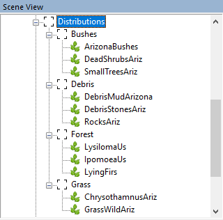

# Density Subgroup mode

*(NEW) This feature is valid for Expeditions only.*
*This feature is new and, currently, may not always work as intended. (`TBD`)*

## Overview
In *Expeditions*, when adding a [Distribution][distributions] to the map, you are able to use the additional mode in the **Brush** dialog. 

This mode is called **Density subgroup** and can be selected instead of the regular **Density** mode, in the same drop-down.

This mode works the same way as the original **Density**, but it allows to paint or clear from the map *all distributions that belong to the particular [Group][group]*.

This feature can only be used if your [Distributions][distributions] are organized in [Groups][group]. 

*Sample Groups of Distributions for Arizona-like Map*  
 

**NOTE**: This feature is new and, currently, not very stable.

## Process

1.  Organize your [Distributions][distributions] in [Groups][group].
2.  Select the distribution from the particular group.
3.  In the Brush window, switch to the **Density subgroup** mode.
4.  By painting in this mode, you will add/clear objects for all distributions from this group.

[distributions]: ./adding_multiple_objects_via_distribution.md
[group]: ./../../getting_started/ui_overview/groups.md