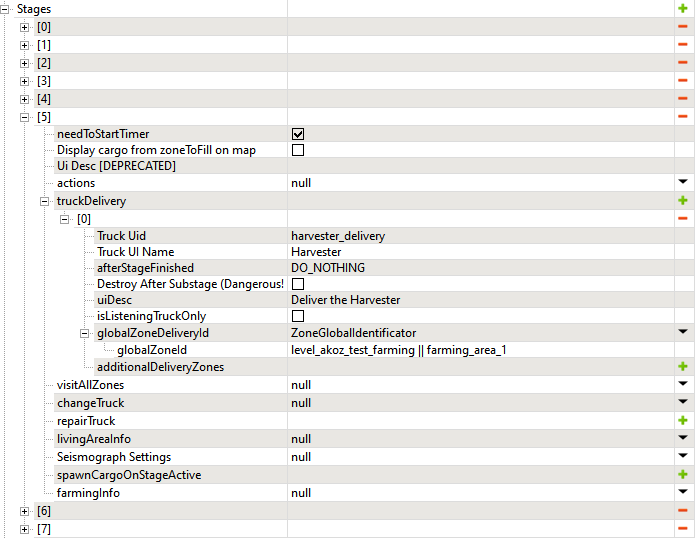
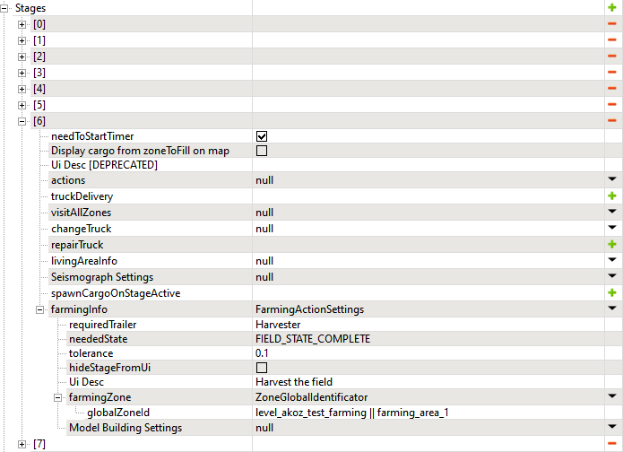

# Appendix: Sample Stages of Farming Contract

Below you can find screenshots of all [Stages](./../objectives/objectives_in_snowrunner/stages/stages_in_snowrunner.md) of a sample Farming contract.

## Stage 0: Cultivator
The goal of this **truckDelivery** stage is to *deliver the Cultivator*.

## Stage 1: Cultivate the field
The goal of this **farmingInfo** stage is to *cultivate the field*.

## Stage 2: Planter
The goal of this **truckDelivery** stage is to *deliver the Planter*.

## Stage 3: Seed the field
The goal of this **farmingInfo** stage is to *seed the field*.

## Stage 4: Hidden automatic step
This stage will be passed automatically when the player finishes the previous stage. The field will be switch to the next distribution, which will show the grown plants.

## Stage 5: Harvester
The goal of this **truckDelivery** stage is to *deliver the Harvester*.

## Stage 6: Harverst the field
The goal of this **farmingInfo** stage is to *harvest the field*.

## Stage 7: Hidden automatic step
This stage will be passed automatically when the player finishes the previous stage. The field will be switch to the next distribution, which will show the results of harvesting.

