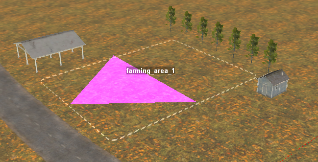
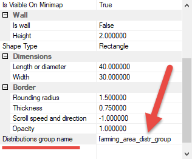

# Zone for Farming Area

*This topic is valid for SnowRunner only.*  

First of all, you need to create a zone for a Farming Area. This is done *almost* in a standard way:

1.  You create a Zone in the **Zones** section in the **Scene View** panel (see [Zones: Overview][zones_overview] for details).

2.  *Importantly*, you need to place it the location on the map where you want to create a farming area. And, you need to resize this precisely to the dimensions of the future farming area.

    

3.  In the properties of the zone locator, fill in the **Distributions group name** field.

    

    **NOTE**: The specified value will be the name of the group of distributions that you will create at [Step 2][step_2]. It must be *exactly* the same as the name of this group, otherwise the farming area will not work.

4.  In the **Zone Settings** dialog, in the **TERRAIN LOCATORS LIST** there, expand properties of the created zone, and add the **ZonePropertyFarmingArea** property to the props section of the created zone.
    
    
    
    **NOTE**: If all other things (all [Steps][steps]) are set up correctly, farming will work even without the **ZonePropertyFarmingArea** property added to the **props** of the zone. However, we still recommend to always add it, since it affects some UI-related use cases (generation of UI text when there is no **Ui Desc** in the the farming Stage).
    
5.  Specify all other properties of the zone and zone locator as you like, in a standard way.

After you have finished creating the zone for the farming area, you can proceed to [creating distributions][step_2] for it.

[zones_overview]: ./../zones/zones_overview.md
[step_2]: ./distributions_for_farming_area.md
[steps]: ./farming_overview.md