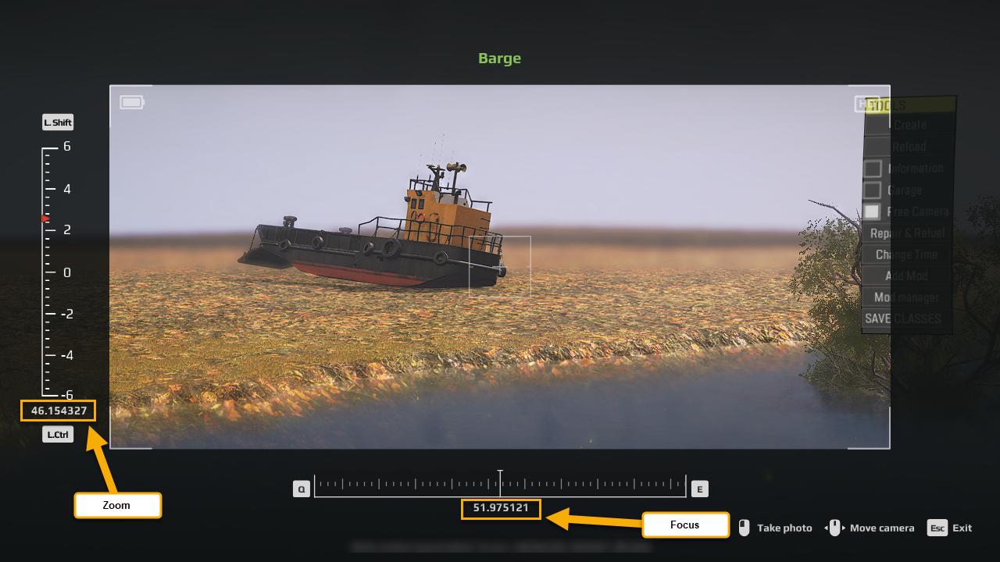

# Taking Photos

*(NEW) This feature is valid for Expeditions only.*

## Overview
The *Taking Photos* (or *Camera*) minigame allows the player to take photos of objects or views of the level.

To successfully take a photo, the player needs to locate a target object or a level point and match the target zoom and focus intervals while looking through the camera.

## Setup
The general setup of a zone and a stage for this miningame is performed as described in [Minigames: Overview](./minigames_overview.md).

For the *Taking Photos* minigame, the **MinigameCamera** settings should be selected in the **setting** field of the *ZonePropertyMinigame* prop.

These settings are the following:

-   ***uiWinHeader*** – *(Not used)* The UI text of the header is *not* displayed for the *Taking Photos* minigame.
-   ***uiWinDesc*** – *(Not used)* The main UI text is *not* displayed for the *Taking Photos* minigame.
-   **delayWinMs** – Delay of the win popup, in milliseconds.
-   **showTryAgainPopup** – Whether or not should the Try Again popup be shown if the player fails to pass the minigame.
-   **exitSound** – The sound that will be played when the player leaves the minigame. For details on specifying links to sound files, see [Adding Sounds][adding_sounds].
-   **timeToSolve** – The time limit for winning the minigame. If the player exceeds this limit while playing, the minigame is considered failed and closes. In the original game, this parameter is always set to `-1`, which corresponds to unlimited period of time.
-   **name** – The *identifier* of this minigame within this zone that is used by the corresponding stage of the objective. See [Minigames: Overview](./minigames_overview.md) for details.
-   **inputWinMinigameLink** – *(Not customizable during modding).*
-   **requiredAbilities** – *(Should not be used).*
-   **setting** – Settings of the minigame itself. You need to select the *MinigameCameraSetting* here, it is required.

    -   **cameraSubtitle** – The name of the object that needs to be shot. Will be displayed to the player in the UI.

    -   **employerName** – The internal identifier of the employer. 
        
        **NOTE**: Currently, this field is not displayed when configuring this minigame. It is a known issue that will be fixed. (`TBD`)

    -   **employerTitle** – The UI text that will be displayed in the lower right corner of the photo (bold text, 1st line). In the original game, typically, the same value as **cameraSubtitle** (name of the object) is used for this field.

    -   **employerSubtitle** – The UI text that will be displayed in the lower right corner of the photo (regular text, 2nd line). In the original game, typically, the value of this field is based on the selected employer. E.g., "By Expeditions Inc".

    -   **maxFocusExpected** – The upper limit of the target *focus* interval. 
    -   **minFocusExpected** – The lower limit of the target *focus* interval.

        **NOTE**: To take successful photo, the value of the focus should be less than **maxFocusExpected** and greater than **minFocusExpected**.

    -   **maxZoomExpected** – The upper limit of the target *zoom* interval.
    -   **minZoomExpected** – The lower limit of the target *zoom* interval.

        **NOTE**: To take successful photo, the value of the zoom should be less than **maxZoomExpected** and greater than **minZoomExpected**.    

    -   **dirAngleExpected** – The conventional precision with which the player should aim the camera at the target object. Even the value of `0.99` can be good for large objects.

    -   **positionSubjectForPhoto** – The coordinates of the *target object* that the player needs to shoot/aim at.

    -   **startCameraPosition** – The coordinates of the *camera point* from which the shooting will be made by the player.

    -   **startCameraDir** – The initial *direction* of the camera at the beginning of the minigame. Typically, this direction should *not* be aiming at the target object, to allow players to find it by themselves.

        **WARNING**: If you leave **startCameraDir** with `0` values, the minigame will not work and there will be crash at the start of the minigame.

## Tuning Procedure
You can tune the settings of this minigame as follows:

1.  In the Expeditions Editor, select the object that you want the player to shoot and view its coordinates (**Position**). These coordinates will go to the **positionSubjectForPhoto** field of the minigame settings.

    **NOTE**: The coordinates shown in the **Position** fields of the object are the coordinates of the *pivot* of the object, so you may still need to tune them in the case of the large object. If you want the player to take the photo not of the particular object, but of the particular view, you can add the small object to the scene, place it in the necessary location, write down its coordinates, and then remove the object.

2.  Now, we need to identify the **startCameraPosition** coordinates:
    -   In the Editor, move the camera to the necessary point of the level and set its correct direction (roughly).
    -   Show the exact values of the current camera position and direction, by pressing the **Statistics** () button on the toolbar or pressing CTRL + T.
    -   Use the camera *position* values as the **startCameraPosition** coordinates. 

    **NOTE**: See [Tip on cameraPos and cameraDir values][tip_on_camerapos_and_cameradir] for details.

3.  Now, still in the Editor, we can set **startCameraDir**:
    -   In the Editor, with the camera being in the same position, change the direction of the camera (to avoid direct aiming at the object).
    -   As in the step 2 above, using the **Statistics** () shown for the camera, set the camera *direction* values as the **startCameraDir** values.  

4.  Now, we need to set up correct focus and zoom values:

    1.  Save your changes, [pack][pack] the level and open it in the game itself, as a *local mod*. 
    
        **NOTE**: Loading the level as the *local mod* means the regular loading of the level after [packing][pack], *without* uploading it to mod.io.  

    2.  Open the roughly configured minigame, and, within the minigame itself, locate the target object (the **cameraSubtitle** label at the top will become green) and set the zoom and focus values with which the object looks good and sharp.

        **NOTE**: The precision with which you will need to aim the camera at the target object is controlled by the **dirAngleExpected** parameter.

    3.  *If you have opened the map as the local mod* (see above), then, while being in the minigame, the necessary **cam zoom** and **cam focus** values are displayed instead of the **ZOOM** and **FOCUS** labels.
        
        

    4.  Based on the identified **cam zoom** and **cam focus** values, specify the **minFocusExpected**/**maxFocusExpected** and **minZoomExpected**/**maxZoomExpected** limits.  
    For example, if the **cam focus** value was `68.51`, you could set **minFocusExpected** as `66` and **maxFocusExpected** as `71`. The process for the **cam zoom** value is similar.

5.  Save your changes to the minigame settings. Then, if necessary, restart the game and test the final settings of the minigame.

[tip_on_camerapos_and_cameradir]: ./../../additional_info_on_maps/camera_values/tip_on_camera_pos_and_camera_dir_values.md
[pack]: ./../../packing_and_publishing_maps/packing_maps.md
[adding_sounds]: ./../sounds_and_music/sounds/adding_sounds.md