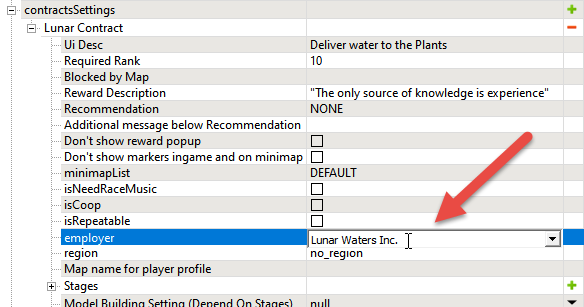

# Custom Employers

*Currently, this feature works for SnowRunner only.*  
*For Expeditions, it is planned to be implemented, but does not work in the current version of the game.*

## Overview
If necessary, you can use custom employers in your objectives, along with the in-game ones.

Particularly, custom employers can be created for Contracts in *SnowRunner*.
In *Expeditions*, custom employers currently does not work.

## Creation of Custom Employer
To create a custom employer:

1.  In the Zone Settings dialog, expand the **objectiveSettings** section and click  next to its **employer** subsection.

    

2.  In the appearing dialog, specify the internal name of the new employer.  
    For example, `Lunar Waters Inc.`

    

    **NOTE**: This internal name of the employer you will need to use in all objectives that you want to link to this employer. Paricularly, in SnowRunner, you will need to use it for the necessary [Contracts](./objectives_in_snowrunner/contracts.md).

3.  After doing this, the new record in the **employer** list will appear, with the specified id.
    
    

4.  In the new record, specify the properties of the new employer:

    -   **UiName** – the UI name of the employer that will be shown for the player in the UI of the game. If the **UiName** field is not specified, the internal name of the employer specified at Step 2 above will be shown in UI.
        
        **NOTE**: If you want to localize the UI name of the employer to the languages supported by the game, you can specify the UI_IDENTIFIER of the employer name in the **UiName** field (or as internal name from Step 2 above) instead of the name itself. See [Localization](./../../additional_info_on_maps/localization/localization.md) for details.

    -   **Employer Logo** – the name of the small logo of the employer.

    -   **Employer Background** – the name of the large logo of the employer.
        
        **NOTE**: As values of the **Employer Logo** and **Employer Background** fields, you need to specify the names of corresponding image files *without their extensions*. For example, `lunar_waters_inc_small` should be specified for **Employer Logo** if the name of the image file is `lunar_waters_inc_small.png`. For requirements to format, dimensions, and location of these image files, see below.
        
        

5.  **Employer Logo** and **Employer Background** images must have the following format, dimensions, and location:

    -   Format: `PNG`  
        To keep the original style of the in-game employer logos, you can use a white image on the transparent background.

    -   Dimensions:

        -   For *SnowRunner*:        
            -   **Employer Logo** image: `40 x 40` px
            -   **Employer Background** image**: `200 x 200` px
            
        -   For *Expeditions*: *(Currently does not work)* 

    -   Location: `Media\prebuild\<MapName>\ui\textures`  
    I.e., you need to put them in the folder of your map that contains Contracts with this employer, in the `\ui\textures` subfolder of it.

6.  Save your changes in the Zone Settings dialog (**File \> Save** or CTRL + S).

## Linking Objectives to Custom Employers
In *SnowRunner*, to link a Contract to the created custom employer:

1.  In the Zone Settings dialog, expand the properties of a target Contract.

2.  Double-click the value of the **employer** field of the Contract and type in the *internal name* of the custom employer there.
    
    **NOTE 1**: The drop-down list with the in-game employers will *not* contain your custom employer until you type it in.
    
    **NOTE 2**: The value of the **employer** field must be *exactly* the same as the *internal name* of the employer (the value you have specified at step 2 above when you were creating this employer).

    

3.  After you have typed in the necessary value, press ENTER to save it. Please note that without clicking ENTER after typing in the value will not be saved.

4.  Save your changes in the Zone Settings dialog (**File \> Save** or CTRL+S).

After repacking your map and loading it in the game, you will see that your Contract now displays the name and logos of the created custom employer.

