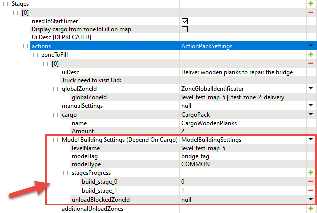

# Model Building Settings

## Overview
The **Model Building Settings** fields allow you to link the process of "building" some object on the map to the process of accomplishing stages or to delivering/taking some object by the player. 

The same process of substituting one model's state on the map with another one and playing the corresponding animation can be used both in Expeditions and SnowRunner not only for "building", but for other scenarios too:

-   "placing a Camera Trap on a tree" (Expeditions)
-   "repairing" some object (SnowRunner)
-   "installing a Radio station" (Expeditions)
-   "gathering resources from an unfinished building" (SnowRunner)
-   and so on 

In the text below, we will use the term "build" meaning any action of that type.

Usage of this functionality requires appropriate animations (e.g., the animation of repairing the bridge) and the model setup. Therefore, currently, you can use this functionality for models where these things are already configured. Typically, these models can be identified by the **\_objective** suffix in their names and you can find them by this suffix in the **Select Asset** window when adding a model.

For example, in SnowRunner, you can use the **bridge_wooden_big_02_objective** model.

The setup of **Model Building Settings** fields will require you to know the names of **stagesProgress** of these models (i.e. states of this object in the process of "building"). For each model used in the game, you can view these states in the XML file of the class of the model. These XML classes can be found in the **initial.pak** archive, in the **\[media\]\\classes\\models\\** folder there. Or, at the same path in the subfolders of DLCs there, in the **\[media\]\\\_dlc** folder (e.g., for SnowRunner, **\[media\]\\\_dlc\\us_07\\classes\\models**).\
In these XML files, the names of these states can be found as a value of the **Name** attribute of the **Subset** tag.

For example, in SnowRunner, in the **bridge_wooden_big_02_objective.xml** model class, you will find such states as **build_stage_0** and **build_stage_1**:

Along with it, you will need to specify the **Tag** for the selected model in the Editor. It is specified in the properties of the model, after selecting this model in **Scene View**.

For example, in the screenshot above, we have specified the "**bridge_tag**" for the **bridge_wooden_big_02_objective** model.

The same tag you will need to specify in the **Model Building Settings** fields, see below.

There can be the following scenarios for "building" objects:

1.  We can link "building" of an object to **delivery of something to the zone**. For Expeditions, this will be the delivery of an [Inventory Item](./../../../../custom_gameplay_entities/inventory_items/custom_inventory_items_overview.md) to some zone. For SnowRunner, this will be delivery of some Cargo.

2.  We can link "building" of an object to **accomplished stages of the objective**.

    **WARNING**: You should not use the *same* **\_objective** model in two separate delivery stages (i.e. in two separate **actions** stages link "building" of this model to the delivery of the cargo). If you want "building" of the same model to depend on two deliveries of the cargo as two separate stages, you should link "building" to the accomplishing of these stages instead. I.e., in this case, you should perform the setup similarly to Scenario 2 below, not Scenario 1.

3.  We can link "building" of an object to **obtaining something from the zone**. For Expeditions, this will be a certain substage of the **takeInventory** stage that will direct the player to take some [Inventory Items](./../../../../custom_gameplay_entities/inventory_items/custom_inventory_items_overview.md) from the particular zone.
For SnowRunner, this will be a scenario for "dismantling" buildings and linking this "dismantling" to the amount of cargo the player obtains from the **...CargoLoading** zone.

## Scenario 1: Linking to Delivery
If we are linking to the delivered item/cargo, we will need to fill in:

-   *For Expeditions*, the fields in the **objectConstruction** stage of the objective, which describes the assignment to deliver some inventory item.
-   *For SnowRunner*, the fields in the **actions** stage of the objective, which describes the assignment to deliver the cargo.

Particularly, the **Model Building Settings (Depend On Cargo)** fields there will be the following:

-   **levelName** – this field is filled in automatically and contains the name of the map.

-   **modelTag** – specify here the same tag that you specified for the model in Editor (see above). For example, the "**bridge_tag**" that we have used above.

-   **stagesProgress** – in this list, you need to link the states of the model to the status of the delivery. Item or cargo can be either delivered or not delivered. So, you need to add two stages here: one for goods not delivered (with `0` value) and one for delivered goods (with `1` value). Names of the stages should be *exactly* the same as the corresponding states of the model (**build_stage_0** and **build_stage_1** in our example, see above).
    
    `TBD: Refactored only to this point.`

    

    By doing so, we will map **build_stage_0** to not delivered goods (the `0` value) and **build_stage_1** to delivered goods (the `1` value).

    
    
    **WARNING**: Names of model states must be specified without spaces, otherwise they will not work.

-   **modelType** – allows you play a specific sound from the predefined set of sounds when a model changes state (e.g. during transition from **build_stage_0** to **build_stage_1** in our example). If this transition is animated, this sound will be played along with the animation. Sounds in this predefined set correspond to the following entities: \"COMMON\" (default value), \"WOOD\", \"BRICK\", \"METAL\", \"LOG\". Custom sounds here are not supported.

    **WARNING**: Currently, this field does not work as intended. The sound is played, but it is always the \"COMMON\" sound, regardless of the selected value. This field will be either fixed, or removed from the future versions of the Editor.

-   **unloadBlockedZoneId** – *(optional field)* allows you to specify a zone that will be blocked for unloading if there is a truck, trailer, or cargo in this zone. Sometimes this could be necessary to avoid clipping and visual artifacts when you are "building" something.

The final set of settings here will look like the following:

## Scenario 2: Linking to Stages

If we are linking to the accomplished stages of the objective (see [[5.16.1]](#stages)), we need to fill in the fields in the **Model Building Settings (Depend On Stages)** section within this objective.

The fields here are specified similarly to Scenario #1. However, in the **stagesProgress** list, you need to create entries corresponding not to the status of delivery but to the number of stages accomplished by the player for this objective.

For example, let's assume that your objective contains two stages and the model has 3 states (let's *assume* that the model has the **build_stage_0**, **build_stage_1**, and **build_stage_complete** states). The default state of the model (when the player has accomplished no stages) will be **build_stage_0**. When the player has accomplished the first stage, we want the model to switch into the **build_stage_1** state. When the player has accomplished two stages, we want the model to switch into the final **build_stage_complete** state. So, in the **stagesProgress** list, we need to map model states of the model (on the left) to the number of accomplished stages (on the right).

**WARNING**: Names of model states must be specified without spaces, otherwise they will not work.\
\
And, in this case, the necessary settings will be the following:

These settings will work as described above.

**NOTE**: In the game, the **bridge_wooden_big_02_objective** model has no **build_stage_complete** state. So, please treat these settings as an illustrative example only.

## Scenario 3: TBD

You can also link the "dismantling" of the building to cargo in the **...CargoLoading** zone.\
See [5.15.1.1.1. Model Building Settings for \...CargoLoading zones](#model-building-settings-for-...cargoloading-zones) for details.

