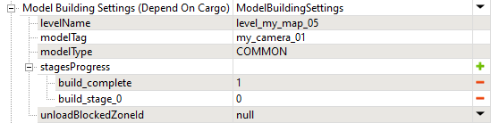

# Model Building Settings

## Overview
The **Model Building Settings** fields allow you to link the process of "building" some object on the map to the process of accomplishing stages or to delivering/taking some object by the player. 

The same process of substituting one model's state on the map with another one and playing the corresponding animation can be used both in Expeditions and SnowRunner not only for "building", but for other scenarios too:

-   "placing a Camera Trap on a tree" (Expeditions)
-   "repairing" some object (SnowRunner)
-   "installing a Radio station" (Expeditions)
-   "gathering resources from an unfinished building" (SnowRunner)
-   and so on 

In the text below, we will use the term "build" meaning any action of that type.

## Process

### Identify Target Model
Usage of this functionality requires appropriate animations (e.g., the animation of installed camera trap or repairing the bridge) and the model setup. Therefore, currently, you can use this functionality for models where these things are already configured. 

Typically, models that contain such animations can be identified by the `_objective` suffix in their names and you can find them by this suffix in the **Select Asset** window when [adding a model][adding_model].

For example, in *Expeditions*, you can use the `animal_tracking_camera_01_objective` model.

### Identify Animation States
The setup of **Model Building Settings** fields will require you to know the names of **stagesProgress** of these models (i.e. states of this object in the process of "building"). For each model used in the game, you can view these states in the *XML file of the class of the model*. 

These XML classes can be found in the [`initial.pak`][initial_pak] archive, in the `[media]\classes\models\` folder there. Or, at the same path in the subfolders of DLCs there, in the `[media]\_dlc` folder.

In these XML files, the names of these states can be found as a value of the `Name` attribute of the `Subset` tag.

For example, in Expeditions, for `animal_tracking_camera_01_objective` model, you will find such states as `build_stage_0` and `build_complete`:

```xml
<ModelBrand
	...
	<Subset IsDefault="true" Name="build_stage_0">
		...
	</Subset>
	
	<Subset Name="build_complete">
		...
	</Subset>
    ...
</ModelBrand>
```

In this code, `build_stage_0` corresponds to the tree without the installed *Camera Trap*.  
And `build_complete` corresponds to the playback of the animation and the tree with the installed *Camera Trap*.


### Set up Tag
You will need to specify the **Tag** for the selected model in the Editor. 

It is specified in the properties of the model, after selecting this model in the **Scene View** panel.

The same tag you will need to specify in the **Model Building Settings** fields, see below.


### Select Scenario for "Building" Objects
There can be the following scenarios for "building" objects:

1.  We can link "building" of an object to **delivery of something to the zone**. In *Expeditions*, this will be the delivery of an [Inventory Item][inventory_item] to some zone configured using the [`objectConstruction`][objectconstruction] stage of the objective. Or, in *Expeditions*, this zone can be "building" objects on its own, without the objective, if it is a [`objectConstructionInZone`][object_construction_in_zone] zone. In *SnowRunner*, this will be [delivery of some Cargo][delivery_of_cargo].

2.  We can link "building" of an object to **accomplished stages of the objective**. I.e., the player accomplishes certain stages of the objective and the model is built.

    **WARNING**: You should not use the *same* `_objective` model in two separate delivery stages. If you want "building" of the same model to depend on two deliveries as two separate stages, you should link "building" to the accomplishing of these stages instead.

3.  We can link "building" of an object to **obtaining something from the zone**. Im *Expeditions*, this will be a certain substage of the [`takeInventory`][takeinventory] stage that will direct the player to take some [Inventory Items][inventory_item] from the particular zone.
In *SnowRunner*, this will be a scenario for "dismantling" buildings and [linking this "dismantling"][mbs_for_cargo_loading_zones] to the amount of cargo the player obtains from the **CargoLoading** zone.

Depending on these scenarios, Model Building Settings can be specified:

-   In the properties of the [stage][stages]. For example, in the [`objectConstruction`][objectconstruction] and [`takeInventory`][takeinventory] stages in Expeditions. Or in the stage of [delivery of Cargo][delivery_of_cargo] in SnowRunner. This will link these MBS to delivery to the target zone or obtaining items from it.

-   In the properties of the [objective][objective], where MBS will be named as "**Model Building Setting (Depend On Stages)**". These settings will be linked to the accomplished stages of this objective.

-   In the properties of the zone. For example, in *Expeditions*, in the [`objectConstructionInZone`][object_construction_in_zone] zone where they will be linked to delivery to this zone. Or, in *SnowRunner*, in the **CargoLoading** zone, which will [link them to "dismantling"][mbs_for_cargo_loading_zones].


### Set up the Model Building Settings
After selecting scenario that you want to implement and, correspondingly, the *place* where you will be specifying Model Building Settings, you need to actually specify them. 

For example, in Expeditions, the **Model Building Settings (Depend On Cargo)** fields of the [`objectConstruction`][objectconstruction] stage corresponding to the delivery of some item will be the following:

-   **levelName** – the name of the map, without the `.xml` extension.

-   **modelTag** – the same tag that you specified for the model in Editor, see [above](#set-up-tag).

-   **stagesProgress** – in this list, you need to map the animation states of the model (see [above](#identify-animation-states)) to the status of the delivery. Item or cargo can be either delivered or not delivered. So, you need to add two stages here: one for goods not delivered – which will correspond to `0` value, and one for delivered goods – which will correspond to `1` value. Names of the stages should be *exactly* the same as the corresponding states of the model, e.g. – `build_stage_0` and `build_complete` above.

    

    By doing so, we will map `build_stage_0` to not delivered goods (the `0` value) and `build_complete` to delivered goods (the `1` value).
    
    **WARNING**: Names of model states must be specified without spaces, otherwise they will not work.

-   **modelType** – *(Currently, this field does not work as intended.)* allows you play a specific sound from the predefined set of sounds when a model changes state. If this transition is animated, this sound will be played along with the animation. Custom sounds here are not supported. 

-   **unloadBlockedZoneId** – *(optional field)* allows you to specify a zone that will be blocked for unloading if there is a truck or, for SnowRunner, trailer or cargo in this zone. Sometimes this could be necessary to avoid clipping and visual artifacts when you are "building" something.

The final set of settings here will look like the following:




**NOTE 1**: If we were linking to the accomplished [stages] of the objective, we would need to fill in the fields in the **Model Building Settings (Depend On Stages)** section within this objective. In these case, fields would be specified similarly. However, in the **stagesProgress** list, you would need to create entries corresponding not to the status of delivery but to the *number of stages* accomplished by the player for this objective.

**NOTE 2**: The MBS properties linked to obtaining items in the [`takeInventory`][takeinventory] stage are specified in a similar way. And, in SnowRunner, [Model Building Settings for CargoLoading zones][mbs_for_cargo_loading_zones] work similarly.


[initial_pak]: ./../../../getting_started/file_paths_and_naming/file_paths.md#source-of-info-initialpak-archive
[inventory_item]: ./../../../../custom_gameplay_entities/inventory_items/custom_inventory_items_overview.md
[objectconstruction]: ./../objectives_in_expeditions/stages/objectconstruction.md
[takeinventory]: ./../objectives_in_expeditions/stages/takeinventory.md
[actions]: ./../objectives_in_snowrunner/stages/delivery_of_goods/goods_delivery.md
[stages]: ./../objectives_overview.md#stages-and-substages
[mbs_for_cargo_loading_zones]: ./../../zones/snowrunner_zones/cargoloading_and_manualloading_zones/model_building_settings_for_cargo_loading_zones.md
[adding_model]: ./../../models/adding_models.md
[object_construction_in_zone]: ./../../zones/expeditions_zones/object_construction_in_zone_zones.md 
[delivery_of_cargo]: ./../objectives_in_snowrunner/stages/delivery_of_goods/goods_delivery.md
[objective]: ./../objectives_overview.md