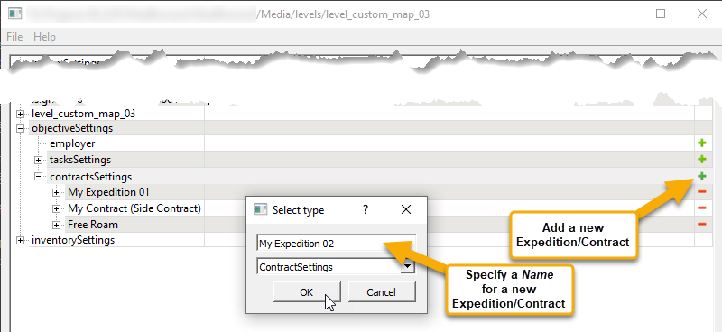

# Common Fields of Objectives

*(NEW) This feature is valid for Expeditions only.*  
*For fields that are common for all objectives in SnowRunner, see [Common Fields of Objectives][common_fields_of_objectives_snowrunner].*

## Common Fields
In *Expeditions*, most fields of [Expeditions][expeditions_and_contracts], [Contracts][expeditions_and_contracts], and [Tasks][tasks] are the same. 

They are the following:

-   *Name* – The name of the objective is specified when you create it, see the screenshot below. Particularly, when you create an Expedition/Contract in the **contractsSettings** list. Or, when you create a Task in the **tasksSettings** list. Please note, that, in the Zone Settings plugin, the *Name* of the objective is displayed as the name of the *section* that contains its properties. After the creation, it can be modified by pressing F2 or by double-clicking.
    
    

    **WARNING**: The names of the objectives must be unique. Even objectives with different types must have different names. For example, if a task and a contract have the same name, this can result in unpredicted behavior.

    **TIP**: If localization is necessary, you can use UI_IDENTIFIERS for localization strings within the text fields of objectives. See [Localization][localization] for details.

-   **Ui Desc** – The description of your objective that will be displayed in the UI of the game.

-   **Sandbox Objective** – *(Optional; Should not be used in Expeditions)* This field should not be used and will be removed. (`TBD`)

-   **Blocked By Map** – *(Optional; Should not be used in Expeditions)* In *Expeditions*, this field should not be used and will be removed. (`TBD`) 

-   **Reward Description** – *(Optional)* The *description* of the reward that will be given to the player after accomplishing this objective. This descriptiion will be displayed in the UI. For details on rewards, see [Rewards][rewards].

-   **Don't show reward pop-up** – *(Optional; Should not be used in Expeditions)* In *Expeditions*, this field should not be used and will be removed. In *SnowRunner*, it defines whether or not the game should display the reward pop-up to the player. (`TBD`)

-   **Don't show markers ingame and on minimap** – *(Optional; Should not be used in Expeditions)* In *Expeditions*, this field should not be used and will be removed. In *SnowRunner*, this option can be used specifically for maps that will be played in Hard Mode. If you enable it, the precise markers for some objects that are shown in the game and on minimap will not be shown to the player. (`TBD`)

-   **minimapList** – *(Optional; Should not be used in Expeditions)* In *Expeditions*, this field should not be used and will be removed. In *SnowRunner*, this drop-down is used for tweaking the UI of an objective (shown to the player on the minimap) a bit. (`TBD`)

-   **isNeedRaceMusic** – *(Optional; Should not be used in Expeditions)* In *Expeditions*, this field should not be used and will be removed. This option was made specifically for *SnowRunner*'s DLC 7 ("Season 7: Compete & Conquer"). It allows you to switch regular music that is played on your map to the predefined racing music used in DLC 7. (`TBD`)

-   **isCoop** – *(Optional; Should not be used in Expeditions)* In *Expeditions*, this field should not be used and will be removed. In *SnowRunner*, when enabled, this option will enable the cooperative game logic for this objective and will hide it in the single player game. This option was developed specifically for such cooperative objectives as racing Contests of the SnowRunner's DLC 7 ("Season 7: Compete & Conquer"). This option is not intended to work with objectives of different types and will have unpredicted behavior for them (use at your own risk). (`TBD`)

-   **Can’t be canceled or skipped** – *(Optional; Should not be used in Expeditions)* This field should not be used and will be removed. (`TBD`)
-   **Expedition for tutorial** – *(Optional; Should not be used in Expeditions)* This field should not be used and will be removed. (`TBD`)

-   **isRepeatable** – *(Optional; Should not be used in Expeditions)* In *Expeditions*, this field should not be used and will be removed. In *SnowRunner*, this option allows you to mark this objective as a repeatable one. If this option is enabled, the player becomes able to repeat the execution of the objective after finishing it. In *Expeditions*, it can be used only for [Tasks][tasks]. (`TBD`)

-   **Stages** – Settings of assignments given to the player during the objective. Every *Stage* corresponds to a group of assignments of particular types that the player needs to accomplish. These assignments within a *Stage* are called *Substages*. For details on Stages and Substages, see [Stages in Expeditions][stages_and_substages].

-   **Model Building Setting (Depend On Stages)** – *(Optional)* Settings of the model that will change its visual state (will be "built", will appear/disappear, etc.) when the player accomplishes certain stages of the objective. See [Model Building Settings][model_building_settings] for details.

-   **Blocker Objectives** – *(Optional)* The list with the ***names*** (see *Name* above) of objectives you need to accomplish to unlock the current objective.

-   **Required inventory** – *(Optional, Should be used for Expeditions only.)* The list of [Inventory Items][inventory_items] that are required for the execution of this objective. If this list is filled for an [Expedition][expeditions_and_contracts], the player will *not* be able to start it without this inventory. 

    **WARNING 1**: Currently, the **Required inventory** list should be used for Expeditions *only*. It should *not* be used for Contracts or Tasks. In the future, it will be usable for Contracts too.

    **WARNING 2**: For an [Expedition][expeditions_and_contracts], all Inventory Items that are added to the **Required inventory** list (by **Type** or by **itemName**) *must* be available to the player in Headquarters. I.e., in the case of custom [Inventory Items][inventory_items], every such item must have the [**canTakeInHq**][cantakeinhq] option *enabled*. Otherwise, the player will not be able to add the required item to Inventory when preparing for the Expedition and will not be able to start it. 

    Every record of the required inventory in this list has the following fields:

    -   **itemName** – *(Optional; Currently not implemented field.)* The identifier of the particular required [Inventory Item][inventory_items]. (`TBD`)
 
    -   **Type** – The type of required [Inventory Item][inventory_items]. One of the predefined [types][inventory_items_types] of inventory items should be selected here. For the full list of these types, see [Appendix: Types of Inventory Items][inventory_items_types].

        **NOTE**: For the system, the specified **itemName** (see above) of the item has more priority than **Type**. However, if **itemName** is not specified, the necessary item will be required based on **Type**.

    -   **Required num** – The reqired amount of the specified inventory item.

-   **Required crew** – *(Optional, Should be used for Expeditions only.)* The list of *Specialists* that are required for the execution of this objective. If this list is filled for an [Expedition][expeditions_and_contracts], the player will *not* be able to start it without these crew members.  

    **WARNING**: Currently, the **Required crew** list should be used for Expeditions *only*. It should *not* be used for Contracts or Tasks. In the future, it will be usable for Contracts too.

    Every record of the required Specialist in this list has the following fields:

    -   *Type* – The type of *Specialist* that is required. One of the predefined types of *Specialists* should be selected here. (`TBD`)

-   **Required truck addons** – *(Optional, Should be used for Expeditions only.)* The list of Truck Addons that are required for the execution of this objective. If this list is filled for an [Expedition][expeditions_and_contracts], the player will *not* be able to start it without these addons on one of the deployed trucks.  
    
    **WARNING**: Currently, the **Required truck addons** list should be used for Expeditions *only*. It should *not* be used for Contracts or Tasks. In the future, it will be usable for Contracts too.

    Every record of the addon in this list has the following fields:

    -   *Type* – The type of Truck Addon that is required. Can be one of the following:

        -   `SEISMIC_VIBRATOR`
        -   `METAL_DETECTOR`
        -   `SIDEBOARD`
  
-   **rewards** – *(Optional)* The list of the rewards that will be given to the player after accomplishment of the objective. For example, you can give a new truck as a reward to the player using the **ObjectiveRewardItem** type. Or, unlock the particular zone with particular properties using **ObjectiveRewardOpenZoneProperties**. Or, even dynamically change the properties of the particular zone using **ObjectiveRewardUpdateZoneProperties**. For details, see [Rewards][rewards].

-   **trucksWithoutForceGrounding** – *(Optional)* The list of trucks that will *not* be correctly positioned on the map *according to the height of the terrain*. I.e., the list of trucks that are *intentionally* positioned incorrectly (e.g. are placed within the mud, below the terrain level). To add a truck to this list, assign an **Id** to it in the properties of the truck in the Editor, and add this **Id** to the list.

-   **bonusRewards** – *(Optional; Valid for Expeditions only)* The list of additional *money rewards* that will be given to the player if the particular condition has been fulfilled during the execution of an *Expedition* objective. For example, you can give additional money to the player, if the truck's damage taken during the execution of the objective has been less than a certain limit. Or, when the player has used *Recovery* less than the certain number of times. For details, see [Rewards][rewards].

    **NOTE**: **bonusRewards** are valid for [Expeditions][expeditions_and_contracts] only. They are *not* valid for [Contacts][expeditions_and_contracts] and [Tasks][tasks].

## Fields that Are Specific for Particular Types of Objectives
However, along with common fields, there are fields that are specific for particular types of objectives and are available only for them.

For fields specific for *Expeditions* and *Contracts*, see [Expeditions and Contracts][expeditions_and_contracts].

For fields specific for *Tasks*, see [Tasks][tasks].

[common_fields_of_objectives_snowrunner]: ./../objectives_in_snowrunner/common_fields_of_objectives.md
[expeditions_and_contracts]: ./expeditions_and_contracts.md
[tasks]: ./tasks.md
[localization]: ./../../../additional_info_on_maps/localization/localization.md
[stages_and_substages]: ./stages/stages_in_expeditions.md
[model_building_settings]: ./../model_building_settings/model_building_settings.md
[inventory_items]: ./../../../../custom_gameplay_entities/inventory_items/custom_inventory_items_overview.md
[inventory_items_types]: ./../../../../custom_gameplay_entities/inventory_items/appendix_types_of_inventory_items.md
[cantakeinhq]: ./../../../../custom_gameplay_entities/inventory_items/general_properties_of_inventory_items.md
[rewards]: ./rewards.md