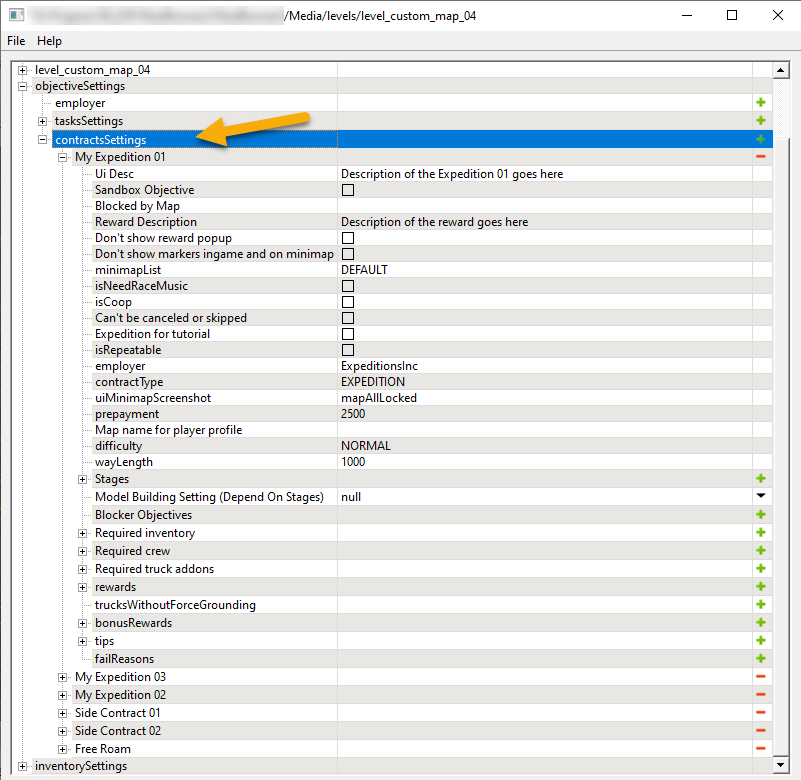
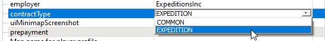

# Expeditions and Contracts

*(NEW) This topic is valid for Expeditions only.*

## Overview
Both *Expeditions* and *Contracts* are created within the **contractsSettings** subection of the [**objectiveSettings**][objectives_overview] section, see below.

Every created record in this list corresponds to either an Expedition or a Contract.

Fields that set the properties of the Expedition or the Contract are the same for them. Most of these fields are [common for all types of objectives][common_fields_of_objectives], but there are some [Expedition/Contract-specific fields](#expeditioncontract-specific-fields) that are listed below.

The number of Expeditions and Contracts that can be performed by the player within the map is unlimited.

## Important Nuances

### Expedition vs. Contract
The **contractType** field of the record in the **contractsSettings** list will define whether this record corresponds to an Expedition or to a Contract.

**TIP**: You can change the value of this field later on – to create an Expedition from a Contract and vice versa.

### A Must: Expedition and Deploy Zone
At least one Expedition is required for the player to be able to load a standalone map. 

Moreover, there needs to be at least one [Deploy zone][deploy_zones] on this map to allow the player to deploy their trucks to it during this Expedition.

**NOTE**: The single required Expedition may be a [*Free Roam*](#free-roam-expedition) one.

### Progression
If there are multiple Expeditions on the same map, the progress of the player on the map will be transferred between them. 

I.e., if the player has explored some area or has built some FOB Modules in Expedition A, they will remain in the same state as they were at the end of Expedition A when the player will start Expedition B on the same map.

The following is "saved" between Expeditions:

-   Explored areas
-   Built FOB modules
-   Opened zones

However, the location of *Air Drops* and their contents are randomized for every Expedition. I.e., in a new Expedition – they will be different, if it is correctly configured. See [Inventory Settings][inventory_settings] for details.

Content of FOB Modules (available *Fuel*, etc.) is also refreshed in every new Expedition.

However, there is one exception: items that the player puts in [*Warehouse*][fob_module_storage_zones] (`EXTRA_STORAGE`) will be stored and will be available in the next Expedition.  

### Order of Expeditions
If Expeditions are unlocked, the player is able to perform them in any order.

However, as other objectives, Expeditions can be locked by other objectives – to be performed only after their successful accomplishment. You can use the **Blocker Objectives** list for such locking, see [Common Fields of Objectives][common_fields_of_objectives] for details.

### Free Roam Expedition
You can add the *Free Roam* mechanics to your map – i.e., allow the player to explore the map without any restrictions or requirements.

To support this mechanics, you need to create a special Expedition that has only one Stage and one [**freeRoamInfo**][freeroaminfo] substage within it. See [freeRoamInfo][freeroaminfo] for details.

## Expedition/Contract-Specific Fields

Most fields of the Expeditions/Contracts are common for all objectives, see [Common Fields of Objectives][common_fields_of_objectives] for details.

Fields that are specific for Expeditions/Contracts are the following:

-   **employer** – The employer of the Expedition or Contract. In this field, you can:

    -   Select one of the employers from the original game:
        -   `TVCompany` – "Great Outdoors"
        -   `NationalPark` – "Mineral Valley"
        -   `OreCompany` – "G. Rocks Group"
        -   `TravelAgency` – "Apex Europe"
        -   `ExEarth` – "TerraScout Geological"
        -   `ArizonaStateGovernment` – "Arizona Government"
        -   `ArizonaMuseumofNaturalHistory` – "Arizona National Museum"
        -   `TheGreatOutdoors` – "Great Outdoors"
        -   `Expeditionslnc` – "Expeditions Inc"

    -   Specify a *custom employer* that you need to create beforehand. See [Custom Employers][custom_employers] for details.

-   **contractType** – This field allows you to select whether this objective is an Expedition or a Contact:
    -   `COMMON` – This objective is a Contract.
    -   `EXPEDITION` – This objective is an Expedition.
     
-   **uiMinimapScreenshot** – *(Valid for an Expedition only.)* This field defines the file name of the small "briefing" picture of the map that will be displayed in the UI for this Expedition (in the Expedition Selection screen). This file name should be specified without file extension. The format of this picture should be `PNG`, its dimensions should be `400 х 400`, the file of the picture should be put into the folder of the map in `\Media\prebuild\`, into the `ui\textures` subdirectory. For example, the value of the field should be `my_custom_map_07` for the `\Media\prebuild\<name_of_map>\ui\textures\my_custom_map_07.png` image. (`TBD`)

    **NOTE**: The default value of the **uiMinimapScreenshot** filed (`mapAllLocked`) corresponds to the "No Signal" briefing picture. 

-   **prepayment** – *(Valid for an Expedition only.)* The amount of money that will be given to the player as the prepayment for the Expeditions. This field is valid for the Expedition objectives only.

-   **Map name for player profile** – *(Optional)* (`TBD`)

-   **difficulty** – *(Valid for an Expedition only.)* The difficulty of the Expedition that will be displayed in the UI of the Selected Expedition screen as **Difficulty**.

-   **wayLength** – *(Valid for an Expedition only.)* The approximate way length of the player within this Expedition. Will be displayed in the UI of the Selected Expedition screen as **Distance**.

-   **tips** – *(Valid for an Expedition only.)* Set of standard helpful tips that displayed in the UI of the Selected Expedition screen within the **TIPS** section, along with **Difficulty** and **Distance**. Particularly, here you can add the following standard tips that will be displayed next to the **Truck**, **Terrain**, **Conditions**, and **Objects** labels:

    -   `TAKE_TRUCK_SCOUT` – Truck: "Scout"
    -   `TAKE_TRUCK_HIGHWAY` – Truck: "Offroad"
    -   `TAKE_TRUCK_TWO` – Truck: "Two trucks"
    -   `TAKE_EQUIP_SUSPENSION` – "Model of suspension" *(not used in the original game)*
    -   `TERRAIN_HEIGHT` – Terrain: "Height differences"
    -   `TERRAIN_WATER` – Terrain: "Watery terrain"
    -   `TERRAIN_RAVINE` – Terrain: "Ravines"
    -   `TERRAIN_WOODS` – Terrain: "Woodland"
    -   `CONDITIONS_TRAVEL` – Conditions: "Travel to another map"
    -   `CONDITIONS_TRUCK` – Conditions: "Deliver truck"
    -   `CONDITIONS_REPAIR` – Conditions: "Need more spare parts"
    -   `OBJECTS_BRIDGE` – Objects: "Bridge construction"

-   **failReasons** – *(Optional; Should not be used in Expeditions)* In *Expeditions*, this field should not be used and will be removed. (`TBD`)

[objectives_overview]: ./../objectives_overview.md
[common_fields_of_objectives]: ./common_fields_of_objectives.md
[deploy_zones]: ./../../zones/expeditions_zones/deploy_zones.md
[freeroaminfo]: ./stages/freeroaminfo.md
[custom_employers]: ./../custom_employers.md
[inventory_settings]: ./inventory_settings.md
[fob_module_storage_zones]: ./../../zones/expeditions_zones/zones_of_fob_modules/fob_module_storage_zones.md