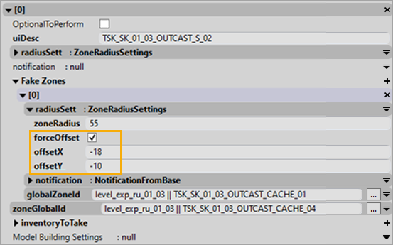

# Fake Zones

!!! info

    This feature is valid for Expeditions only.

## Overview
The **Fake Zones** mechanics allows you to add *possible, but – after exploration – not valid* zones for the execution of the particular [substage][substage] of the objective by the player.

I.e., if the substage of the objective contains some configured Fake Zones, the player will need to visit them, but, after visiting, will be informed that they are not valid enough and will need to try other zones to accomplish the substage.

Typically, the *Fake Zones* mechanics is used in situations when the player needs to find something or is searching for the suitable location to do something – to expand the list of posible vartiants by the ones that eventually will be invalid.

For example, this can be used for a task with the **objectConstruction** [substage][substage] that tells the player to deliver and install a *Portable Meteostation* in the suitable location. If, along with the actual target zone that is "suitable", you configure the **objectConstruction** [substage][substage] with `2` Fake Zones – the player will initially see `3` possible locations for the Meteostation after activation of the task. They will all look the same way and the player will not know whether this or that zone is "suitable" beforehand. The player will be able to visit these `3` zones in any order. However, only the actual target zone will allow the player to complete the substage, `2` Fake Zones will just inform the player that their search needs to be continued. And, Fake Zones will be skipped once the player locates the actual target zone and completes the substage – i.e., their visiting is optional. 

## Setup
In Expeditions, almost all [substages][substage] contain the **Fake Zones** list. The only exceptions are **truckDelivery** and **freeRoamInfo** substages.

To add Fake Zones to your substage:

1.  Create these zones in the Editor.

    **NOTE**: Icons of these zones should be the same as the icon of the actual target zone of the substage. Obviously, this is necessary to make all zone variants – both suitable and non-suitable – look similarly to the player.

2.  Add the corresponding number of records to the **Fake Zones** list of the necessary substage. For every Fake Zone record, you will need to specify:

    -   **globalZoneId** – link to the created Fake Zone from step 1.
    -   **notification** – settings of the notification displayed to the player upon visiting this zone. See [Notifications][notifications] for details.

**WARNING**: Along with Fake Zones, you must also specify the link to the *actual target zone* that will be valid for the exectution of this Substage. It is also specified in the properties of the substage, typically in the **globalZoneId** field (but *not* within the **Fake Zones** section). If your substage contains Fake Zones, but no valid target zone is configured, this will lead to an error.

Fake Zones do not depend on the location and the size of the main zone. You can set the Fake Zone's offset from the center of this Fake Zone's main zone with the help of the **Offset** parameters:

[substage]: ./stages/stages_in_expeditions.md
[notifications]: ./notifications.md