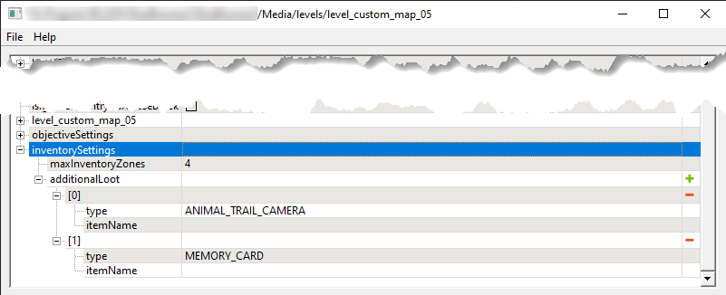

# Inventory Settings

*(NEW) This feature is valid for Expeditions only.*

## Overview
At the beginning of a new [Expedition][expeditions_and_contracts], the location of *Air Drops* and their contents are randomized.

Particularly, the game selects only the certain specified number of *Air Drops* from all *potential* Air Drop zones with [*ZonePropertyInventoryStorage*][zone_property_inventory_storage] props, and spawns only these zones.

Moreover, the Inventory Items and Consumables within these zones are also spawned according to probabilities (**chance**) specified for them in these zones.

And, if necessary, particular Inventory Item(s) can be automatically added to one of these zones.

## Setup

### Random Selection of Air Drop Zones
This effect is obtained by the proper setup of following parameters:

-   **alwaysSpawn** checkbox – This option in [*ZonePropertyInventoryStorage*][zone_property_inventory_storage] prop of the zone defines whether or not this zone should be spawned during every Expedition to this map. If it is *disabled*, the zone will automatically participate in the "random selection". If it is *enabled*, the zone will be an exception and will be spawned always.

-   **maxInventoryZones** parameter – This parameter is availavle while configuring [Zones][zones_overview] and [Objectives][objectives_overview] properties, in the Zone Settings plugin, in the **inventorySettings** section there. The value of this parameter defines the *number of zones that will be selected for spawning* from *all* [*ZonePropertyInventoryStorage*][zone_property_inventory_storage] zones with *disabled* **alwaysSpawn** option available on the map. 

*inventorySettings section in the Zone Settings plugin:*

### Random Selection of Zone Content
If the zone itself has been selected for spawning, items within it will be spawned with the probabilities specified in the [*ZonePropertyInventoryStorage*][zone_property_inventory_storage] prop of this zone.

Particularly, they will be spawned according to values of the **chance** fields that are specified:

-   For every possible Inventory Item – in [*ZonePropertyInventoryStorage*][zone_property_inventory_storage] prop \> **slotsSettings** \> `[slot]` \> **possibleItems** \> `[possible item]`.
-   For every possible Consumable Item – in [*ZonePropertyInventoryStorage*][zone_property_inventory_storage] prop \> **fuelSlotSettings**, **repairsSlotSettings**, and **wheelsSlotSettings**. 

### Additional Spawning of Inventory Items
If necessary, you can also add a particular Inventory Item(s) to one of these [randomly selected zones](#random-selection-of-airdrop-zones), in addition to their [randomly selected content](#random-selection-of-zone-content).

These items need to be configured also in the Zone Settings plugin, within the **inventorySettings** \> **additionalLoot** section (see screenshot above).

Every such item can be added using the following properties of the record within the **additionalLoot** list:

-   **type** – The type of [Inventory Item][inventory_items] to be added. One of the predefined [types][inventory_items_types] of inventory items should be selected here. For the full list of these types, see [Appendix: Types of Inventory Items][inventory_items_types].

-   **itemName** – *(Optional)* The identifier of the particular [Inventory Item][inventory_items] to be added.
    
    **NOTE**: For the system, the specified **itemName** (see above) of the item has more priority than **type**. However, if **itemName** is not specified, the necessary item will be added based on **type**.

[expeditions_and_contracts]: ./expeditions_and_contracts.md
[zone_property_inventory_storage]: ./../../zones/expeditions_zones/inventory_storage_zones.md
[zones_overview]: ./../../zones/zones_overview.md
[objectives_overview]: ./../objectives_overview.md
[inventory_items]: ./../../../../custom_gameplay_entities/inventory_items/custom_inventory_items_overview.md
[inventory_items_types]: ./../../../../custom_gameplay_entities/inventory_items/appendix_types_of_inventory_items.md