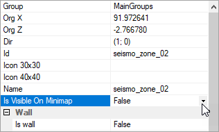

# Seismograph Settings

*(NEW) This feature is valid for Expeditions only.*  
*For the **Seismograph Settings** substage in SnowRunner, see [Seismograph Usage][seismograph_settings_snowrunner].*

## Overview
The **Seismograph Settings** [substage][stages_and_substages] corresponds to an assignment where the player needs to perform seismic prospecting in the particular zone(s), using the Seismic Vibrator frame module. Zones where the Seismic Vibrator needs to be used are not displayed on the map. The player needs to locate these zones using distances to them that are displayed in the UI when this substage is active.

Zone locators of zones for seismic prospecting should *not* be visible to the player. To hide a zone locator, you can set the **Is Visible On Minimap** option to `False` in the zone locator properties in the Editor. However, if this zone has empty **props** in the Zone Settings plugin dialog, this is not required and the locator will be hidden automatically.

**NOTE 1**: This [substage][stages_and_substages] has the same settings as the [**visitAllZones**](./visitallzones.md) substage. However, *not all* of these settings can be used when setting up the **Seismograph Settings** substage. 

**NOTE 2**: This substage may have [multiple target zones][zone_related_assignments] where the player needs to perform seismic prospecting.These zones correspond to records in the **zones** list: `[0]`, `[1]`, etc. Target zones and other options are set up on the per zone basis (within these records).

## Setup
After selecting the appropriate settings type, the **Seismograph Settings** section will contain the following settings:

-   **notification** section – *(Optional; Currently does not work.)* Settings of the notification displayed to the player upon accomplishing the whole substage. See [Notifications][notifications] for details.

-   **zones** list – The list of [zone-related assignments][zone_related_assignments] correspoding to zones where the player needs to perform seismic prospecting. At least one record in this list is required. If you add multiple records to this list, the player will need to perform seismic prospecting in *all* of these zones, in any order.

    -   `[0]`, `[1]`, `[2]`, etc. – The record of the particular [zone-related assignment][zone_related_assignments] correspoding to the zone where the seismic prospecting needs to be performed.

        -   **OptionalToPerform** – *(Optional)* Enabling this option will mark this substage as optional. By default, this option is disabled and the substage is required. See [Optional Substages][optional_substages] for details.

        -   **uiDesc** – The name of the substage that will be displayed in the UI of the game. The distance to the zone selected in **globalZoneId** (see below) will be displayed next to it. 

        -   **Truck need to visit Uid** – *(Cannot be appropriately used in Expeditions.)* In SnowRunner, this field allows to specify the identifier of the truck that the player needs to perform seismic prospecting of the target zone, where this truck is initially located on the map and has the same **Id** in its properties. However, in Expeditions, trucks are selected by the player and deployed to Deploy zones and there is no ability to sit into the truck that was *initially* (before deploying) located on the map. That's why this field cannot be used in Expeditions and there is no need to use it.

        -   **mayVisitZoneWithDrone** – *(Should not be used for **Seismograph Settings** substage.)* This field is not valid for **Seismograph Settings** substage and should not be used for it.

        -   **visitWithDroneOnly** – *(Should not be used for **Seismograph Settings** substage.)* This field is not valid for **Seismograph Settings** substage and should not be used for it.

        -   **notification** – *(Optional)* The notification to be displayed after completion of this [zone-related assignment][zone_related_assignments] of the substage. See [Notifications][notifications] for details.  

        -   **Fake Zones** – *(Should not be used for **Seismograph Settings** substage.)* This field is not valid for **Seismograph Settings** substage and should not be used for it.

        -   **globalZoneId** – The target zone that needs to be visited by the player. The zone locator of this zone should remain hidden, either automatically, or by the manual setup, see [above](#overview).

        -   **radiusSett** – *(Can be used for **Seismograph Settings** substage, but is not recommended; Optional)* The radius of the [Zone Search Area][zone_search_area] where you want the player to search for the target zone. This field can be used for **Seismograph Settings** substage, similarly to its usage for other substages. See [Zone Search Area][zone_search_area] for details. In the case of usage, it will highlight the approximate area of the target zone on the map, with the target zone not necessarily in the center of this area. However, this usage is not recommended, since it provides additional clues in the UI along with the standard ones.

[seismograph_settings_snowrunner]: ./../../objectives_in_snowrunner/stages/seismograph_usage.md
[stages_and_substages]: ./stages_in_expeditions.md
[zone_related_assignments]: ./stages_in_expeditions.md#multiple-zone-related-assignments-within-substage
[notifications]: ./../notifications.md
[optional_substages]: ./../optional_substages.md
[zone_search_area]: ./../zone_search_area.md
