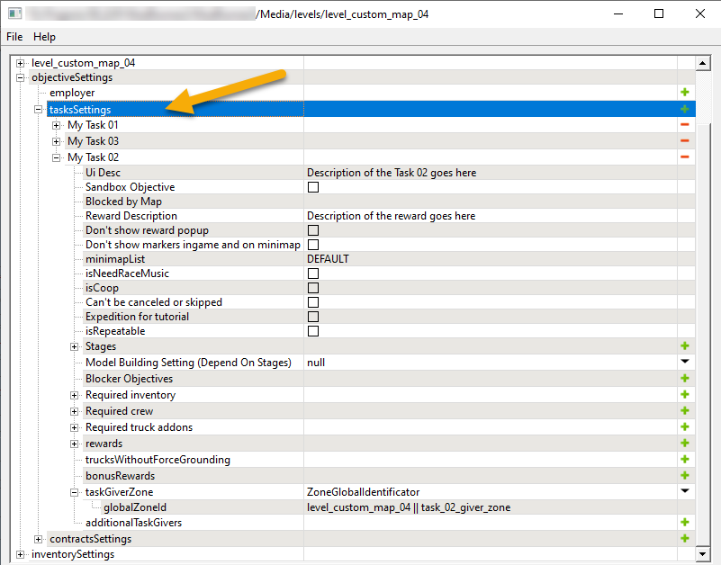

# Tasks

*(NEW) This topic is valid for Expeditions only.*

## Overview
Tasks are created within the **tasksSettings** subection of the [**objectiveSettings**][objectives_overview] section.

Every record in this list corresponds to a Task.

Most of properties of the Task are [common for all types of objectives][common_fields_of_objectives]. However, there are some [Task-specific fields](#task-specific-fields) that are listed below.

The number of Tasks that can be created for the map is unlimited.

## Important Nuances

### A Must: Task Giver Zone
You must specify at least one zone as a *Task Giver* (**taskGiverZone**, see below). 

This zone is necessary for the player to be able to activate the task.

## Task-Specific Fields 
Most fields of a Task are common for all objectives, see [Common Fields of Objectives][common_fields_of_objectives] for details.

Along with these fields, Tasks have two fields that are specific for them:

-   **taskGiverZone** – the identifier of the zone where the task can be activated by the player.

-   **additionalTaskGivers** list – the list with identifier of additional zones that activate the task.

[objectives_overview]: ./../objectives_overview.md
[common_fields_of_objectives]: ./common_fields_of_objectives.md