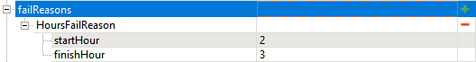

# Contests

*This topic is valid for SnowRunner only.*  

## Contest-Specific Fields
In *SnowRunner*, most fields of all objectives are [the same](./common_fields_of_objectives.md).

However, along with them, there are fields that are specific to Contests.

They are the following:

-   **taskGiverZone** – the ID of the zone where the contest is activated (by the player).

-   **additionalTaskGivers** list – the list with IDs of additional zones that activate the contest.

-   **failReasons** – the list that contains the conditions for failure of the contest:

    **NOTE**: You can specify multiple reasons for failure in the **failReasons** section.

    -   **ChangeTruckFailReason** – failure due to changing the truck during the objective.

    -   **CockpitFailReason** – failure due to switching to the cockpit view during the objective.

    -   **DamageFailReason** – failure by the amount of the received damage. The damage limit is specified in the maxDamage field.

    -   **GarageFailReason** – failure due to entering the Garage during the objective.

    -   **HoursFailReason** – failure by time, specified as the period of time during which the player needs to finish the Contest. When specifying the time of the beginning of the contest (**startHour**) and the maximum time when it needs to be accomplished (**finishHour**), you need to specify hours as integers and in `24`-hour format. For example, the following settings will set the contest to start at `2:00 AM` and will set its deadline to `3:00 AM.`
    
        
    
        **NOTE**: You cannot specify float values (e.g. `1.5`) here, only integers (e.g. `1` or `2`).
        If the player will take this contest earlier (say, at `11:00 PM`), the game will switch its time on the map to `2:00 AM` automatically.

    -   **RecoveryFailReason** – failure due to usage of the Recovery feature by the player during the objective.

    -   **TimeFailReason** – failure by time. The time limit (in seconds) is specified in the **timeLimitSec** field.

        **WARNING**: All created Contests have 3 default **failReasons**: **ChangeTruckFailReason**, **RecoveryFailReason**, and **GarageFailReason** (the in-game contests have the same fail reasons). You cannot remove them, but you can specify additional **failReasons**, if necessary.

-   **pvpCoopOn** – this option was developed specifically for racing Contests of the *DLC 7* (*"Season 7: Compete & Conquer"*). It enables the competition logic of these Constests for mutliple participating players.
    
    **NOTE**: For correct behaviour of racing Contests, you will also need to enable the **isCoop** option for them, see [Common Fields of Objectives](./common_fields_of_objectives.md) above. I.e., *both **pvpCoopOn** and **isCoop** must be enabled for all racing Contests.

-   **needToStartTimerInGiverZone** – *This option was implemented specifically for racing Contests.* By default, it is enabled, which means that the timer of a Contest starts when the player activates (or restarts) it in the **taskGiverZone** of this Contest. However, sometimes, you may want to start the timer *not* directly after the activation or restart of the Contest, but after the particular actions have been done by the player.  
    For example, you may want to start it when the player reaches the special starting zone of the race (by accomplishing the corresponding **visitAllZones** Stage of this Contest).  
    In this case, you will need to disable the **needToStartTimerInGiverZone** for the Contest, which will tell the game to start the timer *at the beginning of the first Stage where the* ***needToStartTimer*** is *enabled*.  
    However, by default, **needToStartTimer** is enabled for every Stage.  
    So, you will need to disable *not only* **needToStartTimerInGiverZone** for the Contest as a whole, but *also disable* **needToStartTimer** for the first few Stages where you don't want the timer to start.  
    In our example, you will need to disable it for the first **visitAllZones** Stage corresponding to the player reaching the starting zone.  
    **See also**: the **needToStartTimer** in [Stages in SnowRunner](./stages/stages_in_snowrunner.md#fields-that-are-common-for-all-stages) above.

-   **recoverContestZone** – this section was developed specifically for racing Contests of the *DLC 7* (*"Season 7: Compete & Conquer"*). Its **globalZoneId** field allows you to set up a special target zone for the Recover feature available in the **Functions** menu specifically for this Contest. Typically, this zone is the starting zone of this racing Contest. If this zone is specified and the player uses Recover during the Contest, then this player will be recovered to the starting zone, not to the Garage or a different **ZonePropertyRecovery** zone that can be too far away from the racing location.

## Warning on changeTruck Stage
Your contests should *not* contain the **changeTruck** stage in them. 

The usage of this stage is prohibited for contests. 

Otherwise, you will create a contest that the player will not be able to accomplish, due to the default **ChangeTruckFailReason**, which you cannot remove (see above).