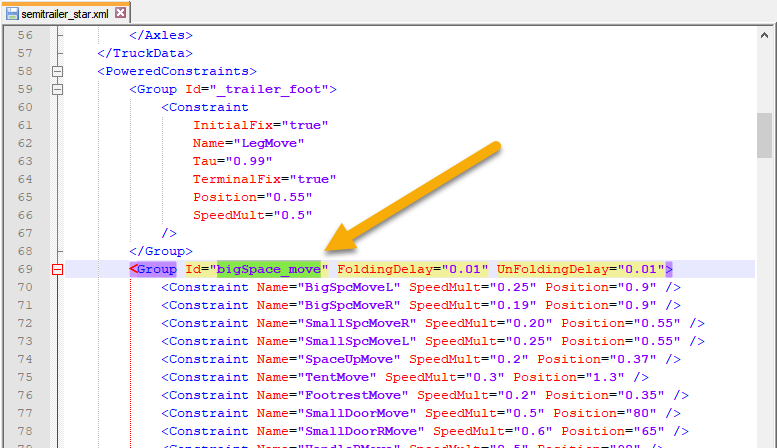
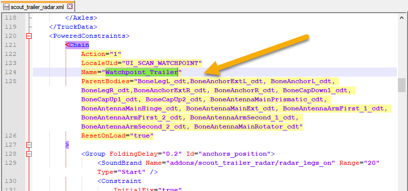

# Freezing Trailers

*This topic is valid for SnowRunner only.*  

Using the **FreezeTrailer** settings while configuring an objective, you can freeze and unfreeze the particular trailer or semitrailer and make this trailer play some animation based on Powered Constraints, if the XML class of the tralier has them described.

**WARNING**: The **FreezeTrailer** feature can be used *for trailers and semitrailers only*. It cannot be used for trucks. If you specify the **Id** of the truck in the **Trailer Uid** field, the game will *not* freeze or unfreeze it and the animation will *not* work too.

The intended usage of the **FreezeTrailer** settings is similar to their usage in *DLC 11* (*"Season 11: Lights & Cameras"*): you can create two "freezing" objectives – freeze a target trailer in one of them and unfreeze it in the other. The "unfreezing" objective should be locked (using **Blocker Objectives**) by the "freezing" one – to keep the correct order of these operations. 

For example, you can create 3 contracts: the first one to deliver a trailer to Zone A that will freeze it there, the second (intermediate one) that will unfreeze it there (which will make it attachable again), and the third one to deliver the unfrozen trailer to Zone B.

Or, you can create a single "freezing" objective and leave the target tailer in its frozen form, if you want to.

The frozen trailer will be totally locked. I.e., you will not be able to attach a frozen trailer to a truck or move it from the place where it was frozen. Unfreezing will reset this to the normal state.

If necessary, when freezing or unfreezing the target trailer you can play an animation based on Powered Constraints – if the XML class of the tralier has them described. The name of this animation should be specified in the **Animation Name** field, see below.

**WARNING**: However, when configuring the objective that uses the **FreezeTrailer** feature and zones of this objective, you should take into account that the Powered Constraints-based animation uses the physics of the game, which has some limitations. Particularly, all physics works only *near the truck* and does *not* work when the truck is far away. That's why, you should create your objective with the **FreezeTrailer** feature in such a way that, at the moment when the player accomplishes this objective and activates the **FreezeTrailer** feature, the truck and the target trailer are close to each other. Otherwise, if the target trailer and the truck are far away, the animation of the trailer will be played *not* in the moment of the accomplishment of the objective, but *the next time the truck will move closely to the trailer*.

The fields of this feature are the following:

-   **Trailer Uid** – The identifier of the target trailer or semitrailer, which must be exactly the same value as the value of the **Id** field in the trailer's properties.

-   **Animation Name** – (optional field) The name of the animation based on Powered Constraints that will be played when freezing or unfreezing the trailer. Depending on the configuration of `<PoweredConstraints>` in the XML class of the target trailer, there are two scenarios for setting up this value:

    -   *If there is no `<Chain>` tag within `<PoweredConstraints>` that is responsible for the necessary animation in the XML class of the trailer:*  
        In this case, you need to specify here the value of the `Id` attribute of the corresponding `<Group>` tag within `<PoweredConstraints>` that is responsible for the Powered Constraints-based animation in the XML class of the target trailer.  
        For example, for the `semitrailer_star.xml` trailer, which is located in the `[media]\_dlc\dlc_11\classes\trucks\trailers` folder of the [`initial.pak`][initial_pak] archive, it will be "`bigSpace_move`" (without quotes):  
        

    -   *If there is a `<Chain>` tag within `<PoweredConstraints>` that is responsible for the necessary animation in the XML class of the trailer:*  
        In this case, you need to specify here the value of the `Name` attribute of the `<Chain>` tag within `<PoweredConstraints>` that is responsible for the Powered Constraints-based animation in the XML class of the target trailer.  
        For example, for the `scout_trailer_radar.xml` trailer, which is located in the `[media]\_dlc\dlc_1_1\classes\trucks\trailers` folder of the [`initial.pak`][initial_pak] archive, it will be "`Watchpoint_Trailer`" (without quotes):  
        

        **NOTE**: For info on Powered Constraints, `<Chain>`, and `<Group>` – see [Powered Constraints: Overview][powered_constraints_overview].

-   **type** – The type of action ("`FREEZE`" or "`UNFREEZE`").

[initial_pak]: ./../../../getting_started/file_paths_and_naming/file_paths.md#source-of-info-initialpak-archive
[powered_constraints_overview]: ./../../../../truck_modding/additional_info_on_trucks/powered_constraints/powered_constraints_overview.md