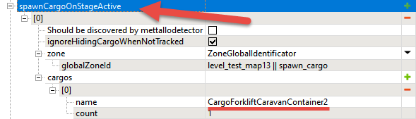

# Delivery of Cabins

*This topic is valid for SnowRunner only.*  

The group of fields in the **livingAreaInfo** section corresponds to the assignment where the player needs to deliver some cargo (typically Cabins) to the Living Area zone.

The process to create this assignment is the following:

1.  You need to create a Living Area zone (the zone with the **ZonePropertyLivingArea** property). It is created in a standard way.
    In the properties of this zone, in the **name** field, you need to select the type of cargo that the player needs to deliver to accomplish the assignment. Typically, to set up a delivery of Cabins, you need to select the "**CargoForkliftCaravanContainer2**" type there. See [5.15.1.9. Living Area feature: ...LivingArea zones](#living-area-feature-livingarea-zones) above.

2.  In one of the Stages of the objective, you need to add the **livingAreaInfo** section. In this section, you need to specify the following properties:

    -   **livingAreaValue** -- the number of cargo items that the player will need to deliver to this zone. Please note that the *cargo type* of these items will be taken from the properties of this **...LivingArea** zone (you have specified it in the **name** field at step #1 above).

    -   **livingAreaGlobalZoneId** -- you need to specify here the global id of the **...LivingArea** zone that you have created at step #1 above.

3.  Ensure that you have added the **spawnCargoOnStageActive** section with a sufficient number of cargo items (of the same cargo type) to be spawned.\
    See [5.16.1.7](#spawning-cargo-on-a-map-spawncargoonstageactive-section) above for details.\
    Please note that *models* of cabins (e.g. **cargo_cabin_rus_01**) that were added to the map *manually in the Editor* will *not* interact with the **LivingArea** zone. They may be used for decorative purposes. Only the cargo items *spawned with the help of* **spawnCargoOnStageActive** *sections* will interact with it correctly.\
    \
    

> **WARNING**: The **spawnCargoOnStageActive** section must be added to the Stage where other assignments (delivery, visit all zones, living area, etc.) do exist. If there is only the **spawnCargoOnStageActive** section within the Stage and there are no other assignments within the same Stage, this Stage will be skipped and no cargo will be spawned.

**TIP**: If necessary, you can use various cargo platforms for cargo items that need to be placed in the **LivingArea** zone (e.g., the **cargo_platform_wide** model). To help a player place cabins on these platforms, you can add the Caterpillar TH357 telehandler (the **cat_th357** truck in the Editor) to your map. However, please note that this is a DLC truck and, on your map, it will be available to owners of DLC2 ("Explore and Expand") only.

