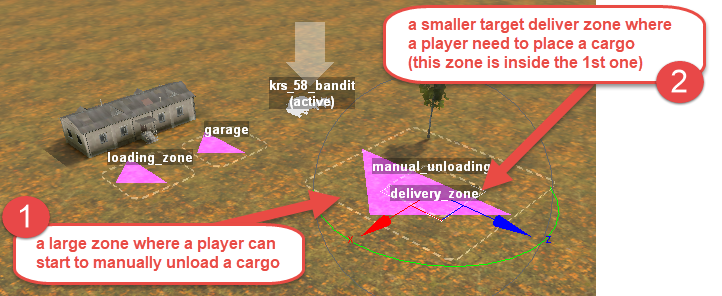

# Manual Unloading of Cargo

*This topic is valid for SnowRunner only.*  

To set up manual unloading of the cargo, you need to create an additional zone that will interact with the player. This zone must be placed *around* the target cargo delivery zone (specified in the **globalZoneId** field, see [5.16.1.1](#delivery-of-goods-actions-zonetofill-section) above).

Typically, the setup of these two zones is similar to the following:

**NOTE**: In the case of manual unloading, the delivery zone itself can be also located on some platform or eminence.

The manual unloading zone is created as a regular zone with an empty **props** section:

After the creation of this manual unloading zone and placing the delivery zone inside it, you need to specify the link to the manual unloading zone in the **Manual Unloading Settings \> Interaction zone Uid:** field, see below.\
\
**NOTE**: The link to a delivery zone itself must be specified as usual, in the **globalZoneId** field.

For our example, the setup may be the following:

