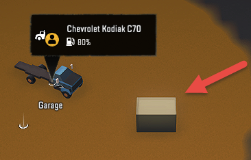
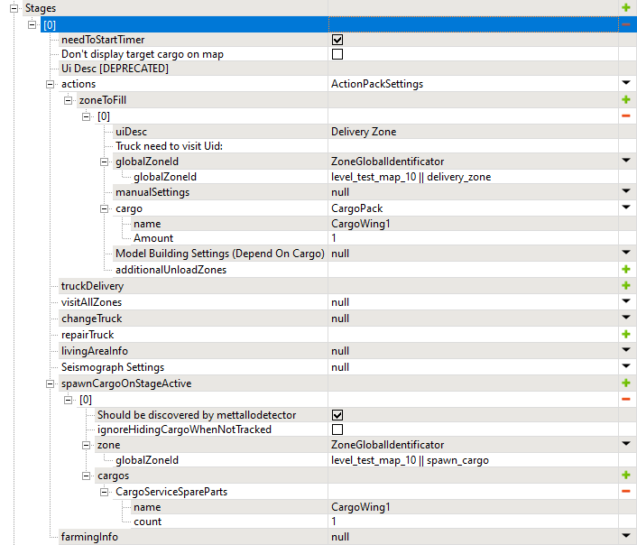

# Metal Detector

*This topic is valid for SnowRunner only.*  

The **Should be discovered by metallodetector** option in the **spawnCargoOnStageActive** stage will allow you to mark the spawned cargo as searchable by the metal detector.

After the player uses the metal detector at a particular distance from the marked cargo, these pieces of cargo are "found" and are highlighted on the navigation map.

However, there are certain nuances in using this feature, they are listed below.

***Hint #1: Hiding the markers of cargo while tracking the objective***

Regardless of its actual state, the **Don\'t display cargo from zoneToFill on map** option (see [5.16.1. Stages](#stages) above) works as if it is enabled if the stage contains the **spawnCargoOnStageActive** with the enabled **Should be discovered by metallodetector** option. Due to this, white markers of the type of the cargo (see pictures below) are always *not* shown for spawned cargo when the player tracks this objective.

**NOTE**: However, this affects the displayment of cargo only *when this objective is tracked*. If the player switches to the different objective, the white markers of the cargo type will be *shown* even when it is not found by the metal detector -- it's the known issue (see pictures below). For total hiding of cargo, see the next hint.

 

***Hint #2: Hiding all cargo of the particular CargoType***

If you want to hide white markers of the type of the cargo for *all cargo of the particular CargoType*, while creating an objective for metal detector, you can do it by *disabling* the **ignoreHidingCargoWhenNotTracked** option in this **spawnCargoOnStageActive** stage.

**WARNING**: Disabling the **ignoreHidingCargoWhenNotTracked** option will hide *all* cargo of the CargoType specified in this **spawnCargoOnStageActive** \> **cargos** section on all map until this metal detector objective will not be accomplished -- even the pieces of the same cargo that are *not* used within this objective. I.e., disabling this option should be used with care, since it may break accomplishment of other objectives.

However, this option works *not* only when this objective is tracked, so it will hide white markers of the type of the cargo shown when the player switches to another objective. I.e., disabling the **ignoreHidingCargoWhenNotTracked** option will fix the known issue from ***Hint #1*** above.

**TIP**: To avoid negative effects of disabled **ignoreHidingCargoWhenNotTracked**, we recommend you to use *unique CargoTypes* for all objectives for metal detector.

If the **ignoreHidingCargoWhenNotTracked** option is *enabled* (by default), the "hiding" behavior will be limited to the tracked objective, i.e. hidden cargo will be shown when the player switches to another objective. And, all other cargo of the same CargoType will *not* be hidden on the map.

***Hint #3: Using unique CargoTypes for metal detector objectives within a Region***

We can *fully* hide white markers showing the type of cargo only for *all* cargo of the particular CargoType at once (see above).

Due to this, we recommend you to use unique CargoTypes within all metal detector objectives ***within a Region***. Only in this case, you can safely disable the **ignoreHidingCargoWhenNotTracked** option for them and not break other objectives.

***Hint #4: Sample stage of a simple metal detector objective***

Below is the sample stage of a simple metal detector objective, with disabled **ignoreHidingCargoWhenNotTracked** option.

