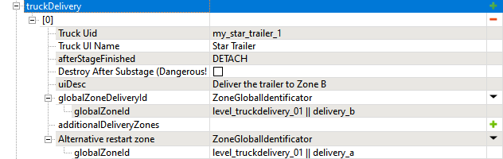

# Truck Delivery

*This topic is valid for SnowRunner only.*  
*For Truck Delivery in Expeditions, see [truckDelivery](./../../objectives_in_expeditions/stages/truckdelivery.md).*  

The group of fields in the **truckDelivery** section corresponds to the assignment where the player needs to deliver the truck or trailer to the particular zone.

**NOTE 1**: The player will not be able to *sit* into the target truck during the assignment. However, the player can attach it to their vehicle using the winch or as a trailer.

**NOTE 2**:You can give the truck or trailer involved in the **truckDelivery** assignment as a reward to the player. To do this, select the `REWARD` option in the **afterStageFinished** field (see below) and ensure that in previous stages of the objective this truck or trailer has not been removed from the map (`DESTROY` option).

You can set up multiple assignments of this type within this section and they will be treated as one **truckDelivery** substage. I.e., the player will need to accomplish all of them to pass the **truckDelivery** substage. In settings of the section, they will be set up in the separate numbered subsections: `[0]`, `[1]`, and so on. To add such a section, click the plus button next to the **truckDelivery** section.

Settings of every such assignment are the following:

-   **Truck Uid** – The identifier of the target truck or trailer that the player will need to deliver to the target zone. Particularly, you will need to place the truck or trailer on the map in the Editor and specify the certain value of the **Id** field in its properties (e.g. `task_truck`). After that, *exactly* the same value should be specified as Truck Uid in the settings of the truckDelivery stage.

    **NOTE**: Starting with *DLC 11* (*"Season 11: Lights & Cameras"*) you can use the same truck or trailer (with the same ID) in different objectives, see below.

-   **Truck UI Name** – The name of the target truck or trailer that will be displayed in the UI.

-   **afterStageFinished** – the action that the game will need to perform with the target truck/trailer after the stage and/or the whole objective is accomplished:

    -   `REWARD` - give the truck involved in the assignment as a reward to the player after the *objective* is finished.

        **NOTE**: Alternatively, you can give a new truck/trailer (not the one from the map) as a reward to the player using the **ObjectiveRewardItem** type in the rewards list of the objective. For details, see [Rewards](./../rewards.md).

    -   `DETACH` - after the *stage* is finished, the system will detach the truck involved in the assignment (if it has been attached to the player's vehicle using the winch or as a trailer).

    -   `DESTROY` - after the *stage* is finished, the system will remove the truck involved in the assignment from the map.

    -   `DO_NOTHING` - after the *stage* is finished, the system will do nothing. I.e., the system will *not* destroy the truck, detach it, or give it as a reward. This option is especially actual for Contests since for Contests usage of the `DESTROY` and `REWARD` options is inappropriate.

-   **Destroy After Substage (Dangerous!)** – By default, disabled. When enabled, removes the truck/trailer involved in the assignment from the map not after accomplishing the *stage*, but after accomplishing the particular **truckDelivery** substage. For example, if the `Stage #0` of your objective consists of two substage assignments – **truckDelivery** and **vizitAllZones**, you can remove the target truck/trailer involved in **truckDelivery** directly after finishing of this substage, without waiting for the whole `Stage #0` to finish.

    **NOTE**: Similiraly to the `DESTROY` option in **afterStageFinished** field, **Destroy After Substage (Dangerous!)** should be used with care and you must not remove trucks/trailers if they are used in subsequent (sub)stages.

-   **uiDesc** – The short text that will be displayed for this assignment in the UI.

-   **globalZoneDeliveryId** – The identifier of the target zone the where this truck or trailer needs to be delivered.

-   **additionalDeliveryZones** – The list that allows you to specify identifiers of some additional zones where the player may deliver the target truck/trailer.

-   **Alternative restart zone** – *(optional field)* The identifier of the zone where the tartet truck/trailer will be automatically moved to if the player restarts the objective. The setup of this field can be necessary if the target truck or trailer is involved in multiple delivery assignments. For example, you can use the same trailer in two different contracts, one – to deliver a trailer from initial location to Zone A and another one – unlocked by the acomplishment of the first one – to deliver it from Zone A to Zone B. And, using the **Alternative restart zone** field in the second contract, you can set up that restarting of this *second* contract will spawn this trailer *not* in its initial spawn location, but in Zone A where it has already been delivered in the first contract.

    

    **WARNING**: For Regional Contracts that use multiple maps, the zone specified in the **Alternative restart zone** must be located at the map that the Contract belongs to, due to general limitations on spawning in Regional Contracts. I.e., you should follow one of the two valid scenarios:

    *Scenario 1 – If Alternative restart zone is not specified:*  
    All trucks/trailers (and spawned cargo) from **changeTruck**, **truckDelivery**, **repairTruck** and **spawnCargo** stages set up within a Contract must be located on one map.

    *Scenario 2 – If Alternative restart zone is specified:*  
    All trucks/trailers (and spawned cargo) from **changeTruck**, **truckDelivery**, **repairTruck** and **spawnCargo** stages within a Contract, *except a truck/trailer for which the **Alternative restart zone** is set up* – must be located on the map where the **Alternative restart zone** is located.  
    See ["Regional" Contracts](./../../../regions/regional_contracts.md) for details.

    **NOTE**: For these Regional Contracts, to be able to restart a Contract – the player must move to the map this Contract belongs to, i.e. – to the map that contains all objects referenced by it (see above).

When delivering trailers, you can also setup the **FreezeTrailer** settings for freezing and unfreezing them at the end of the objective. See [Freezing Trailers](./../freezing_trailers.md) for details.
