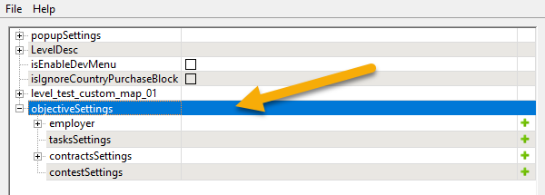
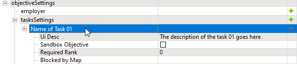

# Objectives: Overview

## Starting Point
The main pipeline for creating objectives is the same for both *Expeditions* and *SnowRunner*.

All objectives are added using the zone settings plugin (**ZoneSettingsEditor.exe**) that you have used when specifying properties (*props*) of [zones][zones_overview]. 

This plugin is available in the Editor, it can be opened by clicking the **Zone Settings** button () on its toolbar. 

In the window of this plugin, objectives are configured within the **objectiveSettings** section:

However, some *subcategories* within this section have a slightly different meaning for *Expeditions* and *SnowRunner*, see below.

### Objectives in Expeditions
In *Expeditions*, the usage of the subcategories within **objectiveSettings** is the following:

-   **employer** – allows to configure a [custom employer][custom_employers] for created objectives.
-   **tasksSettings** – allows to create [Tasks][tasks_in_exp].
-   **contractsSettings** – allows to create [Expeditions and Contracts][expeditions_and_contracts].

    **NOTE**: In *Expeditions*, there is no **contestSettings** subcategory, since Constests are not used in this game.

However, most fields of all types of objectives (Expeditions/Contracts and Tasks) are [the same][common_fields_of_objectives].

**WARNING**: At least one Expedition objective is required for the map to be playable, see [below](#requirements-in-expeditions).

### Objectives in SnowRunner
In *SnowRunner*, the usage of the subcategories within **objectiveSettings** is the following:

-   **employer** – allows to configure a [custom employer][custom_employers] for created objectives.
-   **tasksSettings** – allows to create [Tasks][tasks_in_snowrunner].
-   **contractsSettings** – allows to create [Contracts][contracts_in_snowrunner].
-   **contestSettings** – allows to create [Contests][contests_in_snowrunner].

However, most fields of all types of objectives (Contracts, Tasks and Contests) are [the same][common_fields_of_objectives_in_snowrunner].

**NOTE**: SnowRunner maps are playable even without any objectives.

## Requirements in Expeditions

### Required Expedition
In Expeditions, at least one [Expedition][expeditions_and_contracts] is required for the player to be able to load a map.

I.e., for the player to be able to load the map, this map should have at least one correctly configured [Expedition][expeditions_and_contracts] and at least one correctly configured [Deploy zone][deploy_zones].

## General Info

### Stages and Substages
All objectives in Expeditions and SnowRunner consist of *Stages*. 

Every *Stage* corresponds to a group of assignments of particular types that the player needs to accomplish as a paticular stage of this objective. 

Stages of the objective need to be accomplished successively. The order of these assignments corresponds to the order of stages (`[0]`, `[1]`, `[2]`, etc.) added to the **Stages** list within the objective.

The particular assignments within a Stage are called *Substages*. They can be accomplished in any order. Substages within the Stage are created by filling in the corresponding sections of settings within the numbered Stage record.

A *Stage* frequently contains a single *Substage* of the particular type only. That's why, *Substages* are frequently mixed up with *Stages*.

Properties that define a substage depend on its type, which corresponds to a particular section of settings within the numbered Stage record. 

For example, we can create a task that will have two Stages in the **Stages** list:

-   Stage `[0]` will have the **visitAllZones** section filled in, which will tell the player to visit the particular zone(s).
-   Stage `[1]` will have the **truckDelivery** section filled in, which will tell the player to deliver the particular truck to some zone.

As you can see, in our example, both Stage `[0]` and Stage `[1]` have only one substage: **visitAllZones** for Stage `[0]` and **truckDelivery** for Stage `[1]`. We have done it intentionally, since we would like the player to perform these operations one after another. 

If the order of these operations was unimportant, we could create a single Stage `[0]` and fill in **visitAllZones** and **truckDelivery** sections of settings within this Stage. In this case, the player would be able to accomplish the corresponding substages in any order.

**IMPORTANT**: The list of possible substage types is different for Expeditions and SnowRunner. See [Stages in Expeditions][stages_in_expeditions] and [Stages in Snowrunner][stages_in_snowrunner] for details. 

**NOTE**: You need to add at least one stage to your objective to make it playable.

### Zones Used in Objectives
To configure fields of objectives that link to [zones][zones_overview], you will need to create zones for them first. After that, you will be able to click the browse () button in the zone field and select the zone from the list.

### Trucks Used in Objectives
In various **Truck Uid** fields, you are able to specify the ID of the Truck that will be used in the objective. This ID should be the same as the ID of the particular Truck added to the map that also has an ID in its properties (in the **Id** field).

### Model Building Settings
Objectives allow you to "build" some visial models on the map when the player accomplishes their stages or delivers some object. See [Model Building Settings][model_building_settings] for details.

### Activation of Tasks and Contests
Tasks and, in *SnowRunner*, Contests do require a special zone where the player can activate them. You need to create this zone and add a link to it in the **taskGiverZone** field of the Task or Contest.

If necessary, you can create additional zones for such activation and add them to the **additionalTaskGivers** list. 

### Names and Descriptions
The name of the objective is specified when adding it to the corresponding list of objectives. After that, it can be modified by double-clicking.

**Ui Desc** fields allow you to specify descriptions of objectives and particular assignments of the objectives throughout the UI.

Names of objectives must be unique, even objectives with different types must have different names. E.g., if a task and a contract have the same name, this can result in unpredicted behavior.

**TIP**: If localization is necessary, you can use UI_IDENTIFIERS for localization strings within the text fields of objectives. See [Localization][localization] for details.

## Where Are These Settings Saved?
The values of the specified properties of objectives are saved in the folder of the map within the `\Media\levels\` folder, in the `objective_settings.json` file there. 

So, if you want to *reuse* the settings for both zones and objectives, you will need 3 files from that folder: 

-   `user_name_of_map.txt`
-   `zone_settings.json`
-   `objective_settings.json`

However, you will need to change the name of the map in these files.

## Validation of Objective Settings and Error Log 
The system automatically validates some aspects of the configuration of objectives during [packing][packing]. 

The log of occurring errors can be found in:

-   *For Expeditions*: `\Documents\My Games\Expeditions\base\logs\ModMapError.txt` (TBD)
-   *For SnowRunner*: `\Documents\My Games\SnowRunner\base\logs\ModMapError.txt`

For example: `C:\Users\<username>\Documents\My Games\Expeditions\base\logs\ModMapError.txt`

[zones_overview]: ./../zones/zones_overview.md
[stages_in_expeditions]: ./objectives_in_expeditions/stages/stages_in_expeditions.md
[stages_in_snowrunner]: ./objectives_in_snowrunner/stages/stages_in_snowrunner.md
[model_building_settings]: ./model_building_settings/model_building_settings.md
[packing]: ./../../packing_and_publishing_maps/packing_maps.md
[custom_employers]: ./custom_employers.md
[tasks_in_exp]: ./objectives_in_expeditions/tasks.md
[expeditions_and_contracts]: ./objectives_in_expeditions/expeditions_and_contracts.md
[common_fields_of_objectives]: ./objectives_in_expeditions/common_fields_of_objectives.md
[tasks_in_snowrunner]: ./objectives_in_snowrunner/tasks.md
[contracts_in_snowrunner]: ./objectives_in_snowrunner/contracts.md
[contests_in_snowrunner]: ./objectives_in_snowrunner/contests.md
[common_fields_of_objectives_in_snowrunner]: ./objectives_in_snowrunner/common_fields_of_objectives.md
[deploy_zones]: ./../zones/expeditions_zones/deploy_zones.md
[localization]: ./../../additional_info_on_maps/localization/localization.md
