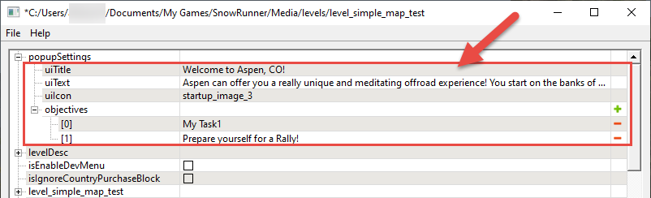
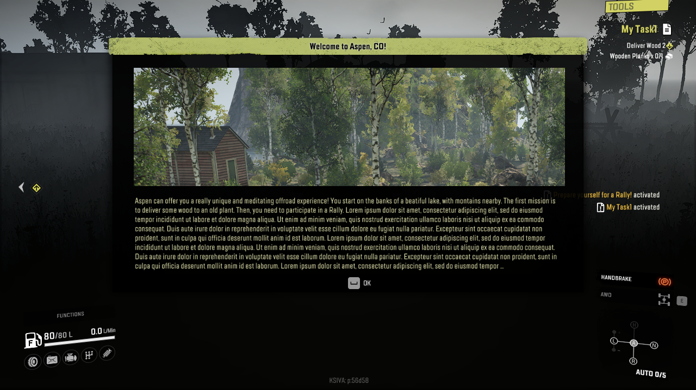

# Introductory Info and Initial Objectives

*This topic is valid for SnowRunner only.*

In *SnowRunner*, The Zone Settings plugin allows you to specify some introductory info for the map in the pop-up, which will be shown to the player just after they will be spawned on it.

**NOTE**: In *Expeditions*, these options are *not* used. They will be removed in the next versions of *Expeditions Editor*.

The settings of this pop-up can be configured in the **popupSettings** section (see below).

Particularly, you can configure:

-   **uiTitle** – the title of the pop-up.

-   **uiText** – the text to be displayed in the pop-up. Please note that the dimensions of the pop-up are fixed and the game does not adjust its size to the length of the text inside it. Thus, to look good with an image of standard size, the length of the text should be near `1200` symbols with spaces.

-   **uiIcon** – the image to be displayed in the pop-up. Its properties should be the following:

    -   **Format** of the image: `PNG`

    -   **Dimensions** of the image: `1188 x 326` px

    -   **Folder** to put the image to: `Media\prebuild\<MapName>\ui\textures\`  
        I.e., you need to put the image to the `ui\textures` subfolder within the folder of the target map in `prebuild`

In the **uiIcon** field, you need to specify the name of the file of this image *without the extension* (e.g. `intro_img` for `intro_img.png`).

Please note that the game will not center this image in the pop-up or change its dimensions to match the pop-up size, please use the recommended image dimensions listed above or similar values.

-   **objectives** – the list with *names* of the objectives (tasks, contests, or contracts) that will be activated immediately after spawning of the player to the map. All of them will be activated simultaneously.
    
    **NOTE**: The first objective that will appear in the HUD of the player (will be tracked by the game) is always the first objective from the **objectives** list.  
    However, due to the fact that all these objectives are activated simultaneously, the order of *other* objectives can be different from their order in the **objectives** list. If want to make a sequence of objectives to be unlocked one after another, you can add the first of them to the **objectives** list and use the **Blocker Objectives** lists in subsequent objectives to form the rest of the sequence (the player will need to manually activate them).

You can localize the values of the **uiTitle** and **uiText** fields. For details, see [Localization][localization].

[localization]: ./../../additional_info_on_maps/localization/localization.md
