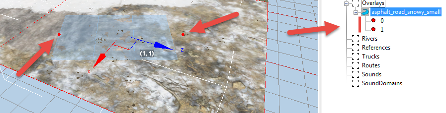

# Adding Overlays

On your map, you can lay roads of several types and add some decorative objects that use a system of curves: railroad tracks, wires, pipes, etc.

**NOTE**: In *Expeditions*, regular "road" overlays are used much less than in *SnowRunner*. However, there are specific `animal_tracks`, `cracked_mud`, `log_road` overlays.

All these objects are added to the map in the form of **Overlay** objects. These objects stretch along the curve that is created by this tool.

To add an overlay to the map, you need to right-click the terrain (or the **Overlays** section in the **Scene View** panel) and select **Add Overlay** in the context menu.

After doing this, the overlay selection window will appear.

To add a selected overlay to the map, you need to double-click it in this window. After doing this, the new overlay, which will contain two points, will be added to the map.

Each point of the overlay has its number, and these numbers begin with `0`. You can expand an overlay object in the **Scene View** window and determine the number of its points. The same points can be seen in the main scene window:

You can add new points to the overlay, to set a more sophisticated curve for it. To add a new point, you can select one of the existing points of the overlay, right-click it, and select **Add after** or **Add Before**. Depending on the selected command, a point will be added to the overlay either between the current number and the number before it or between the current number and the number after it.

Points of the overlay can be moved similarly to moving models. To do this, you can:

-   select the particular point of the overlay and, using arrows and holding the left mouse button, move the point as necessary.

-   or, select the particular point of the overlay, then, in the properties of this point, change values of the **Position X** and/or **Position Y** fields.

An overlay as a whole can also be moved (similarly to moving models).

Along with that, you can also change the width of the overlay at a particular point. To do this, you can:

-   hold the left mouse button in the center of the coordinates of the overlay, then move the mouse to the side, increasing or decreasing the width.

-   or, select the particular point of the overlay, then, in the properties of this point, change the value of the **Width** field.

**NOTE #1**: Overlay will be updated after each operation that changes it. However, some parts of it may disappear, if they are out of the scope of the camera. You can see the final view of the overlay by rebuilding the scene (right-click in the scene window, then **Rebuild Terrain** in the context menu).

**NOTE #2**: Visualization of all points (nodes) of the Overlay with red points on the map may be hidden by enabling the **Hide all nodes of rivers and overlays** () option on the [Toolbar](./../../getting_started/ui_overview/toolbar_buttons.md).

