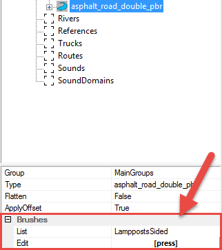

# Brushes for Overlays

Properties of an overlay also contain the **Brushes** section. These fields allow you to add auxiliary objects that will be placed along the length of the overlay. 

For example, in *SnowRunner*, you can add lamp posts along the side of the road.

To select the necessary type of objects that will be placed along the overlay, click the **\[press\]** button next to the **Edit** field and select necessary brushes, in the same way as when setting up a [**Distribution**]. Selected objects will appear on the map after **Rebuild Terrain**.

 

**NOTE**: The intervals between the placed objects are defined in the configuration of the brushes. This configuration is stored in the [`initial.pak`] archive, in the `[media]\classes\editor\brushes.xml` file there:

[distribution]: ./../distributions/adding_multiple_objects_via_distribution.md
[initial_pak]: ./../../getting_started/file_paths_and_naming/file_paths.md#source-of-info-initialpak-archive