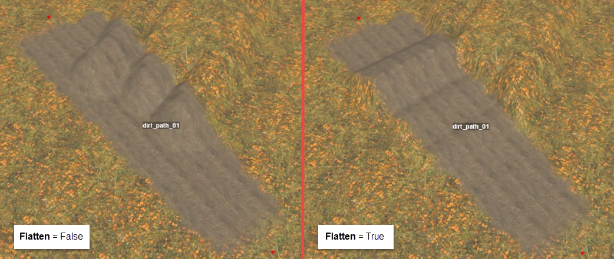

# Flattening Roads 

You can also specify the **Flatten** parameter in the overlay properties. If **Flatten** is set to **True**, the overlay will try to flatten the terrain underneath it.

However, when enabled, this option flattens road bumps *along its width* (from one roadside to another one). Along its length, the road may remain uneven. In other words, the road is flattened in a perpendicular direction. I.e., there will be no oblique slopes from one roadside to another (see screenshot below).

**NOTE**: The heightmap itself will remain unchanged when the **Flatten** parameter is enabled. The overlay will simply flatten it. To see the result of this flattening - you need to perform the **Rebuild Terrain** operation.

