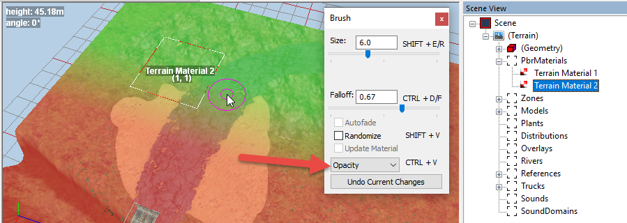
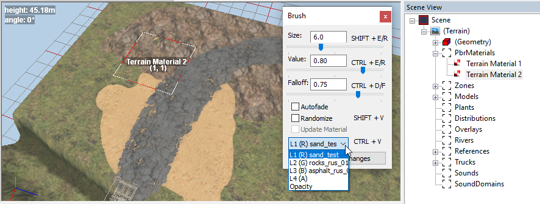

# Assigning PBR Materials to Terrain

The **PbrMaterials** section of the **Scene View** panel allows you to create PBR (Physically-Based Rendering) terrain materials with layers and paint the terrain with them.

## Creation of Material
To create a material:

1.  Right-click the terrain (or the **PbrMaterials** section of the **Scene View** panel).

2.  Select **Add PbrMaterial** in the context menu.

After that, a new material with 4 layers will be created. You can create a maximum of 4 such materials with 4 layers.

**IMPORTANT**: For *SnowRunner*, in winter levels containing snow, you can use only 3 layers of the material. And the third layer should always be the snow (**snow_layer**).

## Material Properties
After the creation of the material, its settings can be specified at the lower part of the **Scene View** panel (after selection of this material). We recommend using almost the same values of settings for all materials of the level.

For example, sample material settings:

-   For summer and autumn maps:

    -   **AlbedoWetnessMult**="`2`"

    -   **RoughnessWetnessMult**="`0.5`"

-   For winter maps:

    -   **AlbedoWetnessMult**="`1`"

    -   **RoughnessWetnessMult**="`1`"

The usage of the same settings for all materials of the level is important for the convenience of painting and the absence of sharp boundaries between different materials.
For details, see [Material Properties](./material_properties.md).

## Brush
The brush for painting with material contains a drop-down list with a selection of paint layers.

Painting with a layer is performed by holding the right mouse button. Whether the layer will be added or removed - depends on the value of the **Value** slider. If the **Value** is greater than `0.50`, then the layer will be added, if it is less than `0.50`, then the layer will be erased.

### Opacity mode
The list of layers of the brush also contains the **Opacity** mode. This mode corresponds to painting the block with the selected material.

**IMPORTANT**: When you are using more than one material for the terrain, you need to paint the terrain with these materials using the **Opacity** mode of this brush first. And, only after it, you can paint the terrain with the layers of these materials. When in the **Opacity** mode, this brush paints terrain on a per-terrain-block basis. I.e. you can paint each terrain block with one material only.

Therefore, to avoid sharp boundaries between different materials, you should use the *same textures* as layers on the edges of two adjacent terrain blocks painted with two different materials.

## Material Name
The name of the material can be set in the **Name** field located at the lower part of the **Scene View** panel, after selection of this material.

