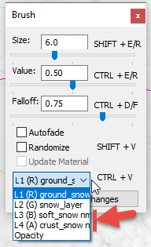

# Material Properties

## Properties of Material
Properties of the material can be specified at the lower part of the **Scene View** panel (after selecting this material in the **Scene View** panel).

They are the following:

-   **AlbedoWetnessMult** - the coefficient that determines how much the existing wetness will darken the texture of the terrain.

-   **RoughnessWetnessMult** - the coefficient that determines how much the existing wetness will affect the roughness of the texture of the terrain.

-   **Mask channel index** - *(Read-only field)* `TBD`

-   **Layer 1**, **Layer 2**, **Layer 3** sections - correspond to particular layers of material. 

    -   To specify texture for the particular layer, click **\[press\]** next to the **\[Choose file\]** field.

    -   **Tiling scale** - the tiling scale of the texture. Recommended values:
        -   for grass, earth, and sand - `5`
        -   for rocks - `1`
        -   for gravel - `3`
        -   for snow - `2.2`

    -   **HM blending contrast** - the smoothness of the border when blending layers. Recommended values:
        -   for soft surfaces - `0.7`-`0.8`
        -   for hard surfaces - `0.8`-`0.9`

    -   **Mask channel index** - *(Read-only field)* `TBD`

## Snowy Levels Specifics
On snowy levels, the third layer (**Layer 3**) of material should always be the **snow_layer**. Materials with the `_snowy` suffix in the name are designed specifically for winter levels.

The brush control changes when painting snowy levels. In this case, additional layers automatically appear in it:

**NOTE**: A level is considered snowy, if, somewhere on it, the snow depth is painted using the **Geometry** \> [**Snow**](./../terrain/geometry_brushes_for_terrain/snow.md) brush. Painting will not be active until you make **Rebuild Terrain** and save the level.

In particular, the **soft_snow** and **crust_snow** layers will appear in the drop-down menu of layer selection. These layers are modifiers of the already painted snow layer. They need to be painted over a layer of snow.

-   **soft_snow** - soft snow, it is typically painted mainly in the areas that contain a forest, bushes, and a lot of plants.

-   **crust_snow** - compressed snow with hard lumps, it is typically painted along the edges of the road.

These layers change the normal map of the **snow_layer** only. This is necessary to vary the snow appearance as described above. The results of painting with these layers cannot be seen in the Editor itself, but are visible in the game.

