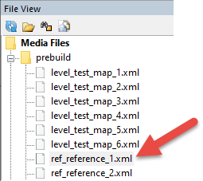

# Adding References

A "reference" is an external map that can be added to your map. Typically, reference maps are small or contain some reusable content. Or, this feature can be used for collaborative work on a large map, where different modders work on their separate parts of a large map and then import their pieces to it.

Names of all reference maps should start with the `ref_` prefix, according to the naming convention.

The set of references used for the creation of original game levels is provided with the Editor, see [Set of In-Game References](./set_of_ingame_references.md) below for details.

**NOTE**: You cannot modify a reference you have imported to your map, except its position and orientation. If you need to change its content, you need to modify the initial, source map of the reference. Or, you can substitute some objects of the reference with different objects using [Mutators](./usage_of_mutators.md).

**Before adding a reference to your map, you may want to compile it**.  
To do this:

1.  Open the source file of the reference in the Editor (by clicking it in the **File View** panel).  
    

2.  Perform the **Rebuild Terrain** operation for the reference.

**TIP**: If necessary, you can skip the compilation of the reference, and simply add it to the map. However, in this case, the preview texture of the reference will be white. But, the reference in the final packed map will look the same.

After that, you can add a reference to your map.

To do this:

1.  Right-click the terrain (or, the **References** section in the **Scene View** panel), and select **Add Reference** in the context menu.

2.  In the appeared standard open dialog, select the **.xml** file of the map of the reference. By default, this dialog shows all source `.xml` files of your maps (in the `prebuild` folder).

3.  In this dialog, select the **.xml** file of your reference and click **Open**.
    After doing this, your reference will appear on the map as a brown rectangle:
    
    

4.  Move and rotate your reference to put it to the necessary location on your map.

    

5.  Then, deselect the reference by clicking somewhere on the map. The reference area will be displayed on the map in the simplified mode:

    

6.  Perform the **Rebuild Terrain** operation (you can do it by right-clicking the terrain and selecting **Rebuild Terrain** from the context menu). After doing this, the content from the reference will appear on the map:

    

7.  As you can see, objects from the imported reference are added to your map. Moreover, the height of the terrain and its material are also changed in the area of the reference (in the screenshot above the material of the reference was applied to all terrain blocks on which reference was located). Change of the material can be enabled or disabled in the properties of the reference (in the **ApplyMaterials** field, see below).

    

8.  To correctly merge the imported reference with your map, you can:

    a.  **configure the properties** of the reference that are displayed at the lower part of the **Scene View** panel when the reference is selected.

    b.  **Use the "RefMergeMask" brush** to create a mask for merging a reference.

    c.  **Use Mutators** to substitute values of settings of the reference and its objects according to a predefined mapping table (e.g. transform an autumn reference to a winter one).

