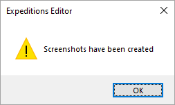
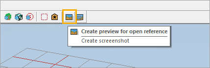
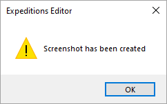

# Reference Browser

**Reference Browser** is a tool for managing references. It allows you to create previews (thumbnails), so it is easier to select and add references when you work on a map.

References are external maps that you can reuse by adding them to your map. Read more about them in the [Adding References](./adding_references.md) article.

## Creating previews

Before you start using Reference Browser, make sure to generate the previews for the references. To do this:

1. Click the **Create preview for all references** button in the toolbar. The browser will scan all the references and create previews. Note that it may take some time, depending on the number of references.

    

2. Once the previews are ready, the following window is displayed:

    

Now the previews are displayed in the **Select Asset** window as you [add references](./adding_references.md) to the map.

## Creating custom previews

When you save a reference, its preview is generated automatically. However, you can create **custom** previews for your references. To do this:

1.  [Open](./adding_references.md) the source file of the reference in the Editor by clicking it in the **File View** panel.

2. Adjust the camera position in the [scene window](../../getting_started/ui_overview/ui_overview.md), so all the necessary objects/scenery is displayed properly. 

3. Click the **Create preview for open reference** button.
   
    

4. Once the preview is ready, the following window is displayed:
   
    

Now the custom preview is available in the **Select Asset** window.