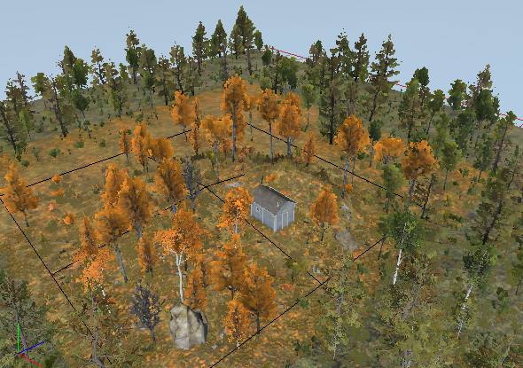

# Usage of Mutators

Mutators allow you to transform all references imported to a map to meet its settings. This is done by the substitution of the initial content of the reference with the content of the same type but matching the target map.

Particularly, using mutators, you can substitute such things as models, layers of materials, brushes used within distributions, standalone plants, and overlays.

Mutators that can be currently used by the Editor are defined in the [`initial.pak`] archive, in the `\[media]\classes\editor\mutators.xml` file there. This XML file has a simple structure. Using corresponding tags, it defines "mutator" entities as objects that have an ID and a mapping table with IDs of objects, which maps the objects you want to substitute with alternative variants you want to use when this mutator is applied:

If you want to apply this mutator to all references imported to the map, you need to specify its ID at the **Mutator** field in the properties of the **Terrain**:

**NOTE**: After changing the value of the **Mutator** field, you need to perform the **Rebuild Terrain** operation to apply your changes. You can do it by right-clicking the terrain and selecting **Rebuild Terrain** from the context menu.

**NOTE**: Mutators are applied only to references imported to the map. And to all such references at once.

For example, let's assume that we have a reference that was initially created in the autumn setting and it does not fit well with the rest of the map, which is in summer and "Russian" setting:

In this case, by using the mutator with the `rus` identifier for the terrain of the map, we can transform this reference to the more appropriate setting:

[initial_pak]: ./../../getting_started/file_paths_and_naming/file_paths.md#source-of-info-initialpak-archive