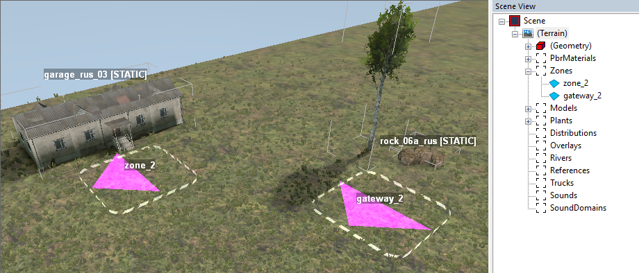
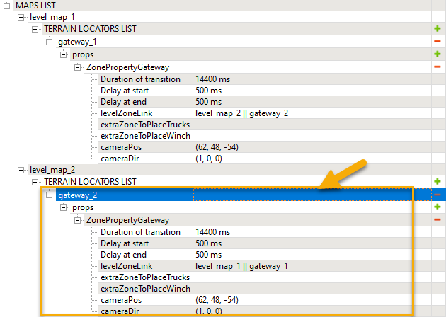
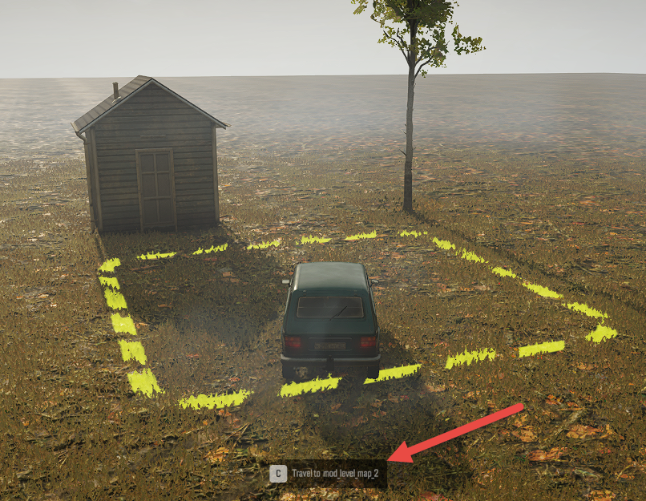

# Regions with Multiple Maps

*Currently, this topic is valid for SnowRunner only.*  
*In Expeditions, custom Regions with multiple interconnected maps are currently not supported. However, they are planned to be supported in the next versions of the game.*  

In SnowRunner, you can combine multiple maps into one Region, connect these maps using the Gateway zones, and pack them as a single mod. Moreover, when creating a region, you can add objectives that require performing actions on multiple maps of the region (e.g. deliver some cargo from one map to another).\
\
**NOTE**: Maps that form the region may be also published as separate mods, if necessary. However, in this case, the Gateway zones and cross-map objectives that are created on the regional level will not work.

All these operations are performed using the Region Settings Editor dialog, which you can open by clicking the **Region settings** button () on the toolbar.

The process described below is an illustration of the setup of a region:

Let's assume that we have already created two maps: **level_map_1** and **level_map_2**. We want to create a region with these two maps and connect them using the Gateway zones. Then, we want to pack the created region as a single mod.

And, let's assume that, along with Gateways, we want these maps to contain the following zones:

-   **level_map_1** will contain the Fuel Station

-   **level_map_2** will contain the Garage

And, we want the player to start on the **level_map_1** and then proceed to **level_map_2**.

Then, we will need to do the following:

1.  Prepare **level_map_1**:

    a.  Open it in the Editor.

    b.  In the Editor, create all necessary ***zone locators***, including zone locators for Gateway zones.\
        In our example, there will be two zone locators with the following IDs:

        i.  **zone_1** (Fuel station)

        ii. **gateway_1** (the zone that will be the gateway in the future)

    c.  Since we want this map to be the starting map of the region, we need to ***add an active truck to this map*** (see [[5.11]](#adding-trucks) for details).

    d.  So, our first map may look like the following in the Editor:

> 

e.  For this map, in the Zone Settings Plugin, we need the following:

    i.  All zones, *including Gateway zones*, should exist in the **TERRAIN LOCATORS LIST** (of the Zone Settings). By default, this list is populated automatically based on zone locators added in the Editor. So, to add these zones, you simply need to click the **Zone Settings** button () on the toolbar (which will open the Zone Settings Plugin) and save your changes there.

    ii. You need to configure **props** of all necessary zones, *except Gateway zones*.\
        The **props** of the Gateway zones will be configured later, on the region level.\
        \
        **WARNING**: If you do not open the Zone Settings Plugin, the **TERRAIN LOCATORS LIST** will not be populated with zones. In this case, the system will have no information about the zones.

f.  In our example, the zone properties of our first map will look like the following:\
    

g.  Now, you need to pack your **level_map_1** map.\
     

2.  Prepare **level_map_2**:

    a.  Do almost the same operations as for **level_map_1**.\
        However, on **level_map_2** you do not need to add an active truck.

> And the zone locators will be the following:

i.  **zone_2** (Garage entrance)

ii. **gateway_2** (the zone that will be the gateway in the future)

b.  So, the zone itself and its zone properties will look like the following:

> \
> \
> 

c.  Do not forget to pack your **level_map_2** map too.\
    You can also publish this map as a separate mod, if necessary.\
     

3.  Now, combine these two maps into the region. Open Region Settings Editor by clicking the **Region settings** button () on the toolbar.\
    

4.  In the appearing dialog, select **File \> New region**.

> 

5.  In the opened **Region desc** tab, specify the properties of the region:

    a.  **Name** - the name of the region, which will correspond to the name of the .zip archive of the region (after packing) and is also displayed on the navigation map.\
        **WARNING**: The value of the **Name** field must ***not*** contain special symbols prohibited for file names: **\\**, **/**, **:**, **\***, **?**, **\"**, **\<**, **\>**, **\|**.

    b.  **Country** - the country of the region (one of the supported by the game). Selected country defines restrictions in purchases of trucks for the player and is also displayed in the UI.

    c.  **UiName** - the name of the region for the UI (for Global Map).

    d.  **UiDesc** - the description of the region for the UI (for Global Map).

    e.  **GlobalMapRegionBG** *(optional)* - the background for the Region on the **Global Map** screen, see [[5.18]](#custom-images-for-regions-and-maps) below for details.

    f.  **GlobalMapRegionIcon** *(optional)* - the icon for the Region in the **Global Map** screen, see [[5.18]](#custom-images-for-regions-and-maps) below for details.

    g.  **Enable Dev Menu** -- this option is similar to the **isEnableDevMenu** option for the particular map (see [[5.15.5]](#enable-or-disable-the-dev-menu-tools-menu) above for details), but on the level of the region. I.e., if it is enabled, the Dev Menu will be enabled for all maps of the region.

    h.  **Ignore Country Purchase Block** -- this option is similar to the **isIgnoreCountryPurchaseBlock** option for the particular map (see [[5.11.2]](#allowing-player-to-purchase-trucks-from-all-countries) above for details), but on the level of the region. I.e., if it is enabled, you will allow the player to purchase trucks from all countries on all maps of the region.

> 

6.  In the **Region desc** tab, add all necessary maps to your region, select a starting level, and set the order of the maps for the regional map:

    a.  For each map you want to add: Click **Add level**, select the map in the appearing **Select level** dialog, and click **OK**.\
        \
        \
        \
        **NOTE**: This dialog contains all maps that you have packed (i.e. the **.pak** files of the maps from the **Media\\Mods** folder). If your map is not there, most probably you've forgotten to pack it.

    b.  After you have added all necessary maps, select the **Starting level** from them by enabling the radio button next to the necessary map.

> **\
> **\
> **NOTE**: The starting map of the region must contain an active truck (see [[5.11]](#adding-trucks) for details).

c.  Using fields with numbers displayed next to added maps, specify the order of these maps. It defines locations of maps on the Region map.\
    \
    

7.  After you have added maps to the region, new tabs (named as maps) will appear in the dialog. If you switch to one of these tabs you will see that it displays properties of zones and objectives of the corresponding map. However, these properties are displayed in the read-only mode and you cannot change them from this tab. For example, in the **level_map_1** tab we will see the following:\
    \
    

8.  Now, in the **Regions** tab, you can configure gateways and regional objectives for your maps. I.e., this tab displays properties of zones and objectives *on the level of the region*.\
    Regional objectives are configured in the **objectiveSettings** section and are configured similarly to regular objectives, see [[5.17.3. Contracts on the level of the Region]](#contracts-on-the-level-of-the-region).\
    Gateways (and other zones, if you want to configure them not on the level of the map, but on the level of the region) are configured in the **MAPS LIST** section, which contains all maps of the region as subsections. Initially, after the creation of the region, it is empty (since no regional zones are configured):\
    \
    

> The process of configuration of a regional zone is pretty much similar to the regular process of zone configuration, see [Zones: Overview][zones_overview].
> \
> **NOTE**: To be able to configure a zone on a regional level, in the **Regions** tab, you need to create a *zone locator* for it on the corresponding map (in the Editor) and, also, ensure that this zone is in the **TERRAIN LOCATORS LIST** with empty **props** section (in the Zone Settings plugin opened for this map), as we have done in the step #1 above.
>
> For example:\
> To configure the **gateway_1** zone, which is located on our **level_map_1**, we will need to do the following:

1.  In the **Regions** tab, expand the **MAPS LIST** section.

2.  In the **level_map_1** section, add the **gateway_1** zone to the **TERRAIN LOCATORS LIST**.

3.  Add **ZonePropertyGateway** to the **props** section of this zone.

4.  In the **levelZoneLink** field of the gateway properties, select **level_map_2 \|\| gateway_2** zone, to link the **gateway_1** zone to the **gateway_2 zone** on the **level_map_2**.

5.  To make the gateway work, you need to set the non-zero value in the **CameraDir** field, otherwise you will see the black screen instead of the animation of the gateway. For example, you can set the **(1, 0, 0)** vector in this field.

6.  At the later steps of gateway tuning, you can configure other properties of the gateway, particularly, the animation sequence played when the player uses this gateway. For details on this, see [[5.17.1]](#settings-of-the-gateway-zone-zonepropertygateway) below.

7.  The final configuration of **MAPS LIST \> level_map_1** section will be similar to the following:\
    \
    

> To configure the **gateway_2** zone, we will need to do almost the same.\
> However, we will link the **gateway_2** zone to the **gateway_1** zone:
>
> 

9.  Save the settings of the region, by selecting **File \> Save** in the menu of the dialog (or by pressing **CTRL+S**).

10. Now, to pack your region, select **File \> Pack region mod** in the menu of the dialog. The system will pack your region to the **.zip** file **Media\\Mods** folder and will display the corresponding message.

After doing this, you can test your region mod locally (in the **NEW GAME \> CUSTOM SCENARIOS**, see [[7. Testing a Map in the Game]](#testing-a-map-in-the-game)).

And finally, you can publish your region by uploading this .zip to snowrunner.mod.io\
(see [[8. Publishing a Map]](#publishing-a-map)).

[zones_overview]: ./../zones/zones_overview.md