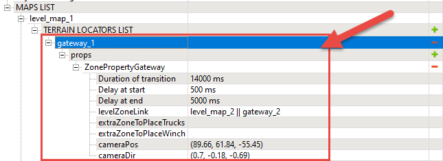

# Settings of Gateway zone

*Currently, this topic is valid for SnowRunner only.*  
*In Expeditions, custom Regions with multiple interconnected maps are currently not supported. However, they are planned to be supported in the next versions of the game.*  

Using Gateway zones you can link not only two different maps of the same region, but two different areas *within the same map*. For the description of this new scenario, please refer to [Gateway zones](./../zones/snowrunner_zones/gateway_zones.md). The section below – relates to the *initial scenario where Gateways were placed on different maps within a Region* to connect them.

Gateway zones allow you to create portals that transfer the player from one map to another map. The main principle here is simple: you create a Gateway zone on the first map and link it to the zone on the second map in the properties of the Gateway zone.

So, the main field in the **ZonePropertyGateway** (properties of a gateway) is:

-   **levelZoneLink** - the target zone on another map to which the player will be transferred. You can specify the link to this zone by clicking the  button in this field and selecting the zone from the list.

**WARNING**: To ensure the correct behavior of the game after the transition provided by your gateway, the target zone of the gateway should meet the particular criteria. To provide necessary space for the transition of players that use trucks with trailers, you can explicitly specify an additional zone that will be used when the player is transferred to this gateway in its **extraZoneToPlaceTrucks** and **extraZoneToPlaceWinch** fields. See [Gateway Rules. Extra zone](./gateway_rules_extra_zone.md).

Gateway zones *that connect two different maps of the same Region* can be created on the level of the region only, using the Region Settings Plugin. For details on their creation, see [[5.17. Regions with Multiple Maps]](#regions-with-multiple-maps) above.

You can set up a skippable animation sequence that will be played when the player uses the gateway. It will be played when the player is spawned in the target zone of the gateway (on the target map). This animation sequence is similar to the Watchtower animation: the camera flies from the initial position and the direction you specify (in the **cameraPos** and **cameraDir** fields, see below) to the starting point of the truck on the target zone of the gateway and the direction of this zone.

**TIP**: It can be hard to specify good **cameraPos** and **cameraDir** values off the top of your head. The [camera statistics](./../../additional_info_on_maps/camera_values/tip_on_camera_pos_and_camera_dir_values.md) that can be displayed in the Editor may help you in that.

So, the animation-related properties of a gateway zone are the following:

-   **Duration of transition** - The duration of the gateway animation sequence, in milliseconds.

-   **Delay at start** - the delay before the playback of the gateway animation, in milliseconds.

-   **Delay at end** - the delay after the playback of the gateway animation, in milliseconds.

-   **cameraPos** - the position of the camera at the start of the gateway animation. From this position the camera will fly to the starting point of the truck on the target zone of the gateway.

-   **cameraDir** - the direction vector for the camera at the start of the gateway animation. You should specify the direction vector here. For example: **(1, 0, 0)**.

    **WARNING**: ***If you leave the* cameraDir** ***field with* 0 *values, the gateway will not work (the player will see the black screen).***

**NOTE**: For descriptions of the **extraZoneToPlaceTrucks** and **extraZoneToPlaceWinch** fields and instructions on setting up an extra zone, see [Gateway Rules. Extra zone](./gateway_rules_extra_zone.md).

