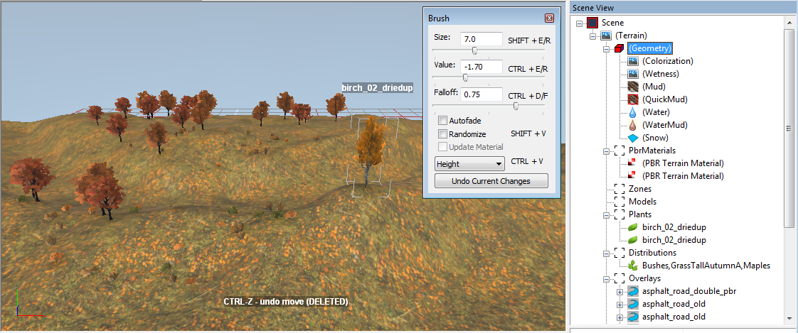
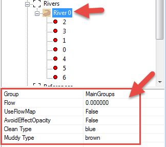
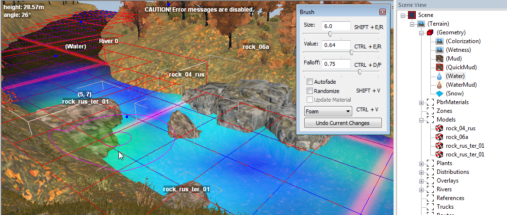
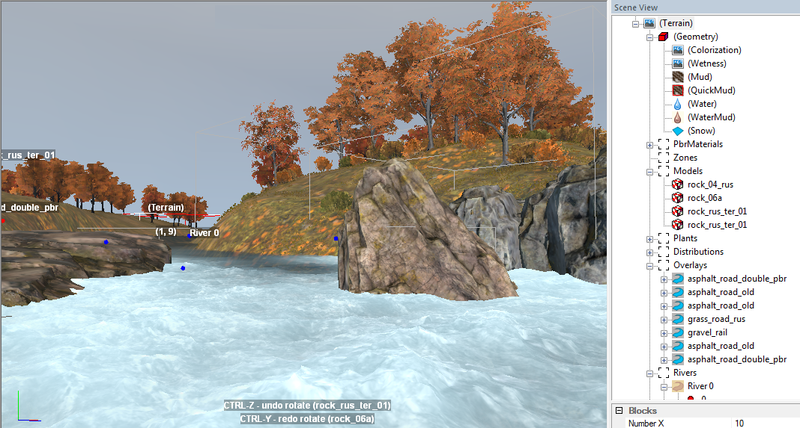

# Adding Rivers and Water Objects

Rivers and other water objects are added to the map in the form of the **River** objects.
To create this object, right-click the terrain in the main window (or the **Rivers** section in the **Scene View**), then select **Add River** in the context menu.

The logic of River objects related to adding points and changing their location on the map is similar to overlays (see [Adding Overlays](./../overlays/adding_overlays.md)). However, there is also an important difference: in contrast to roads, all points of the River object have a height. The water level in the river in this area depends on this height.

The process of creation of a **River** object is typically the following:

1.  Prepare a deepening of the terrain, which we will fill with water.

    

2.  Add the **River** object. Add the necessary number of points to this River object and move/modify it so that it covers the bed of the river. This is done similarly to overlays. However, you need to change the height of the points of the River object as well. You can set the same height for each point of the River object in the **Position Y** parameter of this point. The width of the river at a specific point of the River object can be set by changing the **Width** parameter of this point.

    

3.  Ensure that the river borders are correct. If necessary, adjust the terrain or the River object.

    

4.  After selecting the created River object in the **Rivers** section of the **Scene View** panel, you can configure the following parameters in the object properties panel:
    
    -   **AboveReferences** - if set to "**True**", protects the river colors selected for this river from overriding by river color of the imported references. See [Recommendations for References](./../references/recommendations.md) for details.

    -   **UseFlowMap** - allows you to paint the direction of the flow with the **Water** brush.

        -   If **False**, then the direction of the flow will be set to the direction, in which the numbers of points of the River object are increasing. If you want the opposite direction, you can invert the numbering of these points. To do this, right-click on the **River** object in the **Scene View** and select **River ... - Invert** from the context menu.

        -   If **True**, then you can specify the direction of the river flow using the **Geometry \> Water** brush in the **Flow** mode (see [Water brush](./../terrain/geometry_brushes_for_terrain/water.md)).

    -   **AvoidEffectOpacity** - allows you to ignore the decrease of waves and current velocity depending on depth. By default (**False**), the smaller the depth, the lower the speed of the stream and the smaller the waves. The **True** value allows you to make shallow, but wild mountain rivers.

    -   **Clean Type** - the color of the river when its water is clean.

    -   **Muddy Type** - the color of the river when its water is muddy. The mud is painted by the specific **WaterMud** brush (see [Water Mud brush](./../terrain/geometry_brushes_for_terrain/water_mud.md)).

        

5.  If necessary, using the **Geometry \> Water** brush in the necessary mode (see [Water brush](./../terrain/geometry_brushes_for_terrain/water.md)), paint the following maps of the river:

    -   **Foam** - foam that will be drawn on the surface of the water. Painted by the **Geometry \> Water** brush in the **Foam** mode. The higher the **Value** with which you paint, the more foam will be in this area. As a rule, foam needs to be painted in some "wild" places of the river, for example, where water collides with rocks. The result of painting the foam is stored in the green channel of the `_water.tga` texture (in the map mod folder).

        

    -   **Speed** - the speed of the water in the direction of its flow (see **Flow** below). Painted by the **Geometry \> Water** brush in the **Speed** mode. The higher the **Value** you use for painting, the higher the speed of the water will be in this area. Value = `1` is the maximum water velocity. The result is stored in the blue channel of the `_water.tga` texture (in the map mod folder).

        

    -   **Flow** - the direction of the flow of the river. This map is painted by the **Geometry \> Water** brush in the **Flow** mode. The created map will be applied to the river only if **UseFlowMap = True** is set for the properties of the river (see step **4** above). By default, the flow direction goes from point `#0` of the River to its subsequent points. But, if you set **UseFlowMap = True** and paint the river with the **Water** brush in the **Flow** mode, this will override the default direction of the flow in the painted areas. The Editor remembers the direction in which the brushstrokes were performed, and stores this direction to define the river flow in this area. The color of the brushstroke on the map depends on this direction. The result is stored in the `_water_flow.tga` texture. Along with manual painting of the river flow, you can generate a default flow map and then tune it with a third-party tool (see [Create Default Flowmap](./../terrain/geometry_brushes_for_terrain/context_menu/create_default_flowmap.md) for details).

        

        **WARNING**: When painting the direction of the water flow using the **Flow** mode, the **Autofade** option of the brush should be ***disabled***. The enabled **Autofade** option will result in the automatic correction of brushstrokes, which may result in the incorrect map of flow directions.

        **TIP**: Firstly, set the main direction of the flow for the whole river using a brush with a huge **Size**. Then, using the brush of a smaller size, add the details of the river flow in the necessary areas: the water flow near obstacles and reflection of water from the banks of the river (at `45` degrees from the direction of the main flow). Finally, to achieve the best result and to avoid sharp borders between parts of the flow, you can open the map of flow (the `_water_flow.tga` texture) and blur the necessary parts of it in the image editor of your choice.

6.  Switch to the **Terrain** section in the **Scene View** panel, and ensure that the river looks the way you want, in terms of its speed, direction of flow, and foam.

    

7.  If necessary, paint the dirty or muddy areas of water using the specific **Geometry \> WaterMud** brush (see [Water Mud brush](./../terrain/geometry_brushes_for_terrain/water_mud.md)).

**NOTE**: Visualization of all points (nodes) of the River with blue points on the map may be hidden by enabling the **Hide all nodes of rivers and overlays** () option on the Toolbar, see [Toolbar buttons](./../../getting_started/ui_overview/toolbar_buttons.md).

**TIP**: Starting with the DLC 9 ("*Season 9: Renew & Rebuild*"), you can add animated fish models to your Rivers, see [Interesting Models](./../models/interesting_models.md) for details.

