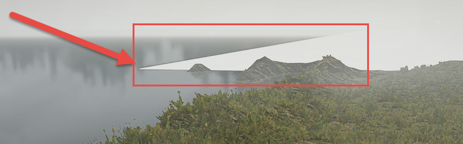
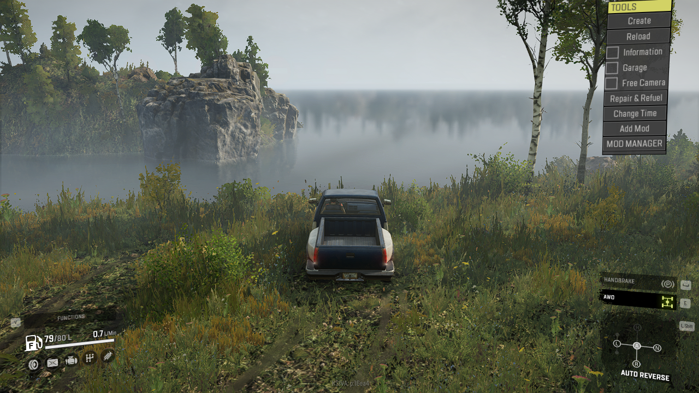

# Background Water: Adding It on Map Edges

The "Background Water" is the feature that allows you to create water surfaces outside the map. I.e. you can expand the water surface, which is on the edge of the terrain, outside of the map itself, and it will work as an extremely large water object on the edge of the map, forming a better scenery for the player.

The properties of this feature are located within the properties of the Terrain, in the **Background Water** group of fields.

The process of configuring Background Water is the following:

1.  Make a standard River object on the edge of the map (in the standard way, see [Adding Rivers and Water Objects](./adding_rivers_and_water_objects.md)).
    To set up background water correctly, we recommend you to make this River object flat, i.e. use the same Y coordinate for all of its points.

2.  Select the **Terrain** section in the **Scene View** panel and fill in the properties in the **Background Water** section:

    -   **Height** - specify the Y coordinate of the created River object here.

    -   **Type (Сlean)** - specify here the same type of the color of the water as in the created River object (the Clean Type field of the River object).

    -   **Enable for -X, ... +X, ...-Z, ... +Z fields** - these fields allow you to enable the Background Water in the necessary direction (i.e. to place it in the direction of the -X, +X, -Z, +Z axis - on the corresponding border of the map). Typically, you enable here the option for axis corresponding to the border, on which the River object is located. If necessary, you can enable multiple options (e.g. if you want your map to have 2 or more water borders).

3.  Important nuances:

    -   In the corners of the background water (i.e. in the corners of the corresponding edge of the map), the surface of the water looks unusual:
        
        

        So, we recommend you to mask these areas of the water surface with mountains, rocks, or other objects. As an alternative option, you can enable the background water for the adjacent side of the map.

    -   To avoid displaying the "**No entry**" signs (marking the edge of the map) to the player, place the border of the water of the River object at the distance greater than 64 meters from the edge of the map. You can use the **Ruler** tool to measure this distance (see [Toolbar buttons](./../../getting_started/ui_overview/toolbar_buttons.md)).
    
        

4.  Rebuild the terrain, pack your map, and test it.

    

