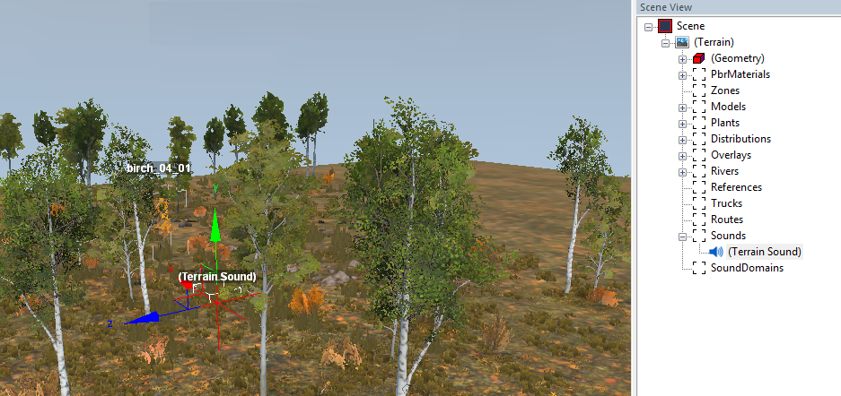

# Adding Sounds

## Process
To add a point source of the 3D sound to the scene:

1.  Right-click the terrain (or the **Sounds** section in the **Scene View**) and select **Add Sound**.

2.  A locator indicating the sound actor will appear in the scene. Move the appeared actor to the necessary area of the scene:

    

3.  To set the properties of the created sound actor, select it in the **Scene View** panel, within the **Scene \> Terrain \> Sounds** section of it. Properties of the actor are displayed at the lower part of the **Scene View** panel.

## Sound Properties
The properties of the sound actor are followinh:

-   **Name** - The internal name of the sound actor in the Editor.

-   **Sound file** - the sound that this actor will play. Since the actor is a 3D sound source, the sound file for it must be *MONO*. In this field, you need to specify the path to the sound, including its name without the file extension. For sound files, you have two options:

    -   *You can use existing in-game sounds.*  
        All these sounds are stored in the `shared_sound.pak` archive, in the `[sound]` directory.  
        In the **Sound file** field, you need to specify the path relative to the `[sound]` folder. When specifying a path, you can use either slashes (`\`) or backslashes (`/`), and you should not specify the file extension of the sound file.  
        For example, if you want to play the sound located at the following path: `[sound]\actors\actor_electric_01_loop.pcm`, then you need to specify the following value in the **Sound file** field: `actors/actor_electric_01_loop`.

        **NOTE**: The `shared_sound.pak` archive is located in the folder with [`initial.pak`][initial_pak].

    -   *You can use your own custom sounds.*  
        In this case, the path must be specified relative to the `Media\sounds` directory, with `/` as path delimiters. See [Custom Sound Files](./custom_sound_files.md) 
    
-   **Volume** - the playback volume. The default value is `1` (the maximum, initial volume of the sound file). If you specify values in the `[0,1]` interval, the volume of the sound file will be multiplied by this parameter (and the sound will be decreased correspondingly).

-   **Distance** section - the section that sets the sound distances (in meters):

    -   **(Distance) Min** - the sound volume will be played at its maximum within a sphere with a center in the source of the sound and a radius equal to the value of this parameter.

    -   **(Distance) Max** - the hearing distance. The sound volume will change from its maximum value to zero between **(Distance) Min** and **(Distance) Max**.

-   **Loop delay** (**Min**, **Max**) section - delay in seconds for the recurred playback of the sound. If both **Min** and **Max** values ​​are zero, then the sound will play continuously, without a pause. If these values ​​are not equal to zero, then, after the playback of the sound is finished, there will be a pause. The length of this pause will be in the range of `[Min, Max]` seconds (a random value will be taken from this range). After the pause, the sound will be played again.

-   **Conditions** - if this parameter is not specified (the field is empty), the sound will play at any time, during day or night. However, you can limit the interval during which it can be played:

    -   If you want to play your sound only during the day, then you should set this parameter to `DAY_FOREST, DAY_WIND`  
        Please note that these two comma-separated IDs are the single value of this parameter, not the two values. They cannot be used separately.

    -   If you want to play your sound only during the night, then you should set this parameter to `NIGHT_FOREST, NIGHT_WIND`  
        These two comma-separated IDs are also the single value of this parameter and cannot be used separately.

[initial_pak]: ./../../../getting_started/file_paths_and_naming/file_paths.md#source-of-info-initialpak-archive