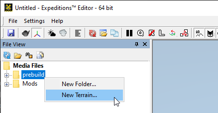
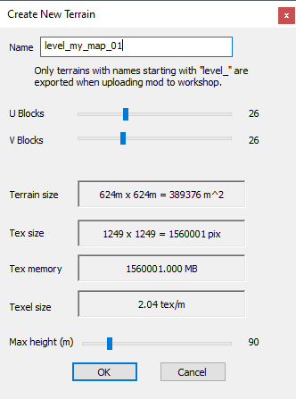
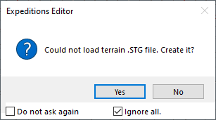
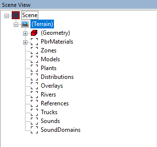
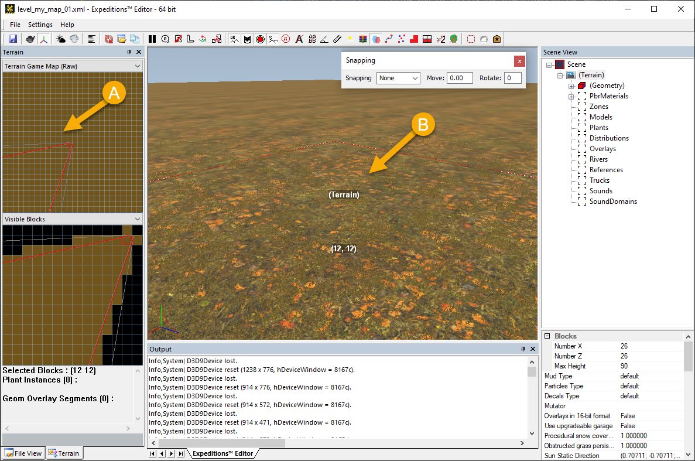

# Creation of a Terrain

To create terrain:

1.  In the **File View** panel, right-click the **prebuild** folder and select **New Terrain** in the list.
    
    *For example, in Expeditions:*  
    

2.  In the appearing window, specify the main parameters of the new map:
   
    *For example, in Expeditions:*  
    

    The parameters here are the following:

    -   **Name** – the name of the map.

        **NOTE**: Names of levels must start with the `level_` prefix, names of references must start with the `ref_` prefix.
    
    -   **U Blocks** and **V Blocks** - allow you to specify the dimensions of the map (the width and length), in blocks. Each block is equal to 24 meters.

        -   **U Blocks** – the number of blocks along the X-axis.

        -   **V Blocks** – the number of blocks along the Z-axis.
    
        **WARNING 1**: The player will experience the "invisible wall" effect near the edges of the map and some space near them will be unusable. Due to that, minimum recommended dimensions of the map are `5 x 5`, in blocks. 

        **WARNING 2**: In *Expeditions*, very small maps are also *not* recommended since the default *Drone* has the *No Flight Zone* near the edges of the map. The default value of the [**noFlyZone**][noflyzone] parameter for the original *Drone* is `150` meters from the edge. 

    -   **Max height (m)** – the maximum height of the level.

3.  When creating new terrain, the system creates the new **data.stg** file and prompts about that.
Answer **Yes**.
    
    *For example, in Expeditions:*  
    

If the creation of the initial terrain was performed successfully, you will see that the **Scene View** panel now contains the following hierarchy:

The **Terrain** section there contains subsections that correspond to both tools (brushes) that you will use during editing terrain and all objects that you will add to the terrain.

However, the main window of the editor will display only the grid and the initial terrain will be not visible.

To display the terrain, double-click the terrain preview in the **Terrain** panel on the left (**A**). After doing this, the terrain will be displayed in the main window (**B**).

*For example, in Expeditions:*

[noflyzone]: ./../../../custom_gameplay_entities/inventory_items/ability_specific_properties_of_inventory_items.md#drone
