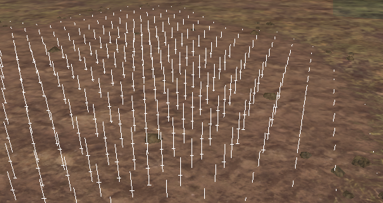

# Mud

## Overview
The **Geometry** \> **Mud** [brush][brush] allows you to add and edit mud on the terrain surface.

Mud is displayed on the surface as vertical lines with horizontal marks. The more marks the line has, the deeper the mud is at this point.

For example:

-   The first horizontal mark is the boundary of the mud, which is passable by light and poorly prepared vehicles.

-   The second mark is the boundary of mud passable by four-wheel-drive regular trucks with offroad tires.

-   Below the second mark - almost everything will bog, except for heavy vehicles, upgraded to the maximum limit.

The higher the **Value** parameter of the brush is, the faster the brush will add depth to the mud. When the **Value** parameter has a negative value, the mud is reduced or erased.

In the drop-down menu, you can select two operating modes of the brush:

-   **Automatic** - this mode adds mud and automatically paints the texture of the mud on the surface. This mud will be sufficiently hard and dried out if wetness or hidden mud is not painted on it (see below). To create mud traces, we recommend you to paint with a brush size of `0.5`-`0.8` meters. For light mud, the **Value** should be `0.54`-`0.56`. For deep traces - `0.6`-`0.7`. Please note that the texture of mud itself will appear in the Editor after rebuilding the terrain.

-   **Extrudes** - this mode adds depth to the mud on the terrain. In this case, the texture of the surface will not change. This is the "hidden mud" that the player will only see when the earth is wet in this place (automatic wetting is defined by the **Extrudes To Wetness** parameter in the **Terrain** section). This mud affects passability most of all.

[brush]: ./overview_main_geometry_brush.md

## Expeditions Specifics
In *Expeditions*, you can also vary some parameters of the mud depending on what type of map you are creating – regular "green" summer one or the "desert" one.

Particularly, you can change the type of the mud (**Mud Type**), the type of particles under the wheels of the truck (**Particles Type**), and the type of the dirt from the mud on the truck (**Decals Type**).

See [Terrain Properties][terrain_properties] for details.

[terrain_properties]: ./../terrain_properties.md

