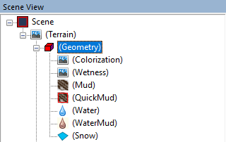
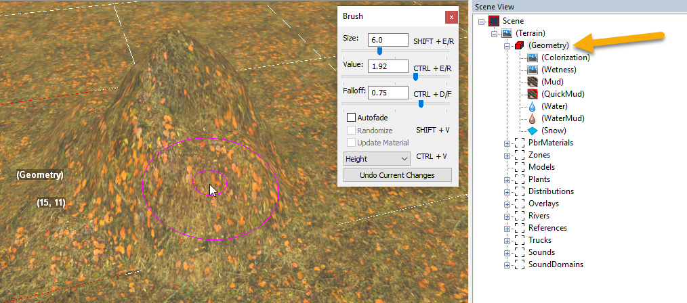

# Geometry Brushes Overview. Main Geometry Brush

## Overview
**Geometry** is the subsection of the **Terrain** section in the **Scene View** panel.

When you select the **Geometry** node (or any of its sub-nodes) in the **Scene View**, the terrain editing menu (brush panel) of a certain kind will appear in the main panel of the Editor.

The **Geometry** section includes tools for working with the terrain surface.

I.e., by choosing the **Geometry** node or its sub-nodes – you select a brush with which you will work with the terrain surface.

Painting, using the selected brush, is performed by pressing and holding the right mouse button while moving the mouse. 

By pressing the left mouse button, you can apply the changes. 

For details on typical **Brush** dialog, see [Typical Brush dialog](./../../../getting_started/ui_overview/typical_brush_dialog.md).

## Main Geometry Brush

The main **Geometry** brush itself – i.e., when the **Geometry** node itself is selected – you can edit heights and the geometry of the terrain. 

In the drop-down list, you can select one of the three operating modes:

-   **Height** - Lowering or raising the surface. If the brush value is negative, recesses will be created on the terrain. If positive, bulges will be created.

-   **Flatten** - Flattening of the surface. I.e., the brush allows you to create flat surfaces when you hold the right mouse button. The height in the center of the brush is used as the height of flattening when you click the right mouse button.

-   **Smooth** - Smoothing of height differences. Smoothing occurs when the right mouse button is pressed. We recommended you to set the **Falloff** value close to `0` for this brush.

After setup of the brush, you can change the terrain surface by moving the brush and holding the right mouse button.

**TIP**: Along with the manual creation of the terrain, you can create a terrain in the third-party tool. For details, see [Copy Source Heightmap](./context_menu/copy_source_heightmap.md).

**NOTE 1**: Other brushes – i.e., sub-nodes of the **Geometry** node – are controlled in the same way. They are briefly described in this section, starting with [Colorization](./colorization.md).

**NOTE 2**: the **Geometry** node has a set of special commands in its [Context Menu](./context_menu/overview_of_context_menu.md).

