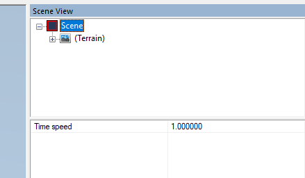

# Scene Properties

After selecting the **Scene** section in the **Scene View** panel, in the lower part of this panel, you can set the speed of the in-game time that will be used for the scene. 

This parameter is *not* used outside the Editor. I.e., it is *not* used inside the game itself. 

However, in the Editor, it affects the playback speed of the animations of objects and allows you to make them faster or slower.

**TIP**: You can also enable **Fog of War** or enable the **TOOLS** menu for your map even when it is in its published state. However, these options are specified along with zone settings, see [Fog of War](./../other_map_settings/fog_of_war.md) and [Tools Menu](./../other_map_settings/tools_menu.md) for details.

