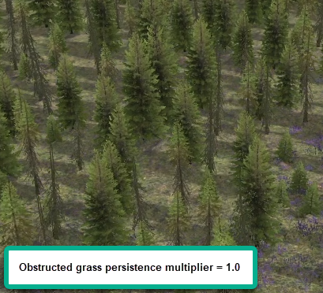
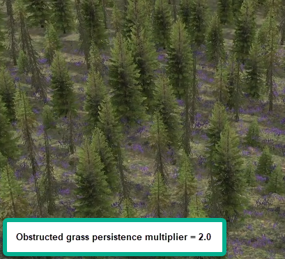

# Terrain Properties

If the **Terrain** section is selected in the **Scene View**, you can see the parameters of the terrain in the lower part of the **Scene View** panel.

In these properties, you can view the information about the size of the map in blocks (which is not editable) and specify such parameters as daytime presets, the sky preset, the sound preset (**Ambient Preset**), and so on.

The full list of parameters is the following:

-   **Blocks** section *(read-only values)*:

    -   **Number X** – *(Read-only value.)* The number of blocks along the X-axis. Maximum value: 84

    -   **Number Z** – *(Read-only value).* The number of blocks along the Z-axis. Maximum value: 84

    -   **Max Height** – *(Read-only value.)* The maximum height of the level.


-   **Mud Type** – Defines the type of [mud/extrudes][mud_extrudes] on the map. Possible values:

    -   `default` – default mud for regular maps. In *Expeditions*, used for "green" summer maps.  
    -   `arizona_custom` *(NEW)* – specific mud for desert maps. Its color is different from the `default` one. This option is available in *Expeditions* only.

-   **Particles Type** *(NEW)* – *(Available in Expeditions only.)* Defines the type of particles that appear when the truck is driving through [mud/extrudes][mud_extrudes] on the map. This option is available in *Expeditions* only. Possible values:

    -   `default` – particles used for the `default` mud on regular maps. In *Expeditions*, used for "green" summer maps.  
    -   `ARIZONA` – particles used for the `arizona_custom` mud on desert maps. Their color is different from the `default` ones. 

    **NOTE**: In the current version of the game, `ARIZONA` particles cannot be selected in the **Particles Type** drop-down. This is a known issue that will be fixed in the future releases of the game.

-   **Decals Type** *(NEW)* – *(Available in Expeditions only.)* Defines the type of the dirt from the mud that appears *on the truck itself* when it is driving through [mud/extrudes][mud_extrudes]. This option is available in *Expeditions* only. Possible values:

    -   `default` – the dirt used for the `default` mud on regular maps. In *Expeditions*, used for "green" summer maps.  
    -   `ARIZONA` – the dirt used for the `arizona_custom` mud on desert maps. Its color is different from the `default` one. 

    **NOTE**: In the current version of the game, `ARIZONA` dirt cannot be selected in the **Decals Type** drop-down. This is a known issue that will be fixed in the future releases of the game.

-   **Mutator** – allows you to specify the ID of the mutator that will be applied to all references imported to this map (to meet its settings). For more details, see [Usage of Mutators](./../references/usage_of_mutators.md).

-   **Overlays in 16-bit format** – *(Option used in SnowRunner.)* This option was added to fix some issues in overlays of asphalt roads. Enabling this option will make these overlays more smooth and their texture will be processed more correctly.   

-   **Use upgradeable garage** – *(Valid for SnowRunner only.)* In *SnowRunner*, enables the usage of upgradeable Garage. For details, see [Upgradeable Garage](./../zones/snowrunner_zones/garageentrance_and_garageexit_zones/upgradeable_garage.md).  

-   **Procedural snow coverage** – sets the coefficient for the procedural snow coverage on the surfaces of models and terrain layers (except the snow layer itself). The higher the value, the greater will be the amount of procedural snow on the surfaces. This parameter works only if the system considers the level as \"snowy\" (i.e. after painting with the depth of snow somewhere, see [[5.2.7. Snow]](#snow)).

-   **Obstructed grass persistence multiplier** (NEW) – *(Available in Expeditions only.)* By default, game engine *optimizes* the amount of grass that is displayed on the map. Particularly, the grass is removed within large groups of trees by default. To manage or disable this behaviour, you can change the value of the **Obstructed grass persistence multiplier** parameter. It value range is from `1.0` to `2.0`, where:

    -   `1.0` – corresponds to the default behavior, where the grass is removed within large groups of trees. 
    -   `2.0` – corresponds to the behavior when the grass is not removed *at all*.
    -   values in between – correspond to the soft blending of the behavior between these two options.

    **NOTE**: The **Obstructed grass persistence multiplier** parameter has effect both on the grass that is automatically used by the [material][material] layers and on the grass that is planted as [distributions][distributions].  
    
     

-   **Sun Static Direction** – sets the direction of the *static* sun during the day. The word "static" is important here since the light from this static sun will be baked into the lightmap (shadows from it will not change during the day). Static lightmap shadows are rendered at the distance greater than `50` meters from the camera. At a distance that is less than `50` meters - more sincere dynamic shadows are used. These dynamic shadows change simultaneously with the change of the daytime presets in the game, according to the direction of the "dynamic" sun (the `SunDir` parameter in the daytime preset). For info on daytime presets, see **Daytime Presets** below. For example, `(1; -0.875; 0)`.

-   **Sun Static Evening Direction** (NEW) – *(Available in Expeditions only.)* Same as **Sun Static Direction** but sets the direction of the *static* sun during the evening. For example, `(1; -0.25; 0)`.

-   **Use Two Lightmaps** (NEW) – *(Available in Expeditions only.)* If `False`, the system will use only lightmaps of **Sun Static Direction**. If `True`, it will use both lighmaps from **Sun Static Direction** and lighmaps from **Sun Static Evening Direction**. The mechanic of blending and switching from one lightmap to the second one is set up in **Daytime Presets** (see below), using the `<ShadowBlend>` and `<ShadowBlendCurve>` tags and their parameters.
    For example, the `day__2_az_01.xml` daytime preset has the following parameters:
    ```xml
	<ShadowBlend BlendFactor="0.039">
	    <ShadowBlendCurve>
			<Point Part="0.3" Percent="0.01"/>
			<Point Part="0.6" Percent="0.125"/>
			<Point Part="0.8" Percent="0.15"/>
        </ShadowBlendCurve>
    </ShadowBlend>    
    ```
    `BlendFactor` in `<ShadowBlend>` sets the blending of the second light map to the first one. E.g., `0.5` = `50%` blending.
    `<ShadowBlendCurve>` parameters allow you to fine tune the blending depending on the time line of the preset. Particualy, `Part` corresponds to the point in time (e.g., `0.3` = `30%` of the preset time interval between the current daytime and the next one), `Percent` corresponds to the percent of blending.

-   **Sky Preset** – the preset for the sky on the level. The existing sky presets can be found in the `[media]\classes\skies\` folder of the [`initial.pak`][initial_pak] archive.
    For example, some possible values:

    -   For *Expeditions*: 
        -   `sky_az_01`
        -   `sky_sk_01`

    -   For *SnowRunner*: 
        -   `sky_us_01`
        -   `sky_ru_02`

-   **Ambient Preset** - the name of the file with sound presets for the environment of the map ("ambient sounds"), without the `.xml` file extension. In particular, there are presets of sounds for specific weather and terrain, including river sounds. There are two options here:

    -   You can use one of the existing in-game presets here. They ae stored in the [`initial.pak`][initial_pak] archive, inside the `[media]\classes\ambients\` directory.  
        For example:

        -   For *Expeditions*: `snd_amb_us_arizona_summer_v2`
        -   For *SnowRunner*: `snd_amb_us_autumn`

    -   Or, you can create your own custom **Ambient Preset** and use it for your map. For details on this, see [Adding Ambient Sounds](./../sounds_and_music/ambient_sounds/adding_ambient_sounds.md).

-   **Daytime Presets** section - specifies presets for lighting and time of day:

    -   **Night** - night

    -   **Night to Day** - dawn

    -   **Day Early Variants** - morning

    -   **DayMidVariants** - midday

    -   **DayLateVariants** - after midday

    -   **DayToNight** - sunset

    The existing daytime presets can be found at the `[media]\classes\daytimes\` folder of the [`initial.pak`][initial_pak] archive. Presets with the `a` suffix (e.g. `day__1a_sk_01`) correspond to the "cloudy weather" variant of the preset.  
    For example:

    -   For *Expeditions*: 
        -   Night `night_sk_01`
        -   NightToDay`night_to_day_sk_01`
        -   DayEarlyVariants `day__1_sk_01;day__1a_sk_01`
        -   DayMidVariants `day__2_sk_01;day__2a_sk_01`
        -   DayLateVariants `day__3_sk_01;day__3_sk_01;day__3a_sk_01`
        -   DayToNight `day_to_night_sk_01`

    -   For *SnowRunner*: 
        -   Night `night_us_02`
        -   NightToDay`night_to_day_us_02`
        -   DayEarlyVariants `day__1_us_02;day__1a_us_02`
        -   DayMidVariants `day__2_us_02;day__2a_us_02`
        -   DayLateVariants `day__3_us_02;day__3a_us_02`
        -   DayToNight `day_to_night_us_02`

    **NOTE**: Mixing presets from different levels can lead to an unpredicted result.\
    **NOTE**: Please be accurate while entering IDs of the **Daytime Presets**. Entered values must not contain spaces (spaces in these values may result in a crash).

-   **Daytime Presets** \> **Force** section - allows you to set one particular daytime preset for the level. This preset will not change with the game time. The section contains the following fields:

    -   **Name** - the name (ID) of the daytime preset, see above.

    -   **Night Factor** - the lighting condition in the specified preset: "Day", "Night", or "Night to Day". This setting is necessary for the game logic that is related to the daytime. Using this value, it will be able to identify what time of the day should be used for the specified preset.

-   **Description level** section:

    -   **Id** - the name of the level for UI.

    -   **Description** - the description of the level for UI.


-   **Extrudes To Wetness** - sets the humidity of the hidden mud (the more it is, the more liquid the dirt will be and the harder it will be to drive).

-   **-threshold** - the parameter for cutting minor mud. Recommended values are in the `[0.05-0.2]` interval:

    -   For winter: `0.2`

    -   For warm seasons: below `0.15` (the best variant is `0.05`).

-   **Background Water** section - these fields allow you to configure the water surfaces outside the map. See [Background Water on Map Edges](./../rivers_and_water_objects/background_water_on_map_edges.md) for details.


[initial_pak]: ./../../getting_started/file_paths_and_naming/file_paths.md#source-of-info-initialpak-archive
[mud_extrudes]: ./geometry_brushes_for_terrain/mud.md
[material]: ./../pbr_materials/assigning_pbr_materials_to_terrain.md
[distributions]: ./../distributions/adding_multiple_objects_via_distribution.md