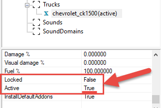

# Adding Trucks

**NOTE**: Requirements necessary for correct loading on the map with player's trucks are different for [*Expeditions*](#expeditions-specifics) and [*SnowRunner*](#snowrunner-specifics). 

## Overview
To add a truck or trailer to the map, you need to right-click the map (or the **Trucks** section in the **Scene View**) and select **Add Truck**.

After doing this, the model of the truck will appear on the map. 

Now, in the properties of the truck, you can specify what particular truck will be spawned and set its addons and other settings. 

To specify these properties:

1.  Right-click the map, select **Add Truck**.

2.  Select the created truck in the **Scene View** in the **Trucks** section. Its properties appear in the lower part of the panel.

3.  Now choose what truck you need. In the **Truck** parameter in the properties of the truck, click on the **\[press\]** button next to the **Edit** field. After doing this, the truck selection list will be displayed. In *SnowRunner*, in the same list, you can also find models of trailers.

4.  After adding a truck or, in *SnowRunner*, a trailer to the map, you can set other settings for it. If the wrong truck or trailer was selected, then the **Edit** field can be cleared by clicking the **\[press\]** button next to the **Сlear** field.

5.  The truck on the map will appear in its standard version. However, you can put the necessary upgrades on it in the appropriate fields (see below). The name of the upgrade must be entered manually, in the format of the ID of this upgrade in the game.

    **NOTE**: Identifiers of truck upgrades can be seen in the XML classes of the trucks in the [`initial.pak`]. Or, they can be seen when the debug Garage UI is opened from the **TOOLS** menu of the "Proving Ground" map. See [How to identify IDs of truck parts](./how_to_identify_ids_of_truck_parts.md) for details.

    Using these IDs you can specify the following parameters:

    -   **Engine**

    -   **Gearbox**

    -   **WinchUpgrade**

    -   **Suspension**

    -   **Wheels** - Tires and rims (without specifying their size):

        -   **Type** - specifies the type of the tires.
        -   **Rim** - specifies the type of rims.
        -   **Tire** - specifies the type of tires.

    -   **Customization** - The number of the color/paint of the truck.

6.  After doing this, you can fill in all other fields:

    -   **Trailer** - *(Used in SnowRunner only.)* In this section, you can add a trailer to a truck. It is added the same way as the truck.

    -   **Addons** - In this section, you can add the necessary visual addons to the truck, similarly to the selection of the truck. However, in the addon selection window, you can select multiple addons (by clicking on them) and add them to the truck at once.

    -   **Position/Rotation** - These fields specify the current coordinates and rotation angles of the truck.

    -   **Id** - The *identifier* of this truck in the game. This field is typically used when you reference this particular instance of truck in Stages of [objectives].

    -   **Land** - Automatically sets the truck on the terrain surface.

    -   **Damage%** - The amount of damage dealt to the functional components of the truck (engine, suspension, wheels, etc.).

    -   **Visual Damage%** - The amount of damage that will be visually displayed on the truck (scuffs, dents, and so on).

    -   **Fuel%** - How much fuel the truck has.

    -   **Locked** - If this option is enabled, the player cannot use the truck, until they find it on the map. By default, all trucks are added to the map in this mode.

    -   **Active** - Depending on the game:

        -   *For SnowRunner:*
            This option allows you to select the truck in which the player will be spawned on the map (the value must be **True** in this case). There can be only one **Active** truck on the map. The default value for this field is **False**. 
            
        -   *For Expeditions:*  
            The **Active** truck is not required. However, there are other requirements, see [below](#expeditions-specifics). 

    -   **Install Default addons** - This option automatically installs all default addons to the truck.

## Expeditions Specifics
In *Expeditions*, the player selects the trucks to be spawned on the map when preparing for an [Expedition][expedition] created for this map.

I.e., unlike *SnowRunner*, there is no need to place a "starting" truck for the player.

However, instead of this, there are important requirements to map [objectives][objectives] and [zones][zones].

Particularly:

-   At least one [Expedition][expedition] should be created for this map – for the player to be able to load it. 

-   At least one [Deploy zone][deploy_zones] should be configured on this map – to allow the player to deploy their trucks to it during this Expedition.

## SnowRunner Specifics
In *SnowRunner*, the truck in which the player starts the game *must* be marked as **Active** by setting **True** in the corresponding field.

By default, the new truck has this field set to **False**. 

**WARNING**: *At least one* truck on the map must be **Active** for correct spawning.

[expedition]: ./../objectives/objectives_in_expeditions/expeditions_and_contracts.md
[objectives]: ./../objectives/objectives_overview.md
[zones]: ./../zones/zones_overview.md
[deploy_zones]: ./../zones/expeditions_zones/deploy_zones.md
[initial_pak]: ./../../getting_started/file_paths_and_naming/file_paths.md#source-of-info-initialpak-archive