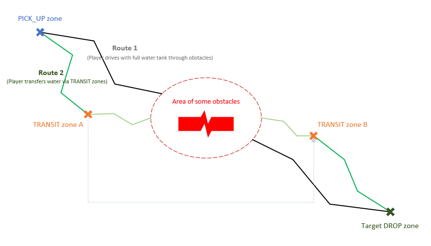

# TRANSIT Water Stations

*This topic is valid for SnowRunner only.*  

## Overview
`TRANSIT` Water Station zones allow the player to *immediately transfer water from one TRANSIT zone to another*.

These zones act as a common reservoir connected to the certain *set of shared zones* of the `TRANSIT` type. The player may fill this common reservoir via any zone from the set and the amount of water will be changed in all of them, since they all are interconnected. And, the player can also take water from this common reservoir, also via any zone from the set (and the amount still available in the reservoir will be changed correspondingly for all zones also).

**NOTE**: For `TRANSIT` zones, water can go in both directions: from the truck tank to the reservoir and backwards.

Since `TRANSIT` zones work for both input and output, and are interconnected, the player becomes able to transfer water with their help.

Thus, one of the simpliest scenarios of the `TRANSIT` zones usage may be the following:

1.  The player fills the truck tank at some `PICK_UP` zone.

2.  The player drives with this water to the `TRANSIT` *zone A* and fills its reservoir with the water from the truck tank, emptying it and making the truck considerably less heavy.

3.  With an empty truck tank and less heavier truck, the player passes some obstacles on the way much easier.

4.  After passing obstacles, player drives to the interconnected `TRANSIT` *zone B* (connected to the same reservoir as *zone A*) and fills the truck tank from it.

5.  With the full truck tank, the player delivers water to the necessary `DROP` zone.

**TIP 1**: The scenario described above can be offered to the player as an alternative to other routes, see the simpliest illustration below.

**TIP 2**: The scenario described above is just one of the basic ones. You can complicate it the way you like. For example, you can open particular `TRANSIT` zones as rewards for accomplishment of some other objectives (by changing their **props** dynamically), see **ObjectiveRewardOpenZoneProperties** and **ObjectiveRewardUpdateZoneProperties** as values of [**rewards**](./../objectives/objectives_in_snowrunner/rewards.md).

## Setting Up
Setting up the `TRANSIT` zone is also rather simple:

1.  In the **stationUIName** field of **ZonePropertyWaterStation**, you set up the name of the zone (e.g. `Water Reservoir, Gate A`) or leave the default one.

2.  In **stationType** – select `TRANSIT`.

3.  In **Water** – specify the amount of water, in liters, that will be initially available in the common reservoir of this zone and all of its interconnected zones. The player will be able to add water to this amount and will be able to take water from it, using any of the interconnected `TRANSIT` zones. To specify an infinite initial amount, you can specify the `-1` value, but this case is non-typical for the `TRANSIT` zones.

4.  In **Capacity** – specify the maximum capacity of the common water reservoir of this zone and all of its interconnected zones. The player will be able to add water to the reservoir until it will be totally full. Specified **Capacity** must be greater than current amount (**Water**). The `-1` value will set the capacity of this water reservoir to infinity, but this case is non-typical for the `TRANSIT` zones.

5.  Leave the **Is water delivery objective zone** option disabled. (This option should be enabled for `DROP` zones that are target zones of some objectives only).

6.  Create all other `TRANSIT` zones that you want to link with the current one and add all of them to the list of **Shared Water Zones** of the current `TRANSIT` zone. Do this *for all created zones* (every such zone must have **Shared Water Zones** list entries that point to all other zones from the set).

**WARNING**: All properties of the interconnected `TRANSIT` zones (except the **stationUIName**) must be the same. If values of the **Water** and **Capacity** fields of the interconnected zones are not the same, they will operate not correctly.

