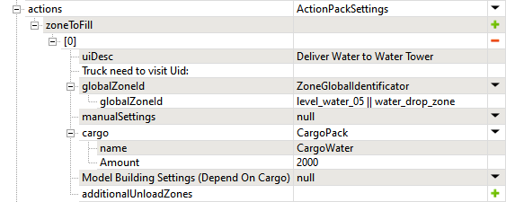

# Water Delivery Objectives 

*This topic is valid for SnowRunner only.*

Objectives that require delivery of the Water from the player to a target zone are set up similarly to regular delivery objectives.

**NOTE**: See [Goods Delivery](./../objectives/objectives_in_snowrunner/stages/delivery_of_goods/goods_delivery.md) above for details of regular delivery objectives.

Particularly, you set up a Stage as if for the regular delivery, but:

-   select the zone of the `DROP` Water Station type in the **globalZoneId** field.
    
    **WARNING**: The `DROP` type in the **ZonePropertyWaterStation** prop is mandatory for the target delivery zone.

-   select `CargoWater` as the **name** of **cargo** in the **CargoPack**.

-   specify the target amount of water, in liters, to be delivered in the **Amount** of **cargo** in the **CargoPack**.

**WARNING 1**: If your `DROP` zone is used as a target zone in some water delivery objective, you should *enable* the **Is water delivery objective zone** option in the **ZonePropertyWaterStation** prop of this zone. This will hide this zone before the activation of the objective and when the currect Stage of the objective is not using it as the target zone.

Otherwise, if this option is disabled and this zone is used within an object, at the moment of activating the corresponding objective, the amount of water in this zone (which is set by the sum of **Water** in the **ZonePropertyWaterStation** prop and water added to this zone by the player *before* activating the objective) will be reset to `0`.

**WARNING 2**: When specifying the target **Amount** of water to be delivered required by the objective, please ensure that it is *equal or less* than the **Capacity** of the zone. Otherwise, the player will not be able deliver the requested amount and will not be able to finish the objective.

