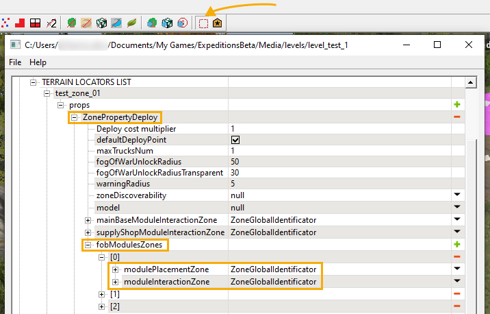
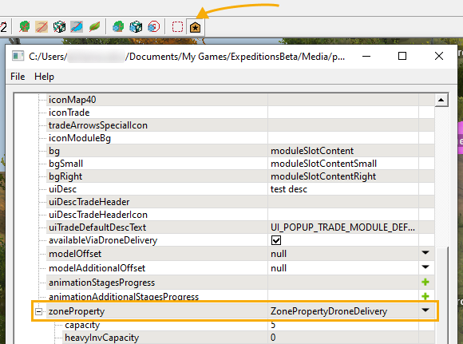

# Zones of FOB Modules: Overview

*This feature is valid for Expeditions only.*

## Overview

**FOB Module Zones** are the areas where players can build modules. Add zones to the scene, so players are able to build any kind of modules: *common* modules (parking zones, service stations, etc.), or *custom* modules with unique parameters.

Each FOB Module Zone requires a **Placement Zone** and an **Interaction Zone**. They are mapped to a [Deploy zone][deploy] in this zone's `ZonePropertyDeploy > fobModulesZones`. This configuration is set in the **Zone settings** menu.

Custom module zones allow you to set specific parameters of this zone: for example, you can define the items in stock and their amount. A custom module also requires a **Placement Zone** and an **Interaction Zone**. In addition, you need to prepare a custom MOD for players to build in one of the FOB Module Zones. To do so, you must [create a MOD][creation_of_custom_fob_module] from the **EXP MODs creation** menu. The properties of the FOB Modules are assigned in `zoneProperty` of the MOD.

 

**NOTE**: The props of FOB Module Zones (listed below) must be used only for configuring custom FOB Modules. Do not assign these props to common standalone zones. If you do it, this might cause a crash.

## moduleId field
Some zones of FOB modules have an addittional field – **moduleId**. In this field, you need to specify the [*identifier*][fob_module_identifier] of the *custom FOB module* to link this zone to this FOB module.

To access the **moduleId** field and make it function in the game, add the `ZonePropertyFOBModuleDefault` property to your FOB Module Zone. **Without this property the FOB will not work**.

I.e., in the **moduleId** field you must specify *the same value* as you have specified in the **name** field in the [general properties][fob_module_identifier] of this custom FOB module.

## Identifiers and Zones of Original In-Game FOB Modules
Original in-game modules also have corresponding identifiers – for example, `DOUBLE_STOCK` corresponds to the *Essentials storage* FOB module. Identifiers of original FOB modules may be used when giving FOB modules as [rewards][rewards] for [objectives][objectives_overview].  

Below is the list of original in-game FOB modules, their identifiers, and zones used for their configuration.

| **Name of FOB Module**| **ID of FOB Module**| **zoneProperty**             | **Topic**          |
|-----------------------|---------------------|------------------------------|--------------------|
| *Base module*         | BASE_MODULE         | ZonePropertyFobModuleStorage | [FOB Module Storage zones](./fob_module_storage_zones.md) |
| *Store*               | SUPPLY_SHOP         | ZonePropertySupplyShop       | [Supply Shop zones](./supply_shop_zones.md) |
| *Gas station*         | GAS_STATION         | ZonePropertyFobModuleStorage | [FOB Module Storage zones](./fob_module_storage_zones.md) |
| *Warehouse*           | EXTRA_STORAGE       | ZonePropertyFobModuleStorage | [FOB Module Storage zones](./fob_module_storage_zones.md) |
| *Repair station*      | REPAIR_ZONE         | ZonePropertyFobModuleStorage | [FOB Module Storage zones](./fob_module_storage_zones.md) |
| *Tow truck*           | TOW_TRUCK           | ZonePropertyTowTruck         | [Tow Truck zones](./tow_truck_zones.md) |
| *Essentials storage*  | DOUBLE_STOCK        | ZonePropertyFobModuleStorage | [FOB Module Storage zones](./fob_module_storage_zones.md) |
| *Expanded parking*    | PARKING             | ZonePropertyParking          | [Parking zones](./parking_zones.md) |
| *Workshop*            | WORKSHOP            | ZonePropertyWorkshop         | [Workshop zones](./workshop_zones.md) |
| *Service station*     | SERVICE_STATION     | ZonePropertyServiceStation   | [Service Station zones](./service_station_zones.md) |
| *Cargo drone*         | DRONE_BASE          | ZonePropertyDroneDelivery    | [Drone Delivery zones](./drone_delivery_zones.md) |
| *Helipad*             | HELICOPTER          | ZonePropertyHelicopter       | [Helicopter zones](./helicopter_zones.md) |
| *Intelligence center* | ANTENNA             | N/A                          | N/A                |

**NOTE**: The *Intelligence center* FOB Module (`ANTENNA`) is configured without the zone. I.e., for this type of the FOB module the **zoneProperty** field is set to `null` and not specified.

## Types of Zones of FOB Modules
As you can see, the internal types of zones within FOB modules are limited to the following:

-   [Drone Delivery zones](./drone_delivery_zones.md)
-   [FOB Module Storage zones](./fob_module_storage_zones.md)
-   [Parking zones](./parking_zones.md)
-   [Service Station zones](./service_station_zones.md)
-   [Supply Shop zones](./supply_shop_zones.md)
-   [Tow Truck zones](./tow_truck_zones.md)
-   [Workshop zones](./workshop_zones.md)

[custom_fob_modules]: ./../../../../../custom_gameplay_entities/fob_modules/custom_fob_modules_overview.md
[fob_module_identifier]: ./../../../../../custom_gameplay_entities/fob_modules/general_properties_of_fob_modules.md
[rewards]: ./../../../objectives/objectives_in_expeditions/rewards.md
[objectives_overview]: ./../../../objectives/objectives_overview.md
[deploy]: ./../../../../creating_a_map/zones/expeditions_zones/deploy_zones.md
[creation_of_custom_fob_module]: ./../../../../../custom_gameplay_entities/fob_modules/creation_of_custom_fob_module.md
